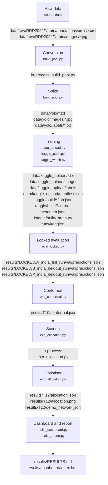

# Repository map

Generated 2026-10-05 12:46:43 +0530

Commit `0034bcf` on `workspace-cleanup`; 16 paths differ from it in the working tree.

Do not edit by hand — rerun scripts/repo_map.py

## 1. What this project is

Quoted from `CLAUDE.md`:

> # certain-road
>
> A pavement management decision-support system. It answers **"which road segments
> should be repaired first, given a fixed budget?"** — not "where is a pothole".
>
> Camera → YOLOv8s detectors (Model B, three-class; Model P, pothole-only) →
> vision-estimated PCI → conformal interval → RSL interval (designed, not built) →
> budget optimiser → offline HTML dashboard.
>
> **Status (2026-10-04, from [`docs/REPO-MAP.md`](docs/REPO-MAP.md) §6):** built and
> tested. T1–T7, T9–T12, T16 and T17 have their outputs. T13 (simulation), T14 (edge
> hardware) and T15 (Chennai footage) are not run; §10a says what each waits for. T0
> and T8 have no output to check. The map is generated from evidence: rerun
> `uv run python scripts/repo_map.py` instead of trusting this paragraph.
> `uv run python scripts/check_repo.py` runs every check CI runs.

Quoted from `docs/design.md`:

> ## §0 — What this is
>
> A pavement management decision-support system, not a pothole detector.
>
> The question the system answers is **"which road segments should be repaired first,
> given a fixed budget?"** — not "where is a pothole?". Detection is an input, not the
> product.
>
> ### Three contributions
>
> 1. **Edge AI** — automated road distress detection from a vehicle-mounted camera.
> 2. **Trustworthy AI** — conformal prediction supplying calibrated uncertainty on the
>    estimated pavement condition of a road segment.
> 3. **Decision support** — that uncertainty measurably changing maintenance
>    prioritisation under a fixed budget.
>
> The novelty is the **integration and the decision**, not the detector.

Evidence at build time, beside the quotes' own status lines: 129 commits from 2026-08-06 to 2026-10-05; Python files: 1 in `kaggle/`, 35 in `scripts/`, 8 in `sim/`, 51 in `src/`, 45 in `tests/`.

## 2. Pipeline

Which artifact carries each stage to the next? A solid edge lists what the later stage's scripts read from what the earlier stage's scripts write (the same path, or inside a directory it writes into), parsed from their source; `configs/repo_map.yaml` names the scripts per stage. A dotted edge means no parsed path links the two (for example, weights passed as a CLI argument); it lists what the earlier stage writes.

## 3. Directory map

### `src/`

What is each file for, and when was it first and last committed? Purpose is the first sentence of a module docstring or a leading config comment, or a Markdown file's first heading. Directories holding more than 25 files directly are one row.

| Path | Lines | First commit | Last commit | Purpose | Working tree |
|---|---|---|---|---|---|
| `src/certain_road/__init__.py` | 0 | 2026-08-06 | 2026-08-06 | no docstring |  |
| `src/certain_road/artifacts/__init__.py` | 1 | 2026-08-06 | 2026-08-06 | artifacts stage. |  |
| `src/certain_road/artifacts/io.py` | 94 | 2026-08-06 | 2026-08-06 | Read and write artifacts, enforcing the schema contract on every access. |  |
| `src/certain_road/artifacts/schema.py` | 127 | 2026-08-06 | 2026-09-06 | Artifact row schemas. |  |
| `src/certain_road/assess/__init__.py` | 6 | 2026-08-06 | 2026-09-22 | Statistical analysis over detector outputs: conformal risk control, drift. |  |
| `src/certain_road/assess/conformal.py` | 113 | 2026-09-22 | 2026-09-22 | T10 — conformal risk control for the pothole miss rate. |  |
| `src/certain_road/assess/drift.py` | 101 | 2026-09-22 | 2026-10-04 | T11 — drift detection with a conformal test martingale. |  |
| `src/certain_road/canbus/__init__.py` | 6 | 2026-09-05 | 2026-09-05 | Control transport. |  |
| `src/certain_road/canbus/obd.py` | 105 | 2026-09-22 | 2026-10-04 | T14 — read vehicle speed and RPM from OBD-II over CAN. |  |
| `src/certain_road/canbus/protocol.py` | 98 | 2026-09-05 | 2026-09-05 | Command <-> bytes: the robot's control-transport wire format. |  |
| `src/certain_road/canbus/transport.py` | 99 | 2026-09-06 | 2026-09-06 | Where a `Command` actually goes. |  |
| `src/certain_road/cli.py` | 430 | 2026-08-06 | 2026-09-06 | Single entrypoint. |  |
| `src/certain_road/core/__init__.py` | 1 | 2026-08-06 | 2026-08-06 | core stage. |  |
| `src/certain_road/core/geometry.py` | 89 | 2026-09-22 | 2026-09-22 | T12 — ground-plane geometry: inverse perspective mapping and GPS helpers. |  |
| `src/certain_road/core/paths.py` | 27 | 2026-08-06 | 2026-10-04 | Repository-relative path resolution. |  |
| `src/certain_road/dashboard/__init__.py` | 1 | 2026-09-05 | 2026-09-05 | The single product screen. |  |
| `src/certain_road/dashboard/plans.py` | 75 | 2026-09-29 | 2026-10-04 | Both repair plans at one budget, side by side, scored on the truth (D079). |  |
| `src/certain_road/dashboard/render.py` | 563 | 2026-10-03 | 2026-10-04 | The offline dashboard (D020): one self-contained HTML file built from result files. |  |
| `src/certain_road/dashboard/results.py` | 36 | 2026-09-29 | 2026-09-29 | Read-only access to result files. |  |
| `src/certain_road/dashboard/template.html` | 281 | 2026-10-03 | 2026-10-03 | no docstring |  |
| `src/certain_road/driving/__init__.py` | 6 | 2026-09-05 | 2026-09-05 | Drive pipeline: what should the robot do right now? |  |
| `src/certain_road/driving/confirm.py` | 44 | 2026-09-05 | 2026-09-05 | N-of-M temporal confirmation. |  |
| `src/certain_road/driving/controller.py` | 26 | 2026-09-05 | 2026-09-05 | Turn a drive state into a wire `Command`. |  |
| `src/certain_road/driving/corridor.py` | 304 | 2026-09-05 | 2026-09-05 | Is a detection in the robot's driving path, and how urgently does it matter? |  |
| `src/certain_road/driving/decision.py` | 137 | 2026-09-05 | 2026-09-06 | The drive state machine. |  |
| `src/certain_road/driving/perceive.py` | 70 | 2026-09-06 | 2026-09-06 | Turn a frame's detections into a `Perception` the state machine can judge. |  |
| `src/certain_road/perception/__init__.py` | 1 | 2026-09-05 | 2026-09-05 | detect stage. |  |
| `src/certain_road/perception/dataset/__init__.py` | 1 | 2026-09-05 | 2026-09-05 | RDD2022 dataset preparation. |  |
| `src/certain_road/perception/dataset/convert.py` | 107 | 2026-09-05 | 2026-09-22 | VOC -> YOLO label conversion. |  |
| `src/certain_road/perception/dataset/dedupe.py` | 79 | 2026-09-22 | 2026-10-04 | D061 — one implementation of image similarity, shared by every caller. |  |
| `src/certain_road/perception/dataset/fetch.py` | 153 | 2026-09-05 | 2026-09-05 | Acquire RDD2022. |  |
| `src/certain_road/perception/dataset/pool.py` | 210 | 2026-09-22 | 2026-10-04 | T2 — one image pool, no duplicate files, leakage-proof split lists. |  |
| `src/certain_road/perception/dataset/split.py` | 223 | 2026-09-05 | 2026-09-05 | Deterministic four-way split. |  |
| `src/certain_road/perception/dataset/voc.py` | 70 | 2026-09-05 | 2026-09-05 | PASCAL VOC annotation parsing for RDD2022. |  |
| `src/certain_road/perception/evaluate.py` | 369 | 2026-09-05 | 2026-09-05 | Detections + ground-truth labels -> mAP and operating-point metrics. |  |
| `src/certain_road/perception/metrics_coco.py` | 172 | 2026-09-22 | 2026-10-04 | T6 — pycocotools-backed evaluation, alongside the ultralytics path. |  |
| `src/certain_road/perception/predict.py` | 155 | 2026-09-05 | 2026-09-06 | Weights + images -> a `DetectionRow` frame, with taxonomy remap applied. |  |
| `src/certain_road/perception/source.py` | 102 | 2026-09-06 | 2026-09-06 | Where frames come from. |  |
| `src/certain_road/perception/train.py` | 104 | 2026-09-05 | 2026-09-05 | YOLOv8n training on Apple Silicon MPS. |  |
| `src/certain_road/runtime/__init__.py` | 6 | 2026-09-06 | 2026-09-06 | On-device composition root. |  |
| `src/certain_road/runtime/pipeline.py` | 84 | 2026-09-06 | 2026-09-06 | The loop that runs on the Jetson: frames in, CAN frames out. |  |
| `src/certain_road/runtime/recorder.py` | 83 | 2026-09-06 | 2026-10-04 | Persist what a drive produced. |  |
| `src/certain_road/sim/__init__.py` | 5 | 2026-09-05 | 2026-09-05 | Simulator - a composition root like cli.py. |  |
| `src/certain_road/sim/model.py` | 97 | 2026-09-05 | 2026-09-05 | Kinematic bicycle model for the simulated robot. |  |
| `src/certain_road/sim/project.py` | 82 | 2026-09-05 | 2026-09-05 | Project a world-space pothole into an image-space `Detection`. |  |
| `src/certain_road/sim/run.py` | 70 | 2026-09-05 | 2026-09-06 | Closed-loop scenario runner: perception → confirmation → decision → actuation. |  |
| `src/certain_road/sim/scenario.py` | 128 | 2026-09-05 | 2026-09-05 | Repeatable trial scenarios. |  |
| `src/certain_road/sim/view.py` | 100 | 2026-09-05 | 2026-09-05 | Top-down render of a scenario run, beside the camera view the robot saw. |  |
| `src/certain_road/survey/__init__.py` | 5 | 2026-09-05 | 2026-09-05 | Survey pipeline: what do we know about this road? |  |
| `src/certain_road/survey/allocation.py` | 129 | 2026-09-22 | 2026-10-04 | T12 — which evaluation segments to repair under a fixed budget. |  |
| `src/certain_road/survey/scoring.py` | 174 | 2026-09-22 | 2026-10-04 | T12 — evaluation-segment health from detections: vision density to a PCI-style score. |  |
| `src/certain_road/survey/segment.py` | 96 | 2026-09-06 | 2026-09-06 | Group a drive's detections into evaluation segments. |  |

### `scripts/`

What is each file for, and when was it first and last committed? Purpose is the first sentence of a module docstring or a leading config comment, or a Markdown file's first heading. Directories holding more than 25 files directly are one row.

| Path | Lines | First commit | Last commit | Purpose | Working tree |
|---|---|---|---|---|---|
| `scripts/audit_duplicates.py` | 127 | 2026-09-22 | 2026-10-04 | D061 — find near-duplicate images that cross a split boundary. |  |
| `scripts/audit_raw.py` | 247 | 2026-09-22 | 2026-10-04 | T1 — audit RDD2022 as it ships, before any conversion touches it. |  |
| `scripts/bph_internal_leakage.py` | 129 | 2026-09-22 | 2026-10-04 | D073 — are BharatPotHole's own eval splits held out, and how diverse is it? |  |
| `scripts/build_dashboard.py` | 40 | 2026-10-03 | 2026-10-04 | T16 — build the offline dashboard: one self-contained HTML file (D020). |  |
| `scripts/build_pool.py` | 251 | 2026-09-22 | 2026-10-04 | T2 — build the YOLO image pool, the split lists, and the split audit. |  |
| `scripts/build_pothole_pool.py` | 119 | 2026-09-22 | 2026-10-04 | D072 — a pothole-only pool for Model P. |  |
| `scripts/check_bharatpothole.py` | 91 | 2026-09-22 | 2026-10-04 | D072 — does BharatPotHole overlap the India holdout? |  |
| `scripts/check_repo.py` | 101 | 2026-10-04 | 2026-10-04 | Every repository check, in order: `uv run python scripts/check_repo.py` (or `make check`). |  |
| `scripts/eval_locked.py` | 255 | 2026-09-22 | 2026-10-04 | T6 — locked evaluation on a held-out set. |  |
| `scripts/eval_open.py` | 125 | 2026-09-22 | 2026-10-04 | T6 — open evaluation on a non-held-out set, under the frozen settings. |  |
| `scripts/eval_video.py` | 304 | 2026-10-04 | 2026-10-04 | D075 — per-pothole confirmation on real road video, one model's pothole channel. | read-only lane |
| `scripts/exhaustive_groups.py` | 112 | 2026-09-22 | 2026-10-04 | D062 — build scene groups from an EXHAUSTIVE comparison, not a hash prefilter. |  |
| `scripts/exhaustive_leak_check.py` | 125 | 2026-09-22 | 2026-10-04 | D062 — prove the India holdout is clean by comparing *every* pair. |  |
| `scripts/exp_allocation.py` | 558 | 2026-09-22 | 2026-10-04 | T12 — does conformal robustness change which roads get repaired? |  |
| `scripts/exp_conformal.py` | 488 | 2026-09-28 | 2026-10-04 | T10 — conformal risk control on the pothole miss rate, from locked predictions. |  |
| `scripts/exp_drift.py` | 318 | 2026-09-28 | 2026-10-04 | T11 — does the drift alarm notice when Model A leaves its domain? |  |
| `scripts/exp_video_extent.py` | 459 | 2026-10-04 | 2026-10-04 | Why Model B is silent on the degraded stretch of the Bengaluru clip. | read-only lane |
| `scripts/kaggle_push.py` | 175 | 2026-09-22 | 2026-10-04 | T5 — build and push a Kaggle training kernel. |  |
| `scripts/kaggle_watch.py` | 59 | 2026-09-22 | 2026-10-04 | T5 — poll a Kaggle kernel, then pull its output. |  |
| `scripts/make_fixtures.py` | 30 | 2026-08-06 | 2026-08-06 | Write synthetic artifacts to runs/synthetic/ for manual pipeline exercise. |  |
| `scripts/make_report.py` | 769 | 2026-10-03 | 2026-10-04 | T17 — generate results/RESULTS.md from the result files. |  |
| `scripts/mps_sanity.py` | 129 | 2026-09-22 | 2026-10-04 | T4 — can this Mac train, and does MPS agree with CPU? |  |
| `scripts/plot_style.py` | 52 | 2026-09-28 | 2026-10-04 | Shared chart style for the static result figures (dataviz reference palette). |  |
| `scripts/qa_raw.py` | 120 | 2026-09-22 | 2026-10-04 | T1 step 5 — draw ground-truth boxes on raw images so they can be eyeballed. |  |
| `scripts/repo_map.py` | 1403 | 2026-10-04 | 2026-10-04 | Generate docs/REPO-MAP.md: what exists, when it was built, and what is left. |  |
| `scripts/scene_groups.py` | 96 | 2026-09-22 | 2026-10-04 | D061 — group India images that show the same road scene. |  |
| `scripts/score_video_gt.py` | 162 | 2026-10-04 | 2026-10-04 | Score each model's confirmed video tracks against hand-counted pothole intervals. | read-only lane |
| `scripts/stage_upload.py` | 94 | 2026-09-22 | 2026-10-04 | T3 — stage only what Kaggle needs, and nothing it must never see. |  |
| `scripts/t10_feasibility.py` | 211 | 2026-09-22 | 2026-10-04 | T10 feasibility — what miss rate can conformal risk control actually certify? |  |
| `scripts/t6_localisation.py` | 195 | 2026-09-22 | 2026-10-04 | T6 follow-up — is the India gap blindness, or boxes in the wrong place? |  |
| `scripts/t6_report.py` | 193 | 2026-09-22 | 2026-10-04 | T6 — the generalization gap, per class, with the confusion structure behind it. |  |
| `scripts/t7_compare.py` | 210 | 2026-09-22 | 2026-10-04 | T7 — Model A vs Model B on india_test, same scorer, same settings. |  |
| `scripts/t9_b_vs_p.py` | 556 | 2026-09-22 | 2026-10-04 | D072 — Model B vs Model P on india_val, pothole only, one scorer, one eval block. |  |
| `scripts/train_progress.py` | 124 | 2026-08-07 | 2026-08-14 | Show YOLO training progress at a glance. |  |
| `scripts/verify_run.py` | 210 | 2026-09-22 | 2026-10-04 | T5b post-run verification — what the kernel actually read and produced. |  |

### `configs/`

What is each file for, and when was it first and last committed? Purpose is the first sentence of a module docstring or a leading config comment, or a Markdown file's first heading. Directories holding more than 25 files directly are one row.

| Path | Lines | First commit | Last commit | Purpose | Working tree |
|---|---|---|---|---|---|
| `configs/canbus/transport.yaml` | 24 | 2026-09-06 | 2026-09-06 | CAN transport. |  |
| `configs/data/india_cal.yaml` | 7 | 2026-09-22 | 2026-09-22 | no docstring |  |
| `configs/data/india_full.yaml` | 7 | 2026-09-22 | 2026-09-22 | no docstring |  |
| `configs/data/india_heldout.yaml` | 7 | 2026-09-22 | 2026-09-22 | no docstring |  |
| `configs/data/india_test.yaml` | 7 | 2026-09-22 | 2026-09-22 | no docstring |  |
| `configs/data/india_train.yaml` | 7 | 2026-09-22 | 2026-09-22 | no docstring |  |
| `configs/data/india_val.yaml` | 7 | 2026-09-22 | 2026-09-22 | no docstring |  |
| `configs/data/model_a.yaml` | 7 | 2026-09-22 | 2026-09-22 | no docstring |  |
| `configs/data/model_b.yaml` | 9 | 2026-09-22 | 2026-09-22 | no docstring |  |
| `configs/data/nonindia_val.yaml` | 7 | 2026-09-22 | 2026-09-22 | no docstring |  |
| `configs/dataset/rdd2022_india.yaml` | 7 | 2026-08-06 | 2026-08-07 | no docstring |  |
| `configs/dataset/rdd2022_multicountry.yaml` | 7 | 2026-08-14 | 2026-08-14 | no docstring |  |
| `configs/driving/corridor.yaml` | 50 | 2026-09-05 | 2026-09-05 | Driving corridor geometry. |  |
| `configs/driving/decision.yaml` | 35 | 2026-09-05 | 2026-09-05 | Drive decision policy. |  |
| `configs/eval/class_maps.yaml` | 38 | 2026-08-15 | 2026-09-06 | Remaps external model class indices onto our frozen taxonomy: 0 = linear_crack, 1 = alligator_crack, 2 = pothole Indices DO NOT align across taxonomies. |  |
| `configs/eval/gt/2DV-cYmIvT4_claude.csv` | 50 | 2026-10-04 | 2026-10-04 | Potholes in 2DV-cYmIvT4 (RT Dashcam, CC BY), window 120-180 s. | read-only lane |
| `configs/eval/thresholds.yaml` | 15 | 2026-08-15 | 2026-08-15 | mAP is computed over the full precision-recall curve, so it uses a minimal floor. |  |
| `configs/eval/video.yaml` | 40 | 2026-10-04 | 2026-10-04 | D075 — per-pothole confirmation on road video (scripts/eval_video.py). | read-only lane |
| `configs/project.yaml` | 115 | 2026-09-22 | 2026-09-28 | RoadSight project configuration. |  |
| `configs/repo_map.yaml` | 103 | 2026-10-04 | 2026-10-04 | scripts/repo_map.py -> docs/REPO-MAP.md. |  |
| `configs/sim/mujoco.yaml` | 84 | uncommitted | uncommitted | MuJoCo live survey demo (sim/mujoco). | untracked |
| `configs/sim/robot.yaml` | 23 | 2026-09-05 | 2026-09-05 | Simulated robot and camera geometry. |  |
| `configs/sim/textures.yaml` | 84 | uncommitted | uncommitted | Textures for the MuJoCo demo (sim/mujoco/textures.py). | untracked |
| `configs/train/yolov8n.yaml` | 24 | 2026-08-07 | 2026-08-07 | YOLOv8n on the RDD2022 India subset (D025). |  |
| `configs/train/yolov8s.yaml` | 36 | 2026-08-14 | 2026-08-14 | YOLOv8s on the RDD2022 multi-country corpus (D042). |  |
| `configs/train/yolov8s_continue.yaml` | 84 | 2026-08-15 | 2026-08-15 | Continuation of the D042 multi-country YOLOv8s run from existing weights (D043). |  |
| `configs/train/yolov8s_india.yaml` | 49 | 2026-08-15 | 2026-08-15 | YOLOv8s on the RDD2022 India subset — the clean capacity ablation. |  |

### `tests/`

What is each file for, and when was it first and last committed? Purpose is the first sentence of a module docstring or a leading config comment, or a Markdown file's first heading. Directories holding more than 25 files directly are one row.

| Path | Lines | First commit | Last commit | Purpose | Working tree |
|---|---|---|---|---|---|
| `tests/__init__.py` | 0 | 2026-08-06 | 2026-08-06 | no docstring |  |
| `tests/fixtures/__init__.py` | 0 | 2026-08-06 | 2026-08-06 | no docstring |  |
| `tests/fixtures/synthetic.py` | 114 | 2026-08-06 | 2026-09-05 | Synthetic artifact generators. |  |
| `tests/test_architecture.py` | 19 | 2026-08-06 | 2026-08-06 | The stage-isolation contract is part of the test suite, not just CI. |  |
| `tests/test_artifacts_io.py` | 104 | 2026-08-06 | 2026-08-06 | no docstring |  |
| `tests/test_canbus_obd.py` | 133 | 2026-09-22 | 2026-10-04 | T14 — OBD-II decoding, exercised against a real bus with a fake ECU. |  |
| `tests/test_canbus_protocol.py` | 65 | 2026-09-05 | 2026-09-05 | Tests for the provisional Command <-> bytes encoding. |  |
| `tests/test_canbus_transport.py` | 89 | 2026-09-06 | 2026-09-06 | The transport layer, exercised on a real CAN bus. |  |
| `tests/test_cli.py` | 14 | 2026-08-06 | 2026-09-05 | no docstring |  |
| `tests/test_conformal.py` | 113 | 2026-09-22 | 2026-09-22 | T10 — the CRC guarantee is only worth as much as these tests. |  |
| `tests/test_dashboard.py` | 181 | 2026-09-29 | 2026-10-04 | The dashboard reads files and runs the T12 optimiser; it must never hide either objective. |  |
| `tests/test_dataset_convert.py` | 200 | 2026-08-06 | 2026-10-04 | no docstring |  |
| `tests/test_dataset_fetch.py` | 103 | 2026-08-06 | 2026-09-05 | no docstring |  |
| `tests/test_dataset_split.py` | 266 | 2026-08-06 | 2026-09-05 | no docstring |  |
| `tests/test_drift.py` | 149 | 2026-09-22 | 2026-10-04 | T11 — a drift detector that alarms on stationary data is worse than none. |  |
| `tests/test_driving_corridor.py` | 166 | 2026-09-05 | 2026-09-05 | Tests for the driving corridor: geometry (Task A) and proximity, urgency, lateral offset (Task B). |  |
| `tests/test_driving_decision.py` | 216 | 2026-09-05 | 2026-09-06 | The drive decision layer: temporal confirmation, confidence gating, and the state machine. |  |
| `tests/test_driving_perceive.py` | 90 | 2026-10-04 | 2026-10-04 | `build_perception`: the rules the simulator and the runtime share. |  |
| `tests/test_eval_locked_links.py` | 64 | 2026-10-04 | 2026-10-04 | A fresh locked run must not commit a link that escapes the repository (D084). |  |
| `tests/test_eval_video.py` | 58 | 2026-10-04 | 2026-10-04 | D075 — per-track 3-of-5 confirmation behind a horizon gate. | read-only lane |
| `tests/test_fixtures.py` | 67 | 2026-08-06 | 2026-09-05 | no docstring |  |
| `tests/test_geometry.py` | 88 | 2026-09-22 | 2026-10-04 | T12 — IPM must invert exactly, and must agree with the simulator's camera. |  |
| `tests/test_kaggle_guard.py` | 157 | 2026-09-22 | 2026-10-04 | The last line of defence before a six-hour run reads its first image. |  |
| `tests/test_make_report.py` | 136 | 2026-10-03 | 2026-10-04 | RESULTS.md is generated; these pin the properties that make it trustworthy. |  |
| `tests/test_metrics_coco.py` | 122 | 2026-09-22 | 2026-10-04 | T6 — the class-id offset is the bug that would not announce itself. |  |
| `tests/test_mujoco_camera.py` | 81 | uncommitted | uncommitted | The MuJoCo camera is the design camera, and it agrees with core.geometry's IPM. | untracked |
| `tests/test_mujoco_road.py` | 79 | uncommitted | uncommitted | The MuJoCo demo's road generator: reproducible, round-trips, and clusters its damage. | untracked |
| `tests/test_operating_points.py` | 123 | 2026-09-22 | 2026-10-04 | The B-vs-P comparison turns on numbers no eyeball can check. |  |
| `tests/test_perception_evaluate.py` | 271 | 2026-09-05 | 2026-09-05 | Tests for `certain_road.perception.evaluate`. |  |
| `tests/test_perception_predict.py` | 201 | 2026-09-05 | 2026-09-05 | Tests for the predict.py schema/remap boundary. |  |
| `tests/test_perception_remap.py` | 35 | 2026-09-05 | 2026-09-05 | no docstring |  |
| `tests/test_perception_source.py` | 59 | 2026-09-06 | 2026-09-06 | Frame sources, exercised against a real video file written on the fly. |  |
| `tests/test_pool_split.py` | 78 | 2026-10-04 | 2026-10-04 | The T2 split functions, on synthetic names: no image pool needed. |  |
| `tests/test_repo_hygiene.py` | 97 | 2026-10-04 | 2026-10-04 | A fresh clone must not depend on one machine's home directory (D084). |  |
| `tests/test_repo_map.py` | 228 | 2026-10-04 | 2026-10-04 | REPO-MAP.md is generated; these pin the extraction it stands on. |  |
| `tests/test_runtime_pipeline.py` | 110 | 2026-09-06 | 2026-09-06 | The on-device loop, run end to end on a laptop. |  |
| `tests/test_runtime_recorder.py` | 97 | 2026-09-06 | 2026-09-06 | Recording a drive to artifacts. |  |
| `tests/test_score_video_gt.py` | 85 | 2026-10-04 | 2026-10-04 | Per-pothole scoring of confirmed video tracks against hand-counted intervals. | read-only lane |
| `tests/test_scoring_allocation.py` | 194 | 2026-09-22 | 2026-10-04 | T12 — scoring must stay monotone, and the ILP must actually beat greedy. |  |
| `tests/test_sim_matrix.py` | 58 | 2026-09-05 | 2026-09-05 | The trial matrix, asserted. |  |
| `tests/test_sim_model.py` | 117 | 2026-09-05 | 2026-09-05 | Kinematics, projection, and the integration that proves the simulator exercises the real driving code rather than paralleling it. |  |
| `tests/test_sim_view.py` | 33 | 2026-10-04 | 2026-10-04 | `render`: the two-panel image `certain-road sim run` writes. |  |
| `tests/test_splits.py` | 201 | 2026-09-22 | 2026-10-04 | T2 — the split lists must be leakage-proof, and these tests are the proof. |  |
| `tests/test_survey_segment.py` | 120 | 2026-09-06 | 2026-09-06 | Grouping a drive into evaluation segments. |  |
| `tests/test_train_config.py` | 102 | 2026-08-07 | 2026-09-05 | no docstring |  |

### `results/`

What is each file for, and when was it first and last committed? Purpose is the first sentence of a module docstring or a leading config comment, or a Markdown file's first heading. Directories holding more than 25 files directly are one row.

| Path | Lines | First commit | Last commit | Purpose | Working tree |
|---|---|---|---|---|---|
| `results/LOCKED/A_india_full.json` | 58 | 2026-09-22 | 2026-09-22 | no docstring |  |
| `results/LOCKED/A_india_full_run/data.yaml` | 7 | 2026-09-22 | 2026-09-22 | no docstring |  |
| `results/LOCKED/A_india_full_run/val/BoxF1_curve.png` | binary | 2026-09-22 | 2026-09-22 | no docstring |  |
| `results/LOCKED/A_india_full_run/val/BoxPR_curve.png` | binary | 2026-09-22 | 2026-09-22 | no docstring |  |
| `results/LOCKED/A_india_full_run/val/BoxP_curve.png` | binary | 2026-09-22 | 2026-09-22 | no docstring |  |
| `results/LOCKED/A_india_full_run/val/BoxR_curve.png` | binary | 2026-09-22 | 2026-09-22 | no docstring |  |
| `results/LOCKED/A_india_full_run/val/confusion_matrix.png` | binary | 2026-09-22 | 2026-09-22 | no docstring |  |
| `results/LOCKED/A_india_full_run/val/confusion_matrix_normalized.png` | binary | 2026-09-22 | 2026-09-22 | no docstring |  |
| `results/LOCKED/A_india_full_run/val/predictions.json` | 1 | 2026-09-22 | 2026-09-22 | no docstring |  |
| `results/LOCKED/A_india_full_run/val/val_batch0_labels.jpg` | binary | 2026-09-22 | 2026-09-22 | no docstring |  |
| `results/LOCKED/A_india_full_run/val/val_batch0_pred.jpg` | binary | 2026-09-22 | 2026-09-22 | no docstring |  |
| `results/LOCKED/A_india_full_run/val/val_batch1_labels.jpg` | binary | 2026-09-22 | 2026-09-22 | no docstring |  |
| `results/LOCKED/A_india_full_run/val/val_batch1_pred.jpg` | binary | 2026-09-22 | 2026-09-22 | no docstring |  |
| `results/LOCKED/A_india_full_run/val/val_batch2_labels.jpg` | binary | 2026-09-22 | 2026-09-22 | no docstring |  |
| `results/LOCKED/A_india_full_run/val/val_batch2_pred.jpg` | binary | 2026-09-22 | 2026-09-22 | no docstring |  |
| `results/LOCKED/B_india_heldout.json` | 58 | 2026-09-22 | 2026-09-22 | no docstring |  |
| `results/LOCKED/B_india_heldout_run/data.yaml` | 7 | 2026-09-22 | 2026-09-22 | no docstring |  |
| `results/LOCKED/B_india_heldout_run/val/BoxF1_curve.png` | binary | 2026-09-22 | 2026-09-22 | no docstring |  |
| `results/LOCKED/B_india_heldout_run/val/BoxPR_curve.png` | binary | 2026-09-22 | 2026-09-22 | no docstring |  |
| `results/LOCKED/B_india_heldout_run/val/BoxP_curve.png` | binary | 2026-09-22 | 2026-09-22 | no docstring |  |
| `results/LOCKED/B_india_heldout_run/val/BoxR_curve.png` | binary | 2026-09-22 | 2026-09-22 | no docstring |  |
| `results/LOCKED/B_india_heldout_run/val/confusion_matrix.png` | binary | 2026-09-22 | 2026-09-22 | no docstring |  |
| `results/LOCKED/B_india_heldout_run/val/confusion_matrix_normalized.png` | binary | 2026-09-22 | 2026-09-22 | no docstring |  |
| `results/LOCKED/B_india_heldout_run/val/predictions.json` | 1 | 2026-09-22 | 2026-09-22 | no docstring |  |
| `results/LOCKED/B_india_heldout_run/val/val_batch0_labels.jpg` | binary | 2026-09-22 | 2026-09-22 | no docstring |  |
| `results/LOCKED/B_india_heldout_run/val/val_batch0_pred.jpg` | binary | 2026-09-22 | 2026-09-22 | no docstring |  |
| `results/LOCKED/B_india_heldout_run/val/val_batch1_labels.jpg` | binary | 2026-09-22 | 2026-09-22 | no docstring |  |
| `results/LOCKED/B_india_heldout_run/val/val_batch1_pred.jpg` | binary | 2026-09-22 | 2026-09-22 | no docstring |  |
| `results/LOCKED/B_india_heldout_run/val/val_batch2_labels.jpg` | binary | 2026-09-22 | 2026-09-22 | no docstring |  |
| `results/LOCKED/B_india_heldout_run/val/val_batch2_pred.jpg` | binary | 2026-09-22 | 2026-09-22 | no docstring |  |
| `results/LOCKED/P_india_heldout.json` | 50 | 2026-09-24 | 2026-09-24 | no docstring |  |
| `results/LOCKED/P_india_heldout_run/data.yaml` | 5 | 2026-09-24 | 2026-09-24 | no docstring |  |
| `results/LOCKED/P_india_heldout_run/gt_root/images/` | 2312 files | 2026-09-24 | 2026-09-24 | 2312 .jpg |  |
| `results/LOCKED/P_india_heldout_run/gt_root/india_heldout.txt` | 2312 | 2026-09-24 | 2026-09-24 | no docstring |  |
| `results/LOCKED/P_india_heldout_run/gt_root/labels.cache` | binary | 2026-09-24 | 2026-09-24 | no docstring |  |
| `results/LOCKED/P_india_heldout_run/gt_root/labels/` | 2312 files | 2026-09-24 | 2026-09-24 | 2312 .txt |  |
| `results/LOCKED/P_india_heldout_run/val/BoxF1_curve.png` | binary | 2026-09-24 | 2026-09-24 | no docstring |  |
| `results/LOCKED/P_india_heldout_run/val/BoxPR_curve.png` | binary | 2026-09-24 | 2026-09-24 | no docstring |  |
| `results/LOCKED/P_india_heldout_run/val/BoxP_curve.png` | binary | 2026-09-24 | 2026-09-24 | no docstring |  |
| `results/LOCKED/P_india_heldout_run/val/BoxR_curve.png` | binary | 2026-09-24 | 2026-09-24 | no docstring |  |
| `results/LOCKED/P_india_heldout_run/val/confusion_matrix.png` | binary | 2026-09-24 | 2026-09-24 | no docstring |  |
| `results/LOCKED/P_india_heldout_run/val/confusion_matrix_normalized.png` | binary | 2026-09-24 | 2026-09-24 | no docstring |  |
| `results/LOCKED/P_india_heldout_run/val/predictions.json` | 1 | 2026-09-24 | 2026-09-24 | no docstring |  |
| `results/LOCKED/P_india_heldout_run/val/val_batch0_labels.jpg` | binary | 2026-09-24 | 2026-09-24 | no docstring |  |
| `results/LOCKED/P_india_heldout_run/val/val_batch0_pred.jpg` | binary | 2026-09-24 | 2026-09-24 | no docstring |  |
| `results/LOCKED/P_india_heldout_run/val/val_batch1_labels.jpg` | binary | 2026-09-24 | 2026-09-24 | no docstring |  |
| `results/LOCKED/P_india_heldout_run/val/val_batch1_pred.jpg` | binary | 2026-09-24 | 2026-09-24 | no docstring |  |
| `results/LOCKED/P_india_heldout_run/val/val_batch2_labels.jpg` | binary | 2026-09-24 | 2026-09-24 | no docstring |  |
| `results/LOCKED/P_india_heldout_run/val/val_batch2_pred.jpg` | binary | 2026-09-24 | 2026-09-24 | no docstring |  |
| `results/RESULTS.md` | 332 | 2026-10-03 | 2026-10-04 | Results |  |
| `results/T1/findings.md` | 69 | 2026-09-22 | 2026-09-22 | T1 — findings |  |
| `results/T1/raw_audit.json` | 373 | 2026-09-22 | 2026-09-22 | no docstring |  |
| `results/T1/raw_audit.md` | 51 | 2026-09-22 | 2026-09-22 | T1 — RDD2022 raw audit |  |
| `results/T10/conformal.json` | 4347 | 2026-09-28 | 2026-09-28 | no docstring |  |
| `results/T10/conformal.md` | 80 | 2026-09-28 | 2026-09-28 | T10 - conformal risk control on the pothole miss rate |  |
| `results/T10/false_alarms_vs_alpha.png` | binary | 2026-09-28 | 2026-09-28 | no docstring |  |
| `results/T10/feasibility.json` | 944 | 2026-09-22 | 2026-09-24 | no docstring |  |
| `results/T10/resampled_risk_hist.png` | binary | 2026-09-28 | 2026-09-28 | no docstring |  |
| `results/T10/risk_vs_alpha.png` | binary | 2026-09-28 | 2026-09-28 | no docstring |  |
| `results/T11/delay_hist.png` | binary | 2026-09-28 | 2026-09-28 | no docstring |  |
| `results/T11/drift.json` | 262 | 2026-09-28 | 2026-09-28 | no docstring |  |
| `results/T11/drift.md` | 19 | 2026-09-28 | 2026-09-28 | T11 - drift alarm (conformal test martingale), Model A |  |
| `results/T11/martingale_traces.png` | binary | 2026-09-28 | 2026-09-28 | no docstring |  |
| `results/T12/allocation.json` | 2099 | 2026-09-22 | 2026-09-28 | no docstring |  |
| `results/T12/allocation.md` | 101 | 2026-09-22 | 2026-09-28 | T12 - repair allocation under budget |  |
| `results/T12/allocation.png` | binary | 2026-09-28 | 2026-09-28 | no docstring |  |
| `results/T12/demo_network.json` | 1616 | 2026-09-29 | 2026-09-29 | no docstring |  |
| `results/T12/findings.md` | 136 | 2026-09-22 | 2026-09-28 | T12 — findings |  |
| `results/T2/_removed29.json` | 147 | 2026-09-22 | 2026-09-22 | no docstring |  |
| `results/T2/_top_dupe_candidates.json` | 242 | 2026-09-22 | 2026-09-22 | no docstring |  |
| `results/T2/duplicates.json` | 29545 | 2026-09-22 | 2026-09-22 | no docstring |  |
| `results/T2/duplicates.md` | 42 | 2026-09-22 | 2026-09-22 | D061 — near-duplicate audit |  |
| `results/T2/exhaustive_india_vs_nonindia_val.json` | 57 | 2026-09-22 | 2026-09-22 | no docstring |  |
| `results/T2/exhaustive_leak.json` | 168 | 2026-09-22 | 2026-09-22 | no docstring |  |
| `results/T2/findings.md` | 130 | 2026-09-22 | 2026-09-22 | T2 — findings |  |
| `results/T2/india_scene_groups.json` | 2400 | 2026-09-22 | 2026-09-22 | no docstring |  |
| `results/T2/nonindia_excluded.json` | 36 | 2026-09-22 | 2026-09-22 | no docstring |  |
| `results/T2/qa_adjacent_pairs.jpg` | binary | 2026-09-22 | 2026-09-22 | no docstring |  |
| `results/T2/qa_biggest_group.jpg` | binary | 2026-09-22 | 2026-09-22 | no docstring |  |
| `results/T2/qa_dup_calib.jpg` | binary | 2026-09-22 | 2026-09-22 | no docstring |  |
| `results/T2/qa_dup_top.jpg` | binary | 2026-09-22 | 2026-09-22 | no docstring |  |
| `results/T2/qa_duplicates.jpg` | binary | 2026-09-22 | 2026-09-22 | no docstring |  |
| `results/T2/qa_india_vs_nonindia_val.jpg` | binary | 2026-09-22 | 2026-09-22 | no docstring |  |
| `results/T2/qa_pool_A.jpg` | binary | 2026-09-22 | 2026-09-22 | no docstring |  |
| `results/T2/qa_pool_B.jpg` | binary | 2026-09-22 | 2026-09-22 | no docstring |  |
| `results/T2/qa_removed29.jpg` | binary | 2026-09-22 | 2026-09-22 | no docstring |  |
| `results/T2/split_audit.json` | 128 | 2026-09-22 | 2026-09-22 | no docstring |  |
| `results/T2/split_audit.md` | 49 | 2026-09-22 | 2026-09-22 | T2 — split audit |  |
| `results/T5/roadsight-train-a_verification.json` | 55 | 2026-09-22 | 2026-09-22 | no docstring |  |
| `results/T5/roadsight-train-b_verification.json` | 61 | 2026-09-22 | 2026-09-22 | no docstring |  |
| `results/T6/gap_analysis.json` | 110 | 2026-09-22 | 2026-09-22 | no docstring |  |
| `results/T6/localisation.json` | 207 | 2026-09-22 | 2026-09-22 | no docstring |  |
| `results/T6/localisation.md` | 74 | 2026-09-22 | 2026-09-22 | T6 follow-up — localisation vs blindness |  |
| `results/T6/qa_india_pothole_misses.jpg` | binary | 2026-09-22 | 2026-09-22 | no docstring |  |
| `results/T6_A_nonindia_val/data.yaml` | 7 | 2026-09-22 | 2026-09-22 | no docstring |  |
| `results/T6_A_nonindia_val/metrics.json` | 55 | 2026-09-22 | 2026-09-22 | no docstring |  |
| `results/T6_A_nonindia_val/val/BoxF1_curve.png` | binary | 2026-09-22 | 2026-09-22 | no docstring |  |
| `results/T6_A_nonindia_val/val/BoxPR_curve.png` | binary | 2026-09-22 | 2026-09-22 | no docstring |  |
| `results/T6_A_nonindia_val/val/BoxP_curve.png` | binary | 2026-09-22 | 2026-09-22 | no docstring |  |
| `results/T6_A_nonindia_val/val/BoxR_curve.png` | binary | 2026-09-22 | 2026-09-22 | no docstring |  |
| `results/T6_A_nonindia_val/val/confusion_matrix.png` | binary | 2026-09-22 | 2026-09-22 | no docstring |  |
| `results/T6_A_nonindia_val/val/confusion_matrix_normalized.png` | binary | 2026-09-22 | 2026-09-22 | no docstring |  |
| `results/T6_A_nonindia_val/val/predictions.json` | 1 | 2026-09-22 | 2026-09-22 | no docstring |  |
| `results/T6_A_nonindia_val/val/val_batch0_labels.jpg` | binary | 2026-09-22 | 2026-09-22 | no docstring |  |
| `results/T6_A_nonindia_val/val/val_batch0_pred.jpg` | binary | 2026-09-22 | 2026-09-22 | no docstring |  |
| `results/T6_A_nonindia_val/val/val_batch1_labels.jpg` | binary | 2026-09-22 | 2026-09-22 | no docstring |  |
| `results/T6_A_nonindia_val/val/val_batch1_pred.jpg` | binary | 2026-09-22 | 2026-09-22 | no docstring |  |
| `results/T6_A_nonindia_val/val/val_batch2_labels.jpg` | binary | 2026-09-22 | 2026-09-22 | no docstring |  |
| `results/T6_A_nonindia_val/val/val_batch2_pred.jpg` | binary | 2026-09-22 | 2026-09-22 | no docstring |  |
| `results/T7/A_vs_B_india_test.json` | 135 | 2026-09-22 | 2026-09-22 | no docstring |  |
| `results/T9/B_india_val_run/data.yaml` | 7 | 2026-09-22 | 2026-09-22 | no docstring |  |
| `results/T9/B_india_val_run/val/predictions.json` | 1 | 2026-09-22 | 2026-09-22 | no docstring |  |
| `results/T9/B_vs_P_india_test_LOCKED.json` | 286 | 2026-09-24 | 2026-09-24 | no docstring |  |
| `results/T9/B_vs_P_india_val.json` | 286 | 2026-09-22 | 2026-09-24 | no docstring |  |
| `results/T9/P_india_val_run/data.yaml` | 5 | 2026-09-22 | 2026-09-22 | no docstring |  |
| `results/T9/P_india_val_run/val/predictions.json` | 1 | 2026-09-22 | 2026-09-22 | no docstring |  |
| `results/T9/bharatpothole_overlap.json` | 26 | 2026-09-22 | 2026-09-22 | no docstring |  |
| `results/T9/bph_internal_leakage.json` | 179 | 2026-09-22 | 2026-09-22 | no docstring |  |
| `results/dashboard/index.html` | 365 | 2026-10-03 | 2026-10-03 | no docstring |  |
| `results/figures/01-dataset-pool-B-samples.jpg` | binary | 2026-10-05 | 2026-10-05 | no docstring |  |
| `results/figures/02-leak-same-scene-pairs.jpg` | binary | 2026-10-05 | 2026-10-05 | no docstring |  |
| `results/figures/03-leak-threshold-bands.jpg` | binary | 2026-10-05 | 2026-10-05 | no docstring |  |
| `results/figures/04-modelA-nonindia-val-PR.png` | binary | 2026-10-05 | 2026-10-05 | no docstring |  |
| `results/figures/05-modelA-india-PR.png` | binary | 2026-10-05 | 2026-10-05 | no docstring |  |
| `results/figures/06-modelA-india-pothole-misses.jpg` | binary | 2026-10-05 | 2026-10-05 | no docstring |  |
| `results/figures/07-modelB-india-heldout-PR.png` | binary | 2026-10-05 | 2026-10-05 | no docstring |  |
| `results/figures/08-modelB-india-heldout-labels.jpg` | binary | 2026-10-05 | 2026-10-05 | no docstring |  |
| `results/figures/09-modelB-india-heldout-predictions.jpg` | binary | 2026-10-05 | 2026-10-05 | no docstring |  |
| `results/figures/10-modelP-india-heldout-PR.png` | binary | 2026-10-05 | 2026-10-05 | no docstring |  |
| `results/figures/11-crc-risk-vs-alpha.png` | binary | 2026-10-05 | 2026-10-05 | no docstring |  |
| `results/figures/12-crc-false-alarms-vs-alpha.png` | binary | 2026-10-05 | 2026-10-05 | no docstring |  |
| `results/figures/13-crc-resampled-risk.png` | binary | 2026-10-05 | 2026-10-05 | no docstring |  |
| `results/figures/14-drift-martingale-traces.png` | binary | 2026-10-05 | 2026-10-05 | no docstring |  |
| `results/figures/15-drift-cusum-delay.png` | binary | 2026-10-05 | 2026-10-05 | no docstring |  |
| `results/figures/16-allocation-policies.png` | binary | 2026-10-05 | 2026-10-05 | no docstring |  |
| `results/figures/17-video-scale-test.png` | binary | 2026-10-05 | 2026-10-05 | no docstring |  |
| `results/figures/18-video-drift-alarm.png` | binary | 2026-10-05 | 2026-10-05 | no docstring |  |
| `results/figures/19-sim-centre-scenario.png` | binary | 2026-10-05 | 2026-10-05 | no docstring |  |
| `results/figures/20-wiring-esp32p4.svg` | 126 | 2026-10-05 | 2026-10-05 | no docstring |  |
| `results/figures/21-dashboard-full-page.png` | binary | 2026-10-05 | 2026-10-05 | no docstring |  |
| `results/figures/22-video-P-confirmed-tracks.png` | binary | 2026-10-05 | 2026-10-05 | no docstring |  |
| `results/figures/MANIFEST.md` | 55 | 2026-10-05 | 2026-10-05 | Deck figures |  |
| `results/mps_sanity.json` | 59 | 2026-09-22 | 2026-09-22 | no docstring |  |
| `results/video/2DV-cYmIvT4/B/summary.json` | 124 | 2026-10-04 | 2026-10-04 | no docstring | read-only lane |
| `results/video/2DV-cYmIvT4/P/summary.json` | 670 | 2026-10-04 | 2026-10-04 | no docstring | read-only lane |
| `results/video/2DV-cYmIvT4/drift.png` | binary | 2026-10-04 | 2026-10-04 | no docstring | read-only lane |
| `results/video/2DV-cYmIvT4/extent.json` | 610 | 2026-10-04 | 2026-10-04 | no docstring | read-only lane |
| `results/video/2DV-cYmIvT4/gt_score.json` | 280 | 2026-10-04 | 2026-10-04 | no docstring | read-only lane |
| `results/video/2DV-cYmIvT4/scale.png` | binary | 2026-10-04 | 2026-10-04 | no docstring | read-only lane |

### `docs/`

What is each file for, and when was it first and last committed? Purpose is the first sentence of a module docstring or a leading config comment, or a Markdown file's first heading. Directories holding more than 25 files directly are one row.

| Path | Lines | First commit | Last commit | Purpose | Working tree |
|---|---|---|---|---|---|
| `docs/CHALLENGES.md` | 203 | 2026-10-05 | 2026-10-05 | Challenges |  |
| `docs/DA2-EVIDENCE.md` | 351 | 2026-10-05 | 2026-10-05 | DA-2 evidence |  |
| `docs/DA2-SCOPE-CHANGE.md` | 101 | 2026-10-05 | 2026-10-05 | Scope change, DA-1 to DA-2 |  |
| `docs/DECISIONS.md` | 3446 | 2026-08-06 | 2026-10-05 | Decision log |  |
| `docs/MENTOR-WALKTHROUGH.md` | 1403 | 2026-09-05 | 2026-09-22 | certain-road — a walkthrough |  |
| `docs/ONBOARDING.md` | 66 | 2026-10-04 | 2026-10-04 | Onboarding |  |
| `docs/colab-training-guide.md` | 220 | 2026-09-07 | 2026-09-07 | Training on Colab (T4) |  |
| `docs/datasets/multicountry-summary.md` | 228 | 2026-09-22 | 2026-09-22 | Dataset summary — RDD2022, all six non-India countries |  |
| `docs/datasets/rdd2022-india.md` | 133 | 2026-09-22 | 2026-09-22 | Dataset card — RDD2022 India subset |  |
| `docs/datasets/water-pothole-viability.md` | 136 | 2026-09-22 | 2026-09-22 | Water-pothole dataset — viability verdict |  |
| `docs/design.md` | 630 | 2026-09-22 | 2026-09-22 | certain-road — Design Specification |  |
| `docs/detector-benchmark.md` | 79 | 2026-09-06 | 2026-09-06 | Detector benchmark — India test set |  |
| `docs/superpowers/plans/2026-08-15-detector-evaluation-harness.md` | 270 | 2026-08-15 | 2026-08-15 | Detector Evaluation Harness Implementation Plan |  |
| `docs/superpowers/plans/2026-09-05-day5-corridor-sim.md` | 146 | 2026-09-05 | 2026-09-05 | Day 5 (hardware-free) — driving corridor + simulator core |  |
| `docs/superpowers/plans/2026-09-05-robot-sprint.md` | 433 | 2026-09-05 | 2026-09-05 | CertainRoad Robot — 15-Day Sprint Plan |  |
| `docs/superpowers/plans/2026-09-22-kernel-preflight.md` | 203 | 2026-09-22 | 2026-09-22 | Kernel-side dataset pre-flight, D073 amendment, Model P relaunch |  |
| `docs/superpowers/plans/2026-09-22-workspace-cleanup.md` | 329 | 2026-09-22 | 2026-09-22 | Workspace Cleanup and Repo Reorganisation — Implementation Plan |  |
| `docs/superpowers/plans/2026-09-28-eval-video.md` | 98 | 2026-09-28 | 2026-10-04 | eval_video — per-track pothole confirmation on real dashcam video |  |
| `docs/superpowers/plans/2026-09-28-t10-t12.md` | 123 | 2026-09-28 | 2026-09-28 | T10 finish (Model B), T11 drift, T12 scoring + allocation |  |
| `docs/superpowers/plans/2026-09-28-video-extent.md` | 71 | 2026-10-04 | 2026-10-04 | Bengaluru silence — scale, Model P, drift, and the scope record |  |
| `docs/superpowers/plans/2026-09-28-video-gt.md` | 73 | 2026-10-04 | 2026-10-04 | Video ground truth: score B and P per pothole; record D081 |  |
| `docs/superpowers/plans/2026-09-29-t16-dashboard.md` | 50 | 2026-09-29 | 2026-10-03 | T16 dashboard |  |
| `docs/superpowers/plans/2026-10-03-d082.md` | 99 | 2026-10-04 | 2026-10-04 | D082: record the model attribution the dashboard already cites |  |
| `docs/superpowers/plans/2026-10-03-t17-results.md` | 35 | 2026-10-03 | 2026-10-03 | T17 results report |  |
| `docs/superpowers/plans/2026-10-04-cleanup.md` | 195 | 2026-10-04 | 2026-10-04 | Release-readiness cleanup |  |
| `docs/superpowers/plans/2026-10-04-da2-evidence.md` | 251 | 2026-10-05 | 2026-10-05 | DA-2 review pack |  |
| `docs/superpowers/plans/2026-10-04-mujoco-demo.md` | 181 | uncommitted | uncommitted | MuJoCo live survey demo | untracked |
| `docs/superpowers/plans/2026-10-04-repo-map.md` | 88 | 2026-10-04 | 2026-10-04 | Repo map: a generated onboarding document |  |
| `docs/superpowers/plans/2026-10-05-da2-screenshots-and-zip.md` | 50 | 2026-10-05 | 2026-10-05 | DA-2: two screenshots, then the source zip rebuilt from HEAD |  |
| `docs/superpowers/plans/archive/2026-08-06-week-1-foundation.md` | 2245 | 2026-09-05 | 2026-10-04 | Week 1 Foundation Implementation Plan |  |
| `docs/superpowers/plans/archive/2026-08-15-week-2-assess.md` | 526 | 2026-09-05 | 2026-09-05 | Week 2: Assess — Vision-Estimated PCI Implementation Plan |  |
| `docs/superpowers/plans/archive/2026-08-16-mentor-walkthrough-doc.md` | 65 | 2026-09-05 | 2026-09-05 | Plan — mentor walkthrough document |  |
| `docs/superpowers/plans/archive/2026-08-16-seven-week-schedule.md` | 194 | 2026-09-05 | 2026-09-05 | The schedule — 4 partitions, 7 weeks, 2026-08-18 → 2026-10-05 |  |
| `docs/superpowers/plans/archive/README.md` | 5 | 2026-09-05 | 2026-09-05 | Archived plans |  |
| `docs/superpowers/specs/2026-09-22-workspace-cleanup-design.md` | 101 | 2026-09-22 | 2026-09-22 | Workspace cleanup and repo reorganisation — design |  |
| `docs/texture-provenance.md` | 176 | 2026-10-05 | 2026-10-05 | Trial textures: sources, licences and leak audit |  |
| `docs/wiring-esp32p4.svg` | 126 | 2026-10-05 | 2026-10-05 | no docstring |  |

### `kaggle/`

What is each file for, and when was it first and last committed? Purpose is the first sentence of a module docstring or a leading config comment, or a Markdown file's first heading. Directories holding more than 25 files directly are one row.

| Path | Lines | First commit | Last commit | Purpose | Working tree |
|---|---|---|---|---|---|
| `kaggle/train/train.py` | 362 | 2026-09-22 | 2026-10-04 | T5/T7 — one training script for Kaggle, driven entirely by job.json. |  |

### `data/`

What does the gitignored `data/` hold? It is never committed, so it has no commit dates or docstrings; listed by directory to depth 2.

| Directory | Files | Size |
|---|---|---|
| `data/kaggle_upload/` | 72,096 files | 4,592,745,458 bytes |
| `data/kaggle_upload/images/` | 36,044 files | 4,589,173,394 bytes |
| `data/kaggle_upload/labels/` | 36,044 files | 2,021,828 bytes |
| `data/kaggle_weights/` | 4 files | 24,032,304 bytes |
| `data/kaggle_wheels/` | 2 files | 1,443,411 bytes |
| `data/processed/` | 130,581 files | 11,605,162,001 bytes |
| `data/processed/china_drone/` | 2,401 files | 116,584 bytes |
| `data/processed/china_motorbike/` | 1,977 files | 176,700 bytes |
| `data/processed/czech/` | 2,829 files | 66,310 bytes |
| `data/processed/india/` | 23,125 files | 521,631,537 bytes |
| `data/processed/japan/` | 10,506 files | 625,822 bytes |
| `data/processed/multicountry/` | 76,776 files | 11,081,691,618 bytes |
| `data/processed/norway/` | 8,161 files | 426,702 bytes |
| `data/processed/united_states/` | 4,805 files | 418,532 bytes |
| `data/raw/` | 100,032 files | 14,772,307,460 bytes |
| `data/raw/RDD2022/` | 85,820 files | 13,832,570,147 bytes |
| `data/raw/bharatpothole/` | 14,158 files | 845,571,569 bytes |
| `data/raw/trial_textures/` | 52 files | 94,159,491 bytes |
| `data/video/` | 2 files | 151,851,243 bytes |
| `data/yolo/` | 76,803 files | 7,774,309,604 bytes |
| `data/yolo/_vectors/` | 22 files | 3,019,941,550 bytes |
| `data/yolo/images/` | 38,385 files | 4,750,170,284 bytes |
| `data/yolo/labels/` | 38,385 files | 2,090,228 bytes |
| `data/yolo_pothole/` | 23,619 files | 1,129,119,684 bytes |
| `data/yolo_pothole/images/` | 11,806 files | 1,127,485,317 bytes |
| `data/yolo_pothole/labels/` | 11,806 files | 655,262 bytes |

### Repository root and other

What is each file for, and when was it first and last committed? Purpose is the first sentence of a module docstring or a leading config comment, or a Markdown file's first heading. Directories holding more than 25 files directly are one row.

| Path | Lines | First commit | Last commit | Purpose | Working tree |
|---|---|---|---|---|---|
| `.github/workflows/ci.yml` | 15 | 2026-08-06 | 2026-10-04 | no docstring |  |
| `.gitignore` | 35 | 2026-08-06 | 2026-10-05 | Data, models, run outputs — large, regenerable, never committed Anchored to the repo root: an unanchored `data/` also matches configs/data/, which holds committed dataset YAMLs (T2). |  |
| `.importlinter` | 93 | 2026-08-06 | 2026-09-22 | no docstring |  |
| `.python-version` | 1 | 2026-08-06 | 2026-08-06 | no docstring |  |
| `CLAUDE.md` | 59 | 2026-08-06 | 2026-10-04 | certain-road |  |
| `Makefile` | 4 | 2026-10-04 | 2026-10-04 | `make check` runs every check CI runs; the steps are in scripts/check_repo.py. |  |
| `README-DA2.md` | 66 | 2026-10-05 | 2026-10-05 | Camera-Based Pothole and Crack Survey for Road Maintenance Planning |  |
| `README.md` | 154 | 2026-08-06 | 2026-10-04 | certain-road |  |
| `TASK_LOG.md` | 348 | 2026-09-22 | 2026-10-04 | RoadSight — task log |  |
| `pyproject.toml` | 65 | 2026-08-06 | 2026-10-04 | no docstring | modified |
| `requirements.txt` | 399 | 2026-09-22 | 2026-10-04 | This file was autogenerated by uv via the following command: uv export --format requirements-txt --no-hashes | modified |
| `sim/__init__.py` | 0 | uncommitted | uncommitted | no docstring | untracked |
| `sim/mujoco/__init__.py` | 1 | uncommitted | uncommitted | MuJoCo live survey demo. | untracked |
| `sim/mujoco/camera.py` | 72 | uncommitted | uncommitted | Render what the dashcam would record, not what the renderer draws. | untracked |
| `sim/mujoco/demo.py` | 91 | uncommitted | uncommitted | MuJoCo survey demo CLI. | untracked |
| `sim/mujoco/road.py` | 227 | uncommitted | uncommitted | Seeded road layout and clustered damage, and its ground truth. | untracked |
| `sim/mujoco/scene.py` | 238 | uncommitted | uncommitted | Assemble the MuJoCo scene for one road: surface tiles, kerbs, shoulders, sky, sun, haze, poles, a wall, signs, and the vehicle carrying the camera. | untracked |
| `sim/mujoco/surface.py` | 236 | uncommitted | uncommitted | Bake the road surface into texture tiles: asphalt, markings, then damage. | untracked |
| `sim/mujoco/textures.py` | 185 | uncommitted | uncommitted | Trial-photo textures: curated, prepared, and checked against the training data. | untracked |
| `splits/india_cal.txt` | 1156 | 2026-09-22 | 2026-09-22 | no docstring |  |
| `splits/india_full.txt` | 7706 | 2026-09-22 | 2026-09-22 | no docstring |  |
| `splits/india_heldout.txt` | 2312 | 2026-09-22 | 2026-09-22 | no docstring |  |
| `splits/india_test.txt` | 1156 | 2026-09-22 | 2026-09-22 | no docstring |  |
| `splits/india_train.txt` | 4622 | 2026-09-22 | 2026-09-22 | no docstring |  |
| `splits/india_val.txt` | 772 | 2026-09-22 | 2026-09-22 | no docstring |  |
| `splits/nonindia_replay.txt` | 5000 | 2026-09-22 | 2026-09-22 | no docstring |  |
| `splits/nonindia_train.txt` | 24508 | 2026-09-22 | 2026-09-22 | no docstring |  |
| `splits/nonindia_val.txt` | 6142 | 2026-09-22 | 2026-09-22 | no docstring |  |
| `uv.lock` | 1889 | 2026-08-06 | 2026-10-04 | no docstring | modified |

## 4. Module reference

Public means a top-level function or class whose name has no leading underscore. 'Imported outside its package' counts files in other packages, `scripts/` and `kaggle/` (code) and `tests/` separately; none at all marks it possibly unused.

### `certain_road`

What does `certain_road` expose, and is anything outside the package using it?

| Module | Symbol | Signature | Docstring first line | Imported outside |
|---|---|---|---|---|
| `certain_road` | (module) |  | no docstring |  |
| `certain_road.cli` | (module) |  | Single entrypoint. |  |
|  | `dataset_fetch` | `dataset_fetch(country: str='India') -> None` | Download RDD2022 and extract one country. | **possibly unused** |
|  | `dataset_census` | `dataset_census(country: str='India') -> None` | Count every class string in the annotations before converting anything. | **possibly unused** |
|  | `dataset_convert` | `dataset_convert(country: str='India') -> None` | Convert VOC XML annotations to YOLO label files. | **possibly unused** |
|  | `dataset_split` | `dataset_split(country: str='India', train_only: list[str]=typer.Option([], '--train-only', help='Additional country whose annotated images join `train` only (no calib/test/val); repeatable. Building a multi-country split this way writes to a new output root and configs/dataset/rdd2022_multicountry.yaml (D041).')) -> None` | Build the deterministic split and the ultralytics data yaml. | **possibly unused** |
|  | `detect_predict` | `detect_predict(weights: Path=typer.Option(..., '--weights', help='YOLO weights (.pt) to run inference with'), images: Path=typer.Option(..., '--images', help='Directory of images to run inference over'), out: Path=typer.Option(..., '--out', help='Output path for the DetectionRow parquet artifact'), class_map: str=typer.Option('identity_3class', '--class-map', help='Named remap from configs/eval/class_maps.yaml (identity_3class for our own models)'), conf: float=typer.Option(None, '--conf', help='Confidence floor; defaults to map_conf_floor in configs/eval/thresholds.yaml'), device: str=typer.Option('mps', '--device'), imgsz: int=typer.Option(None, '--imgsz', help='Inference image size; defaults to imgsz in configs/eval/thresholds.yaml')) -> None` | Run detection over a directory of images and write a DetectionRow artifact. | **possibly unused** |
|  | `detect_eval` | `detect_eval(weights: Path=typer.Option(..., '--weights', help='YOLO weights (.pt) to evaluate'), split: str=typer.Option('test', '--split', help='Dataset split to evaluate on'), class_map: str=typer.Option('identity_3class', '--class-map', help='Named remap from configs/eval/class_maps.yaml (identity_3class for our own models)'), country: str=typer.Option('india', '--country', help="Processed country whose split to read; only 'india' currently has calib/test (D041)"), out: Path=typer.Option(None, '--out', help='Optional path to write the markdown report'), device: str=typer.Option('mps', '--device')) -> None` | Evaluate weights on a processed split: mAP + the operating-threshold sweep + latency. | **possibly unused** |
|  | `detect_train` | `detect_train(smoke: bool=False, country: str='India', config: Path=Path('configs/train/yolov8n.yaml')) -> None` | Train YOLOv8. Use --smoke for a two-epoch setup check. | **possibly unused** |
|  | `main` | `main() -> None` | no docstring | **possibly unused** |
|  | `sim_run` | `sim_run(scenario: str='centre', out: str='runs/sim') -> None` | Run a simulated scenario and render it. No hardware required. | **possibly unused** |

### `certain_road.artifacts`

What does `certain_road.artifacts` expose, and is anything outside the package using it?

| Module | Symbol | Signature | Docstring first line | Imported outside |
|---|---|---|---|---|
| `certain_road.artifacts` | (module) |  | artifacts stage. |  |
| `certain_road.artifacts.io` | (module) |  | Read and write artifacts, enforcing the schema contract on every access. |  |
|  | `SchemaMismatch` | `class SchemaMismatch(Exception)` | An artifact on disk does not match the model used to access it. | tests only (1) |
|  | `write_artifact` | `write_artifact(df: pd.DataFrame, path: Path, model: type[ArtifactModel], *, validate_rows: bool=True) -> None` | Write `df` as the artifact described by `model`, stamping name and version. | 3 code, 4 test files |
|  | `read_artifact` | `read_artifact(path: Path, model: type[ArtifactModel], *, validate_rows: bool=False) -> pd.DataFrame` | Read an artifact, refusing anything whose name or version does not match. | tests only (4) |
| `certain_road.artifacts.schema` | (module) |  | Artifact row schemas. |  |
|  | `ArtifactModel` | `class ArtifactModel(BaseModel)` | One row of one artifact. | **possibly unused** |
|  | `FrameRow` | `class FrameRow(ArtifactModel)` | One sampled frame. Sample spacing and segment length are config, not constants. | 1 code, 2 test files |
|  | `DetectionRow` | `class DetectionRow(ArtifactModel)` | One detected distress instance, in pixel coordinates. | 4 code, 5 test files |
|  | `Detection` | `class Detection` | One detection as a lightweight in-memory value, for real-time pipelines. | 4 code, 5 test files |
|  | `DriveLogRow` | `class DriveLogRow(ArtifactModel)` | One frame's drive decision and the command it produced. | 1 code, 2 test files |
|  | `SegmentRow` | `class SegmentRow(ArtifactModel)` | One evaluation segment: a fixed block of consecutive frames. | 1 code, 1 test files |

### `certain_road.assess`

What does `certain_road.assess` expose, and is anything outside the package using it?

| Module | Symbol | Signature | Docstring first line | Imported outside |
|---|---|---|---|---|
| `certain_road.assess` | (module) |  | Statistical analysis over detector outputs: conformal risk control, drift. |  |
| `certain_road.assess.conformal` | (module) |  | T10 — conformal risk control for the pothole miss rate. |  |
|  | `iou_matrix` | `iou_matrix(a: np.ndarray, b: np.ndarray) -> np.ndarray` | Pairwise IoU between two sets of xyxy boxes, shape (len(a), len(b)). | 4 code, 0 test files |
|  | `matched_confidences` | `matched_confidences(gt: np.ndarray, pred: np.ndarray, scores: np.ndarray, *, iou_threshold: float=0.5) -> np.ndarray` | Confidence of the prediction matched to each GT box, or -inf if unmatched. | 3 code, 1 test files |
|  | `image_loss` | `image_loss(confs: np.ndarray, tau: float) -> float` | Fraction of this image's GT potholes missed once predictions below tau go. | tests only (1) |
|  | `default_tau_grid` | `default_tau_grid(step: float=0.001) -> np.ndarray` | no docstring | 1 code, 0 test files |
|  | `crc_threshold` | `crc_threshold(per_image: Sequence[np.ndarray], alpha: float, tau_grid: np.ndarray \| None=None) -> float \| None` | Largest tau with `(sum_i L_i(tau) + 1) / (n + 1) <= alpha`, else None. | 2 code, 1 test files |
|  | `empirical_risk` | `empirical_risk(per_image: Sequence[np.ndarray], tau: float) -> float` | Plain mean image-level loss — the quantity the guarantee is about. | 2 code, 1 test files |
|  | `instance_miss_rate` | `instance_miss_rate(per_image: Sequence[np.ndarray], tau: float) -> float` | Pooled over boxes, not images. Reported alongside, never certified. | 1 code, 0 test files |
| `certain_road.assess.drift` | (module) |  | T11 — drift detection with a conformal test martingale. |  |
|  | `frame_score` | `frame_score(confidences: Sequence[float], *, topk: int) -> float` | 1 - mean of the top-k confidences; 1.0 when the frame has no detections. | 2 code, 1 test files |
|  | `DriftMartingale` | `class DriftMartingale` | Power martingale over randomised conformal p-values from a growing bag. | tests only (1) |
|  | `run_stream` | `run_stream(reference: Sequence[float], stream: Sequence[float], *, eps: float, alarm_threshold: float, seed: int=0, cusum: bool=False) -> tuple[int \| None, list[float]]` | Feed `stream`; return (index of first alarm or None, log-martingale trace). | 2 code, 1 test files |

### `certain_road.canbus`

What does `certain_road.canbus` expose, and is anything outside the package using it?

| Module | Symbol | Signature | Docstring first line | Imported outside |
|---|---|---|---|---|
| `certain_road.canbus` | (module) |  | Control transport. |  |
| `certain_road.canbus.obd` | (module) |  | T14 — read vehicle speed and RPM from OBD-II over CAN. |  |
|  | `request_frame` | `request_frame(pid: int) -> bytes` | Mode-01 single-PID query, padded to the 8 bytes CAN expects. | tests only (1) |
|  | `parse_response` | `parse_response(arbitration_id: int, data: bytes, pid: int) -> float \| None` | Decode a reply, or None if it is not a positive answer to `pid`. | tests only (1) |
|  | `Reading` | `class Reading` | no docstring | **possibly unused** |
|  | `ObdReader` | `class ObdReader` | Polls speed and RPM over a python-can bus. | tests only (1) |
|  | `NullObdReader` | `class NullObdReader` | `--can none`. Returns no data rather than zero. | tests only (1) |
| `certain_road.canbus.protocol` | (module) |  | Command <-> bytes: the robot's control-transport wire format. |  |
|  | `Action` | `class Action(IntEnum)` | Coarse-grained drive command. Steering direction is carried by | 3 code, 5 test files |
|  | `Mode` | `class Mode(IntEnum)` | Who is authoring commands right now. | 2 code, 3 test files |
|  | `Command` | `class Command` | One control command, transport-agnostic. | 4 code, 3 test files |
| `certain_road.canbus.transport` | (module) |  | Where a `Command` actually goes. |  |
|  | `TransportConfig` | `class TransportConfig` | no docstring | tests only (1) |
|  | `load_transport_config` | `load_transport_config(path: Path) -> TransportConfig` | no docstring | tests only (1) |
|  | `Transport` | `class Transport(ABC)` | Somewhere a `Command` can be sent. | 1 code, 0 test files |
|  | `NullTransport` | `class NullTransport(Transport)` | Records commands and sends them nowhere. | tests only (4) |
|  | `CanTransport` | `class CanTransport(Transport)` | Emits real CAN frames via `python-can`. | tests only (1) |

### `certain_road.core`

What does `certain_road.core` expose, and is anything outside the package using it?

| Module | Symbol | Signature | Docstring first line | Imported outside |
|---|---|---|---|---|
| `certain_road.core` | (module) |  | core stage. |  |
| `certain_road.core.geometry` | (module) |  | T12 — ground-plane geometry: inverse perspective mapping and GPS helpers. |  |
|  | `ground_point` | `ground_point(u: float, v: float, *, f: float, cx: float, cy: float, cam_h: float, pitch: float) -> tuple[float, float] \| None` | Pixel (u, v) -> ground (X forward, Y left) in metres, or None. | 1 code, 1 test files |
|  | `project` | `project(forward: float, left: float, *, f: float, cx: float, cy: float, cam_h: float, pitch: float) -> tuple[float, float] \| None` | Ground (X forward, Y left) -> pixel (u, v). Exact inverse of `ground_point`. | tests only (2) |
|  | `haversine_m` | `haversine_m(lat1: float, lon1: float, lat2: float, lon2: float) -> float` | Great-circle distance in metres. | 1 code, 1 test files |
|  | `interp_track` | `interp_track(ts: list[float], lat: list[float], lon: list[float], t: float) -> tuple[float, float]` | Position at time `t`, linearly interpolated between fixes. | tests only (1) |
| `certain_road.core.paths` | (module) |  | Repository-relative path resolution. |  |
|  | `repo_root` | `repo_root() -> Path` | Walk upward from this file until the directory holding pyproject.toml. | 36 code, 12 test files |
|  | `data_dir` | `data_dir() -> Path` | no docstring | **possibly unused** |
|  | `raw_dir` | `raw_dir() -> Path` | no docstring | 4 code, 0 test files |
|  | `processed_dir` | `processed_dir() -> Path` | no docstring | 1 code, 0 test files |

### `certain_road.dashboard`

What does `certain_road.dashboard` expose, and is anything outside the package using it?

| Module | Symbol | Signature | Docstring first line | Imported outside |
|---|---|---|---|---|
| `certain_road.dashboard` | (module) |  | The single product screen. |  |
| `certain_road.dashboard.plans` | (module) |  | Both repair plans at one budget, side by side, scored on the truth (D079). |  |
|  | `two_plans` | `two_plans(net: dict, budget_fraction: float, *, condition: str='observed_pci', worst_k: int) -> dict` | The optimiser's plan and the worst-first plan at `budget_fraction` of total cost. | tests only (1) |
| `certain_road.dashboard.render` | (module) |  | The offline dashboard (D020): one self-contained HTML file built from result files. |  |
|  | `esc` | `esc(x) -> str` | no docstring | **possibly unused** |
|  | `pct` | `pct(x: float, digits: int=1) -> str` | no docstring | **possibly unused** |
|  | `not_run` | `not_run(nr: NotRun, what: str) -> str` | no docstring | **possibly unused** |
|  | `source` | `source(root: Path, path: Path) -> str` | no docstring | **possibly unused** |
|  | `table` | `table(head: list[str], rows: list[list[str]], *, numeric_from: int=1) -> str` | Rows are pre-escaped HTML cells. Columns from `numeric_from` are right-aligned. | **possibly unused** |
|  | `precompute` | `precompute(net: dict, worst_k: int) -> dict` | Both plans at every budget step and condition, from the real optimiser. | **possibly unused** |
|  | `allocation_section` | `allocation_section(root: Path, worst_k: int) -> tuple[str, str]` | Returns (section html, embedded plan data json). | **possibly unused** |
|  | `allocation_averages` | `allocation_averages(root: Path) -> str` | no docstring | **possibly unused** |
|  | `detector_section` | `detector_section(root: Path) -> str` | no docstring | **possibly unused** |
|  | `conformal_section` | `conformal_section(root: Path) -> str` | no docstring | **possibly unused** |
|  | `drift_section` | `drift_section(root: Path) -> str` | no docstring | **possibly unused** |
|  | `drift_alts` | `drift_alts(root: Path) -> tuple[str, str]` | Alt text for the two T11 figures, stated from drift.json so it cannot go stale. | **possibly unused** |
|  | `figure` | `figure(root: Path, rel: str, caption: str, *, alt: str) -> str` | no docstring | **possibly unused** |
|  | `build_page` | `build_page(root: Path, stamp: dict, *, worst_k: int) -> str` | no docstring | 2 code, 1 test files |
| `certain_road.dashboard.results` | (module) |  | Read-only access to result files. |  |
|  | `NotRun` | `class NotRun` | no docstring | 1 code, 1 test files |
|  | `load_json` | `load_json(path: Path) -> dict \| list \| NotRun` | no docstring | 1 code, 1 test files |
|  | `existing` | `existing(path: Path) -> Path \| NotRun` | A figure or database that is either there or not run. | **possibly unused** |

### `certain_road.driving`

What does `certain_road.driving` expose, and is anything outside the package using it?

| Module | Symbol | Signature | Docstring first line | Imported outside |
|---|---|---|---|---|
| `certain_road.driving` | (module) |  | Drive pipeline: what should the robot do right now? |  |
| `certain_road.driving.confirm` | (module) |  | N-of-M temporal confirmation. |  |
|  | `Confirmer` | `class Confirmer` | Sliding window over a boolean condition. | 3 code, 2 test files |
| `certain_road.driving.controller` | (module) |  | Turn a drive state into a wire `Command`. |  |
|  | `command_for` | `command_for(state: DriveState, policy: Policy) -> Command` | no docstring | 2 code, 1 test files |
| `certain_road.driving.corridor` | (module) |  | Is a detection in the robot's driving path, and how urgently does it matter? |  |
|  | `Corridor` | `class Corridor` | Driving corridor geometry and decision thresholds, in image fractions. | 3 code, 2 test files |
|  | `Urgency` | `class Urgency(StrEnum)` | How urgently a confirmed in-path hazard needs a reaction. | tests only (2) |
|  | `load_corridor` | `load_corridor(path: Path) -> Corridor` | Load a `Corridor` from a YAML file shaped like `configs/driving/corridor.yaml`. | 1 code, 7 test files |
|  | `corridor_polygon` | `corridor_polygon(corridor: Corridor, img_w: int, img_h: int) -> np.ndarray` | The corridor trapezoid in pixel coordinates for an `img_w` x `img_h` frame. | 1 code, 1 test files |
|  | `overlap_fraction` | `overlap_fraction(det: Detection, corridor: Corridor) -> float` | Fraction of `det`'s box area that lies inside the corridor polygon. | tests only (1) |
|  | `in_path` | `in_path(det: Detection, corridor: Corridor, *, min_overlap: float) -> bool` | Whether `det` overlaps the corridor by at least `min_overlap`. | tests only (3) |
|  | `proximity` | `proximity(det: Detection) -> float` | Ground-plane proximity of `det`, from the box's bottom edge, not its | tests only (1) |
|  | `urgency` | `urgency(det: Detection, corridor: Corridor) -> Urgency` | Classify `det`'s proximity against `corridor`'s configured thresholds. | tests only (2) |
|  | `lateral_offset` | `lateral_offset(det: Detection, corridor: Corridor) -> float` | Signed horizontal offset of `det`'s box centre from the corridor | tests only (1) |
|  | `Zone` | `class Zone(StrEnum)` | Where a detection sits relative to the driving line. | tests only (1) |
|  | `lateral_zone` | `lateral_zone(det: Detection, corridor: Corridor, *, escape_lanes: float) -> Zone` | Classify `det` into the driving lane, an escape lane, or outside. | tests only (1) |
| `certain_road.driving.decision` | (module) |  | The drive state machine. |  |
|  | `DriveState` | `class DriveState(StrEnum)` | no docstring | 2 code, 2 test files |
|  | `Hazard` | `class Hazard` | A confirmed hazard, already through temporal confirmation. | tests only (1) |
|  | `Perception` | `class Perception` | One frame's view of the world, as the state machine sees it. | tests only (1) |
|  | `Policy` | `class Policy` | no docstring | 2 code, 0 test files |
|  | `load_policy` | `load_policy(path: Path) -> Policy` | no docstring | 1 code, 6 test files |
|  | `next_state` | `next_state(current: DriveState, perception: Perception, policy: Policy) -> DriveState` | Compute the next state. Deterministic and side-effect free. | 2 code, 1 test files |
| `certain_road.driving.perceive` | (module) |  | Turn a frame's detections into a `Perception` the state machine can judge. |  |
|  | `build_perception` | `build_perception(detections: list[Detection], corridor: Corridor, confirmer: Confirmer, *, escape_lanes: float, frame_age: int=0, healthy: bool=True) -> tuple[Perception, Detection \| None]` | Judge one frame. Returns the perception and the governing detection, if any. | 2 code, 1 test files |

### `certain_road.perception`

What does `certain_road.perception` expose, and is anything outside the package using it?

| Module | Symbol | Signature | Docstring first line | Imported outside |
|---|---|---|---|---|
| `certain_road.perception` | (module) |  | detect stage. |  |
| `certain_road.perception.evaluate` | (module) |  | Detections + ground-truth labels -> mAP and operating-point metrics. |  |
|  | `load_ground_truth` | `load_ground_truth(labels_dir: Path, images_dir: Path) -> pd.DataFrame` | YOLO-normalised label files -> absolute-pixel xyxy ground truth. | 1 code, 1 test files |
|  | `compute_map` | `compute_map(preds: pd.DataFrame, gt: pd.DataFrame, *, num_classes: int) -> dict` | mAP50, mAP50-95, and per-class AP50 over the whole precision-recall curve. | 1 code, 1 test files |
|  | `compute_operating_metrics` | `compute_operating_metrics(preds: pd.DataFrame, gt: pd.DataFrame, conf: float) -> dict` | Precision / recall / F1 / per-class recall / FP count at one confidence threshold. | 1 code, 1 test files |
|  | `measure_latency` | `measure_latency(weights: Path, *, device: str, imgsz: int, reps: int, warmup: int) -> dict` | Mean / p50 / p95 inference latency (ms/image) on a fixed dummy frame. | 1 code, 0 test files |
|  | `render_report` | `render_report(*, weights: Path, country: str, split: str, class_map: str, n_images: int, n_positive: int, n_empty: int, map_metrics: dict, operating_thresholds: list[float], operating_metrics: list[dict], latency: dict) -> str` | Render the mAP + operating-sweep + latency results as markdown. | 1 code, 0 test files |
| `certain_road.perception.metrics_coco` | (module) |  | T6 — pycocotools-backed evaluation, alongside the ultralytics path. |  |
|  | `yolo_to_coco_gt` | `yolo_to_coco_gt(image_paths: Sequence[Path], labels_dir: Path, class_names: dict[int, str]) -> tuple[dict, dict[str, int]]` | Build a COCO ground-truth dict, with a stable stem -> integer id map. | 5 code, 1 test files |
|  | `load_predictions` | `load_predictions(json_path: Path, stem_to_id: dict[str, int], num_classes: int) -> list[dict]` | Read an ultralytics `predictions.json` and shift it onto our class ids. | 4 code, 1 test files |
|  | `coco_eval` | `coco_eval(gt: dict, preds: list[dict], class_names: dict[int, str]) -> dict` | Per-class AP50 / AP50-95 plus 3-class and 4-class style means. | 5 code, 1 test files |
| `certain_road.perception.predict` | (module) |  | Weights + images -> a `DetectionRow` frame, with taxonomy remap applied. |  |
|  | `load_class_map` | `load_class_map(name: str) -> dict[int, int]` | Load a named class remap from `configs/eval/class_maps.yaml`. | 1 code, 2 test files |
|  | `load_class_drops` | `load_class_drops(name: str) -> set[int]` | Class ids this map deliberately discards. | 1 code, 0 test files |
|  | `load_thresholds` | `load_thresholds() -> dict` | Load `configs/eval/thresholds.yaml` -- the single source for conf/iou defaults. | 1 code, 1 test files |
|  | `remap_class_ids` | `remap_class_ids(df: pd.DataFrame, class_map: dict[int, int], class_drop: set[int] \| None=None, *, drop: set[int] \| None=None) -> pd.DataFrame` | Relabel `class_id` per `class_map`. A pure relabel: boxes are never combined. | tests only (1) |
|  | `predict_to_detections` | `predict_to_detections(weights: Path, image_dir: Path, *, class_map: dict[int, int], conf: float, device: str, imgsz: int, class_drop: set[int] \| None=None) -> pd.DataFrame` | Run `weights` over `image_dir`, remap classes, return a `DetectionRow` frame. | 1 code, 1 test files |
| `certain_road.perception.source` | (module) |  | Where frames come from. |  |
|  | `Frame` | `class Frame` | One image, with enough identity to trace a detection back to it. | 1 code, 3 test files |
|  | `FrameSource` | `class FrameSource(ABC)` | An iterable supply of frames. | 1 code, 3 test files |
|  | `VideoSource` | `class VideoSource(FrameSource)` | Frames from a video file. | tests only (1) |
| `certain_road.perception.train` | (module) |  | YOLOv8n training on Apple Silicon MPS. |  |
|  | `load_train_config` | `load_train_config(path: Path) -> dict` | no docstring | tests only (1) |
|  | `resolve_model_path` | `resolve_model_path(model_name: str) -> str` | Resolve a `model:` config value that is a filesystem checkpoint path. | tests only (1) |
|  | `resolve_data_yaml` | `resolve_data_yaml(data_yaml: Path, tmp_dir: Path) -> Path` | Resolve a possibly-relative `path` and write a self-contained copy. | tests only (1) |
|  | `train` | `train(config_path: Path, data_yaml: Path, *, smoke: bool=False) -> Path` | Run training. `smoke=True` runs two epochs to prove the setup works. | 1 code, 0 test files |

### `certain_road.perception.dataset`

What does `certain_road.perception.dataset` expose, and is anything outside the package using it?

| Module | Symbol | Signature | Docstring first line | Imported outside |
|---|---|---|---|---|
| `certain_road.perception.dataset` | (module) |  | RDD2022 dataset preparation. |  |
| `certain_road.perception.dataset.convert` | (module) |  | VOC -> YOLO label conversion. |  |
|  | `to_yolo_lines` | `to_yolo_lines(ann: VocAnnotation, *, size: tuple[int, int] \| None=None, min_box_px: float=0.0) -> tuple[list[str], Counter]` | Return YOLO label lines plus a counter of everything rejected and why. | tests only (1) |
|  | `convert_directory` | `convert_directory(xml_dir: Path, label_dir: Path) -> tuple[int, int, Counter]` | Convert every XML in `xml_dir`. Returns (files, boxes, rejections). | 1 code, 1 test files |
| `certain_road.perception.dataset.dedupe` | (module) |  | D061 — one implementation of image similarity, shared by every caller. |  |
|  | `dhash` | `dhash(path: Path) -> np.uint64` | 64-bit difference hash. cv2/INTER_AREA everywhere — see module docstring. | 2 code, 0 test files |
|  | `norm_vec` | `norm_vec(path: Path) -> np.ndarray` | Mean-centred, unit-norm 128x128 grayscale: dot product is correlation. | 3 code, 0 test files |
|  | `hamming_pairs` | `hamming_pairs(left: np.ndarray, right: np.ndarray, max_distance: int, *, same_set: bool=False) -> list[tuple[int, int, int]]` | Index pairs within `max_distance`. `same_set` yields each pair once. | 2 code, 0 test files |
|  | `UnionFind` | `class UnionFind` | no docstring | 2 code, 0 test files |
| `certain_road.perception.dataset.fetch` | (module) |  | Acquire RDD2022. |  |
|  | `expected_zip_size` | `expected_zip_size() -> int` | Authoritative size from the Figshare API, so we never trust a partial file. | **possibly unused** |
|  | `sha256_of` | `sha256_of(path: Path) -> str` | no docstring | 1 code, 1 test files |
|  | `download_rdd2022` | `download_rdd2022(dest: Path) -> Path` | Download the archive, resuming if a partial file is present. | 1 code, 1 test files |
|  | `extract_country` | `extract_country(zip_path: Path, country: str, dest: Path) -> Path` | Extract one country from the archive's two-level nesting (D036). | 1 code, 1 test files |
| `certain_road.perception.dataset.pool` | (module) |  | T2 — one image pool, no duplicate files, leakage-proof split lists. |  |
|  | `pool_name` | `pool_name(country: str, stem: str) -> str` | `<Country>__<stem>`, per T2. | 1 code, 1 test files |
|  | `unit_hash` | `unit_hash(name: str, salt: str=SALT) -> float` | Stable value in [0, 1) from the name alone. | tests only (1) |
|  | `split_nonindia` | `split_nonindia(stems_by_country: dict[str, list[str]], *, val_frac: float, salt: str=SALT) -> dict[str, list[str]]` | Per-country 80/20. Splitting per country keeps every country's val share | 1 code, 1 test files |
|  | `split_india` | `split_india(stems: list[str], *, fracs: dict[str, float], salt: str=SALT) -> dict[str, list[str]]` | Per-image split into india_train/val/cal/test at the configured fractions. | 1 code, 1 test files |
|  | `split_india_grouped` | `split_india_grouped(stems: list[str], *, fracs: dict[str, float], groups: list[list[str]], salt: str=SALT, class_counts: dict[str, tuple[int, int]] \| None=None, balance_weight: float=4.0) -> dict[str, list[str]]` | Split India keeping same-scene groups intact (D061). | 1 code, 1 test files |
|  | `sample_replay` | `sample_replay(train: list[str], n: int, seed: int) -> list[str]` | Fixed sample of non-India train used to rehearse Model B against forgetting. | 1 code, 1 test files |
|  | `materialise_one` | `materialise_one(*, country: str, stem: str, img_src: Path, xml_src: Path, images_dir: Path, labels_dir: Path, max_side: int, min_box_px: float) -> tuple[bool, Counter]` | Write one image+label pair into the pool. Returns (resized?, rejections). | 1 code, 0 test files |
|  | `write_split_txt` | `write_split_txt(names: list[str], path: Path) -> None` | One `./images/<name>.jpg` per line — relative so Kaggle needs no rewrite. | 1 code, 0 test files |
| `certain_road.perception.dataset.split` | (module) |  | Deterministic four-way split. |  |
|  | `assign_split` | `assign_split(stem: str, salt: str=SALT) -> str` | no docstring | tests only (1) |
|  | `build_splits` | `build_splits(stems: list[str], salt: str=SALT) -> dict[str, list[str]]` | no docstring | 1 code, 1 test files |
|  | `build_multicountry_splits` | `build_multicountry_splits(india_stems: list[str], non_india_stems: list[str], salt: str=SALT) -> dict[str, list[str]]` | India gets the ordinary four-way split; every other country joins `train` only. | 1 code, 1 test files |
|  | `SplitMaterialiseReport` | `class SplitMaterialiseReport` | What actually landed on disk for one split, vs. what was requested. | **possibly unused** |
|  | `materialise` | `materialise(splits: dict[str, list[str]], image_src: Path, label_src: Path, out_root: Path) -> dict[str, SplitMaterialiseReport]` | Lay out images/<split>/ and labels/<split>/ for ultralytics. | 1 code, 1 test files |
|  | `materialise_multicountry` | `materialise_multicountry(splits: dict[str, list[str]], stem_sources: dict[str, tuple[Path, Path]], out_root: Path) -> dict[str, SplitMaterialiseReport]` | Like `materialise`, but stems come from more than one country's raw tree. | 1 code, 1 test files |
|  | `write_data_yaml` | `write_data_yaml(out_path: Path, data_root: Path, repo_root: Path) -> None` | Write the ultralytics data yaml, `path` relative to `repo_root`. | 1 code, 1 test files |
|  | `write_manifest` | `write_manifest(splits: dict[str, list[str]], path: Path, salt: str=SALT) -> None` | no docstring | 1 code, 1 test files |
| `certain_road.perception.dataset.voc` | (module) |  | PASCAL VOC annotation parsing for RDD2022. |  |
|  | `VocObject` | `class VocObject` | no docstring | tests only (1) |
|  | `VocAnnotation` | `class VocAnnotation` | no docstring | tests only (1) |
|  | `parse_voc` | `parse_voc(xml_path: Path) -> VocAnnotation` | no docstring | 2 code, 1 test files |
|  | `class_census` | `class_census(xml_dir: Path) -> Counter` | Count every class string present, including ones we will later drop. | 1 code, 1 test files |

### `certain_road.runtime`

What does `certain_road.runtime` expose, and is anything outside the package using it?

| Module | Symbol | Signature | Docstring first line | Imported outside |
|---|---|---|---|---|
| `certain_road.runtime` | (module) |  | On-device composition root. |  |
| `certain_road.runtime.pipeline` | (module) |  | The loop that runs on the Jetson: frames in, CAN frames out. |  |
|  | `Step` | `class Step` | One frame's worth of what happened. The survey pipeline reads these. | **possibly unused** |
|  | `run` | `run(source: FrameSource, detector: Detector, corridor: Corridor, policy: Policy, transport: Transport, *, escape_lanes: float) -> Iterator[Step]` | Drive the loop, yielding one `Step` per frame. | tests only (3) |
| `certain_road.runtime.recorder` | (module) |  | Persist what a drive produced. |  |
|  | `record` | `record(steps: Iterable[Step], out_dir: Path, *, survey_date: date \| None=None) -> dict[str, Path]` | Consume a drive and write its artifacts. Returns the paths written. | tests only (2) |

### `certain_road.sim`

What does `certain_road.sim` expose, and is anything outside the package using it?

| Module | Symbol | Signature | Docstring first line | Imported outside |
|---|---|---|---|---|
| `certain_road.sim` | (module) |  | Simulator - a composition root like cli.py. |  |
| `certain_road.sim.model` | (module) |  | Kinematic bicycle model for the simulated robot. |  |
|  | `Camera` | `class Camera` | Idealised pinhole camera. No lens distortion, no calibration. | **possibly unused** |
|  | `Robot` | `class Robot` | no docstring | **possibly unused** |
|  | `RobotState` | `class RobotState` | no docstring | tests only (1) |
|  | `load_robot` | `load_robot(path: Path) -> Robot` | no docstring | 1 code, 3 test files |
|  | `step` | `step(state: RobotState, command: Command, dt: float, robot: Robot) -> RobotState` | Advance one timestep. Deterministic: same inputs always give same output. | tests only (1) |
| `certain_road.sim.project` | (module) |  | Project a world-space pothole into an image-space `Detection`. |  |
|  | `project_pothole` | `project_pothole(world_x: float, world_y: float, radius: float, state: RobotState, camera: Camera) -> Detection \| None` | World-space pothole -> image-space `Detection`, or None if not visible. | tests only (1) |
| `certain_road.sim.run` | (module) |  | Closed-loop scenario runner: perception → confirmation → decision → actuation. |  |
|  | `run_scenario` | `run_scenario(scenario: Scenario, robot: Robot, corridor: Corridor, policy: Policy, *, frames: int \| None=None) -> Trace` | Drive the scenario under closed-loop control. | 1 code, 2 test files |
| `certain_road.sim.scenario` | (module) |  | Repeatable trial scenarios. |  |
|  | `Pothole` | `class Pothole` | no docstring | **possibly unused** |
|  | `Scenario` | `class Scenario` | no docstring | **possibly unused** |
|  | `Trace` | `class Trace` | What one scenario run produced, frame by frame. | **possibly unused** |
| `certain_road.sim.view` | (module) |  | Top-down render of a scenario run, beside the camera view the robot saw. |  |
|  | `render` | `render(scenario: Scenario, trace: Trace, robot: Robot, corridor: Corridor, out: Path) -> Path` | Write a two-panel PNG. Returns the path written. | 1 code, 1 test files |

### `certain_road.survey`

What does `certain_road.survey` expose, and is anything outside the package using it?

| Module | Symbol | Signature | Docstring first line | Imported outside |
|---|---|---|---|---|
| `certain_road.survey` | (module) |  | Survey pipeline: what do we know about this road? |  |
| `certain_road.survey.allocation` | (module) |  | T12 — which evaluation segments to repair under a fixed budget. |  |
|  | `Segment` | `class Segment` | no docstring | 2 code, 1 test files |
|  | `allocate_optimal` | `allocate_optimal(segments: Sequence[Segment], budget: float, *, quantum: float=PRIORITY_QUANTUM) -> list[int]` | Exact 0/1 knapsack over priority, subject to the budget. | 2 code, 1 test files |
|  | `allocate_greedy_worst_first` | `allocate_greedy_worst_first(segments: Sequence[Segment], budget: float) -> list[int]` | Repair the worst segment that still fits, repeatedly. The obvious policy. | 2 code, 1 test files |
|  | `allocate_random` | `allocate_random(segments: Sequence[Segment], budget: float, seed: int=0) -> list[int]` | Lower bound. A policy that cannot beat this is not a policy. | 1 code, 1 test files |
|  | `total_cost` | `total_cost(segments: Sequence[Segment], chosen: Sequence[int]) -> float` | no docstring | tests only (1) |
|  | `total_priority` | `total_priority(segments: Sequence[Segment], chosen: Sequence[int]) -> float` | no docstring | tests only (1) |
| `certain_road.survey.scoring` | (module) |  | T12 — evaluation-segment health from detections: vision density to a PCI-style score. |  |
|  | `Camera` | `class Camera` | no docstring | tests only (1) |
|  | `band` | `band(score: float) -> str` | The band whose lower edge `score` has reached. | 2 code, 1 test files |
|  | `segment_index` | `segment_index(distances_m: list[float], segment_m: float) -> list[int]` | Which evaluation segment each cumulative distance falls in. | tests only (1) |
|  | `cumulative_distance_m` | `cumulative_distance_m(lats: list[float], lons: list[float]) -> list[float]` | no docstring | tests only (1) |
|  | `box_footprint_m2` | `box_footprint_m2(x1: float, y1: float, x2: float, y2: float, camera: Camera) -> float \| None` | Ground area of a detection, from the inverse-perspective map of its base. | tests only (1) |
|  | `vision_density` | `vision_density(footprint_m2: float, *, segment_m: float, lane_width_m: float) -> float` | Projected distress footprint as a percentage of the nominal lane area. | 1 code, 1 test files |
|  | `segment_distress` | `segment_distress(footprints_m2: Sequence[float \| None], *, segment_m: float, lane_width_m: float) -> tuple[float, str]` | One class's distress in one evaluation segment, with its unit. | tests only (1) |
|  | `deduct_value` | `deduct_value(vision_density_pct: float, weight: float) -> float` | `w_c · log10(1 + vision_density)` — monotone, and zero at zero distress. | 1 code, 1 test files |
|  | `vision_estimated_pci` | `vision_estimated_pci(deducts: dict[str, float]) -> float` | 100 minus the summed deducts, clipped to [0, 100]. | 1 code, 1 test files |
|  | `robust_vision_density` | `robust_vision_density(vision_density_pct: float, alpha: float, *, certified: bool=True) -> float` | Inflate pothole density by 1/(1-alpha) using T10's certified miss rate. | 1 code, 1 test files |
| `certain_road.survey.segment` | (module) |  | Group a drive's detections into evaluation segments. |  |
|  | `segment_drive` | `segment_drive(detections: pd.DataFrame, drive_log: pd.DataFrame, *, frames_per_segment: int) -> pd.DataFrame` | Group a drive into evaluation segments of `frames_per_segment` frames. | tests only (1) |

## 5. Entry points

What can be run, with which arguments, reading and writing what? Paths and config keys are parsed from literals (an f-string placeholder becomes `*`); 'last output' is the newest modification time among the outputs that exist.

| Script | Purpose | CLI arguments | Reads | Writes | Config keys | Last output |
|---|---|---|---|---|---|---|
| `audit_duplicates.py` | D061 — find near-duplicate images that cross a split boundary. | none | `configs/project.yaml` `data/yolo/*.txt` `data/yolo/images/*.jpg` | `results/T2/duplicates.json` `results/T2/duplicates.md` | `paths.yolo` = `data/yolo` | 2026-09-22 02:07 |
| `audit_raw.py` | T1 — audit RDD2022 as it ships, before any conversion touches it. | none | `data/raw/RDD2022/*/train/annotations/xmls` `data/raw/RDD2022/*/train/images` | `results/T1/raw_audit.json` `results/T1/raw_audit.md` | — | 2026-09-22 01:20 |
| `bph_internal_leakage.py` | D073 — are BharatPotHole's own eval splits held out, and how diverse is it? | none | `data/raw/bharatpothole/BharatPotHole/BharatPotHole/*/images` | `results/T9/bph_internal_leakage.json` | — | 2026-09-22 19:47 |
| `build_dashboard.py` | T16 — build the offline dashboard: one self-contained HTML file (D020). | none | `configs/project.yaml` `results/LOCKED/A_india_full.json` `results/T10/conformal.json` `results/T11/drift.json` `results/T12/allocation.json` `results/T12/allocation.png` `results/T12/demo_network.json` `results/T7/A_vs_B_india_test.json` `results/T9/B_vs_P_india_test_LOCKED.json` `results/T9/B_vs_P_india_val.json` | `results/dashboard/index.html` | `allocation.worst_k` | 2026-10-04 12:52 |
| `build_pool.py` | T2 — build the YOLO image pool, the split lists, and the split audit. | none | `configs/data/*.yaml` `configs/data/model_a.yaml` `configs/data/model_b.yaml` `configs/project.yaml` `data/raw/RDD2022/*/train/annotations/xmls/*.xml` `data/raw/RDD2022/*/train/images/*.jpg` `data/yolo/images` `data/yolo/labels` `results/T2/india_scene_groups.json` `results/T2/nonindia_excluded.json` | `configs/data` `data/yolo/*.txt` `results/T2/split_audit.json` `results/T2/split_audit.md` | `countries.india` = `India` `countries.nonindia` `paths.splits` = `splits` `paths.yolo` = `data/yolo` `seed` `split` | 2026-09-22 02:25 |
| `build_pothole_pool.py` | D072 — a pothole-only pool for Model P. | none | `configs/project.yaml` `data/raw/bharatpothole/BharatPotHole/BharatPotHole/*/images` `data/raw/bharatpothole/BharatPotHole/BharatPotHole/*/labels/*.txt` `data/yolo/*.txt` `data/yolo/images/*.jpg` `data/yolo/labels/*.txt` | `data/yolo_pothole/images/*.jpg` `data/yolo_pothole/labels/*.txt` `data/yolo_pothole/manifest.json` `data/yolo_pothole/p_bph_val.txt` `data/yolo_pothole/p_train.txt` `data/yolo_pothole/p_val.txt` | `paths.yolo` = `data/yolo` `pothole_class` | 2026-09-22 18:31 |
| `check_bharatpothole.py` | D072 — does BharatPotHole overlap the India holdout? | none | `configs/project.yaml` `data/raw/bharatpothole/BharatPotHole/BharatPotHole/*/images` `data/yolo/*.txt` `data/yolo/images/*.jpg` | `results/T9/bharatpothole_overlap.json` | `paths.yolo` = `data/yolo` | 2026-09-22 18:31 |
| `check_repo.py` | Every repository check, in order: `uv run python scripts/check_repo.py` (or `make check`). | none | `scripts` | — | `generated` `output` | outputs absent |
| `eval_locked.py` | T6 — locked evaluation on a held-out set. | `--model` (required) ∈ sorted(ALLOWED) `--set` (required) `--weights` (required) `--data-root` = YOLO_DIR `--self-test` `--out` = None | `configs/project.yaml` `data/yolo` `results/LOCKED/*_*_run/gt_root/images/*.jpg` `results/LOCKED/*_*_run/val` | `results/LOCKED/*_*.json` `results/LOCKED/*_*_run/data.yaml` `results/LOCKED/*_*_run/gt_root/*.txt` `results/LOCKED/*_*_run/gt_root/images` `results/LOCKED/*_*_run/gt_root/labels/*.txt` | `classes` `eval` `paths.yolo` = `data/yolo` `pothole_class` | 2026-09-24 17:19 |
| `eval_open.py` | T6 — open evaluation on a non-held-out set, under the frozen settings. | `--weights` (required) `--set` (required) `--name` (required) | `configs/project.yaml` `data/yolo/*.txt` `data/yolo/images/*.jpg` `data/yolo/labels` `results/*/val` | `results/*/data.yaml` `results/*/metrics.json` | `classes` `eval` `paths.yolo` = `data/yolo` | 2026-09-22 13:36 |
| `eval_video.py` (read-only lane) | D075 — per-pothole confirmation on real road video, one model's pothole channel. | `video` (required) `--horizon` = VCFG['horizon_frac'] `--model` = 'B' ∈ sorted(VCFG['models']) | `configs/eval/thresholds.yaml` `configs/eval/video.yaml` `configs/project.yaml` `runs/video/*/*/annotated.mp4` | `results/video/*/*/summary.json` | `conf` `confirm` `device` `eval.imgsz` `horizon_frac` `latency_warmup` `models` `tracker` | 2026-09-28 12:51 |
| `exhaustive_groups.py` | D062 — build scene groups from an EXHAUSTIVE comparison, not a hash prefilter. | none | `configs/project.yaml` `data/yolo/_vectors/*.json` `data/yolo/_vectors/*.npy` | `results/T2/india_scene_groups.json` `results/T2/nonindia_excluded.json` | `paths.yolo` = `data/yolo` | 2026-09-22 02:20 |
| `exhaustive_leak_check.py` | D062 — prove the India holdout is clean by comparing *every* pair. | none | `configs/project.yaml` `data/yolo/*.txt` `data/yolo/_vectors/*.json` `data/yolo/_vectors/*.npy` `data/yolo/images/*.jpg` | `data/yolo/_vectors` `results/T2/exhaustive_leak.json` | `paths.yolo` = `data/yolo` | 2026-09-22 09:02 |
| `exp_allocation.py` | T12 — does conformal robustness change which roads get repaired? | none | `configs/project.yaml` `data/yolo/images/*.jpg` `data/yolo/india_test.txt` `data/yolo/labels/*.txt` `results/LOCKED/B_india_heldout_run/val/predictions.json` `results/T10/conformal.json` | `results/T12/allocation.json` `results/T12/allocation.md` `results/T12/allocation.png` `results/T12/demo_network.json` | `allocation` `classes` `paths.yolo` = `data/yolo` `pothole_class` `scoring` | 2026-09-29 15:41 |
| `exp_conformal.py` | T10 — conformal risk control on the pothole miss rate, from locked predictions. | none | `configs/project.yaml` `data/yolo/*.txt` `data/yolo/images/*.jpg` `data/yolo/labels/*.txt` `results/LOCKED/A_india_full_run/val/predictions.json` `results/LOCKED/B_india_heldout_run/val/predictions.json` `results/LOCKED/P_india_heldout_run/val/predictions.json` `results/T2/india_scene_groups.json` `results/T6_A_nonindia_val/val/predictions.json` | `results/T10/conformal.json` `results/T10/conformal.md` `results/T10/false_alarms_vs_alpha.png` `results/T10/resampled_risk_hist.png` `results/T10/risk_vs_alpha.png` | `conformal` `paths.yolo` = `data/yolo` `pothole_class` | 2026-09-28 10:22 |
| `exp_drift.py` | T11 — does the drift alarm notice when Model A leaves its domain? | none | `configs/project.yaml` `data/yolo/*.txt` `results/LOCKED/A_india_full_run/val/predictions.json` `results/T6_A_nonindia_val/val/predictions.json` | `results/T11/delay_hist.png` `results/T11/drift.json` `results/T11/drift.md` `results/T11/martingale_traces.png` | `drift` `paths.yolo` = `data/yolo` | 2026-09-28 10:28 |
| `exp_video_extent.py` (read-only lane) | Why Model B is silent on the degraded stretch of the Bengaluru clip. | `video` (required) | `configs/eval/video.yaml` `configs/project.yaml` `data/yolo/*` `data/yolo/*.txt` `data/yolo/india_train.txt` `data/yolo/labels/*.txt` `results/video/*/drift.png` `results/video/*/scale.png` | `results/video/*/extent.json` `runs/video/*/frame_scores.npz` | `device` `drift` `eval` `extent` `models.B` `models.P` `paths.yolo` = `data/yolo` | 2026-09-28 12:56 |
| `kaggle_push.py` | T5 — build and push a Kaggle training kernel. | none | `configs/project.yaml` `kaggle/train/train.py` | `kaggle/build/*/job.json` `kaggle/build/*/kernel-metadata.json` `kaggle/build/*/train.py` | `classes` `kaggle.dataset_slug` = `roadsight-rdd-yolo` `kaggle.username` = `harshavardhananr` `train_A.model` = `yolov8s.pt` `train_B` | 2026-09-22 19:49 |
| `kaggle_watch.py` | T5 — poll a Kaggle kernel, then pull its output. | none | `configs/project.yaml` | `runs/kaggle/*` | `kaggle.username` = `harshavardhananr` | 2026-09-22 20:52 |
| `make_fixtures.py` | Write synthetic artifacts to runs/synthetic/ for manual pipeline exercise. | none | — | `runs/synthetic/artifacts/detections.parquet` `runs/synthetic/artifacts/frames.parquet` | — | 2026-08-07 00:44 |
| `make_report.py` | T17 — generate results/RESULTS.md from the result files. | none | `configs/eval/gt/2DV-cYmIvT4_claude.csv` `docs/DECISIONS.md` `results/LOCKED/A_india_full.json` `results/LOCKED/P_india_heldout.json` `results/T1/raw_audit.json` `results/T10/conformal.json` `results/T10/feasibility.json` `results/T11/drift.json` `results/T12/allocation.json` `results/T13` `results/T14` `results/T15` `results/T2/exhaustive_india_vs_nonindia_val.json` `results/T2/exhaustive_leak.json` `results/T2/split_audit.json` `results/T6/localisation.json` `results/T6_A_nonindia_val/metrics.json` `results/T7/A_vs_B_india_test.json` `results/T9/B_vs_P_india_test_LOCKED.json` `results/T9/B_vs_P_india_val.json` `results/T9/bharatpothole_overlap.json` `results/T9/bph_internal_leakage.json` `results/video` `results/video/2DV-cYmIvT4/B/summary.json` `results/video/2DV-cYmIvT4/P/summary.json` `results/video/2DV-cYmIvT4/extent.json` `results/video/2DV-cYmIvT4/gt_score.json` | `results/RESULTS.md` | — | 2026-10-04 17:05 |
| `mps_sanity.py` | T4 — can this Mac train, and does MPS agree with CPU? | none | `configs/data/model_a.yaml` `runs/t4/sanity_*/results.csv` | `results/mps_sanity.json` | — | 2026-09-22 01:54 |
| `plot_style.py` | Shared chart style for the static result figures (dataviz reference palette). | none | — | — | — | outputs absent |
| `qa_raw.py` | T1 step 5 — draw ground-truth boxes on raw images so they can be eyeballed. | none | `data/raw/RDD2022/*/train/annotations/xmls` `data/raw/RDD2022/*/train/images/*.jpg` | `results/T1/qa/*__*.jpg` `results/T1/qa/_montage_*.jpg` | — | 2026-09-22 01:08 |
| `repo_map.py` | Generate docs/REPO-MAP.md: what exists, when it was built, and what is left. | none | `configs/project.yaml` `configs/repo_map.yaml` `docs/DECISIONS.md` `results/*` `results/*_*` `results/LOCKED` `results/RESULTS.md` `runs` `scripts` `src/certain_road/core/paths.py` | — | `areas` `citation_exclude` `classes` `collapse_over_files` `decimals` `external` `generated` `link_fixed_segments` `never_collapse` `output` `path_roots` `pipeline` `produced_by` `quotes` `read_only_lane` `todo_markers` `todo_scan` `train_args` `untracked_depth` | outputs absent |
| `scene_groups.py` | D061 — group India images that show the same road scene. | none | `configs/project.yaml` `data/yolo/images/*.jpg` | `results/T2/india_scene_groups.json` | `paths.yolo` = `data/yolo` | 2026-09-22 02:20 |
| `score_video_gt.py` (read-only lane) | Score each model's confirmed video tracks against hand-counted pothole intervals. | `gt` (required) `--start` (required) `--end` (required) `--stem` = '2DV-cYmIvT4' `--models` = ['B', 'P'] | `results/video/*/*/summary.json` | `results/video/*/gt_score.json` | — | 2026-09-28 13:21 |
| `stage_upload.py` | T3 — stage only what Kaggle needs, and nothing it must never see. | none | `configs/project.yaml` `data/kaggle_upload/images/*.jpg` `data/kaggle_upload/labels/*.txt` `data/yolo/*.txt` `data/yolo/images/*.jpg` `data/yolo/labels/*.txt` | `data/kaggle_upload/*.txt` `data/kaggle_upload/images` `data/kaggle_upload/labels` `data/kaggle_upload/manifest.json` | `classes` `paths.yolo` = `data/yolo` | 2026-09-22 02:26 |
| `t10_feasibility.py` | T10 feasibility — what miss rate can conformal risk control actually certify? | none | `configs/project.yaml` `data/yolo/*.txt` `data/yolo/images/*.jpg` `data/yolo/labels/*.txt` `results/LOCKED/A_india_full_run/val` `results/LOCKED/B_india_heldout_run/val` `results/LOCKED/P_india_heldout_run/val` `results/T6_A_nonindia_val/val` | `results/T10/feasibility.json` | `conformal.iou` `conformal.tau_step` `paths.yolo` = `data/yolo` `pothole_class` | 2026-09-24 17:25 |
| `t6_localisation.py` | T6 follow-up — is the India gap blindness, or boxes in the wrong place? | none | `configs/project.yaml` `data/yolo/*.txt` `data/yolo/images/*.jpg` `data/yolo/labels/*.txt` `results/LOCKED/A_india_full_run/val` `results/T6_A_nonindia_val/val` | `results/T6/localisation.json` | `classes` `paths.yolo` = `data/yolo` | 2026-09-22 17:54 |
| `t6_report.py` | T6 — the generalization gap, per class, with the confusion structure behind it. | none | `configs/project.yaml` `data/yolo` `results/LOCKED/A_india_full_run/val` `results/T6_A_nonindia_val/val` | `results/T6/gap_analysis.json` | `classes` `eval` `paths.yolo` = `data/yolo` | 2026-09-22 14:08 |
| `t7_compare.py` | T7 — Model A vs Model B on india_test, same scorer, same settings. | none | `configs/project.yaml` `data/yolo` `results/LOCKED/A_india_full_run/val` `results/LOCKED/B_india_heldout_run/val` | `results/T7/A_vs_B_india_test.json` | `classes` `eval` `paths.yolo` = `data/yolo` | 2026-09-22 18:11 |
| `t9_b_vs_p.py` | D072 — Model B vs Model P on india_val, pothole only, one scorer, one eval block. | `--b-weights` `--p-weights` `--split` = SPLIT `--b-preds` `--p-preds` `--gt-root` = POTHOLE_DIR `--groups` = repo_root() / 'results/T2/india_scene_groups.json' `--image-level-too` `--out` = 'B_vs_P_india_val.json' | `configs/project.yaml` `data/yolo/*.txt` `data/yolo_pothole` `results/T2/india_scene_groups.json` | `results/T9/*` `results/T9/*_*_run/data.yaml` | `classes` `eval` `paths.yolo` = `data/yolo` `pothole_class` | 2026-09-24 17:22 |
| `train_progress.py` | Show YOLO training progress at a glance. | none | `runs/detect/models/yolo` | — | — | outputs absent |
| `verify_run.py` | T5b post-run verification — what the kernel actually read and produced. | `--slug` = 'roadsight-train-a' `--run` = 'model_a' `--train-splits` = ['nonindia_train'] `--val-split` = 'nonindia_val' `--allow-india-train` | `configs/project.yaml` `data/yolo/*.txt` | `results/T5/*_verification.json` `runs/kaggle/*` | `kaggle.username` = `harshavardhananr` `paths.yolo` = `data/yolo` | 2026-09-22 20:52 |

## 6. Task status

Where does each spec task stand, and what decided it? Expected outputs are the writes of scripts whose docstring opens with the task id, `results/Tn*` directories, and the sources RESULTS.md names under the task's heading. All present: done; some: partial; none: not run; no expected output found: unknown. The commit is the last whose subject names the task. The last column is `TASK_LOG.md`'s own claim, frozen when that file was superseded (see its banner): shown for contrast, never used.

| Task | Name (source) | Status | Evidence | Scripts | Commit | TASK_LOG.md says |
|---|---|---|---|---|---|---|
| T0 | RoadSight spec adopted with four amendments (commit a23bf6a) | **unknown** | commit a23bf6a names it, but no output path found in scripts' writes, results/, or RESULTS.md | — | `a23bf6a` 2026-09-22 | mostly done |
| T1 | Data audit (RESULTS.md heading) | **done** | `results/T1/qa/*__*.jpg` present (56 files); `results/T1/qa/_montage_*.jpg` present (7 files); `results/T1/raw_audit.json` present (1 file); `results/T1/raw_audit.md` present (1 file) | `audit_raw.py`, `qa_raw.py` | `ac1acd8` 2026-09-22 | done |
| T2 | Data audit (RESULTS.md heading) | **done** | `configs/data` present (9 files); `data/yolo/*.txt` present (9 files); `results/T2/exhaustive_india_vs_nonindia_val.json` present (1 file); `results/T2/exhaustive_leak.json` present (1 file); `results/T2/split_audit.json` present (1 file); `results/T2/split_audit.md` present (1 file) | `build_pool.py` | `66204f9` 2026-09-22 | done |
| T3 | stage only what Kaggle needs, and nothing it must never see. (`scripts/stage_upload.py`) | **done** | `data/kaggle_upload/*.txt` present (5 files); `data/kaggle_upload/images` present (36044 files); `data/kaggle_upload/labels` present (36044 files); `data/kaggle_upload/manifest.json` present (1 file) | `stage_upload.py` | `2ae772b` 2026-09-22 | done |
| T4 | can this Mac train, and does MPS agree with CPU? (`scripts/mps_sanity.py`) | **done** | `results/mps_sanity.json` present (1 file) | `mps_sanity.py` | `54a32ec` 2026-09-22 | done |
| T5 | build and push a Kaggle training kernel. (`scripts/kaggle_push.py`) | **done** | `kaggle/build/*/job.json` present (4 files); `kaggle/build/*/kernel-metadata.json` present (4 files); `kaggle/build/*/train.py` present (4 files); `results/T5/*_verification.json` present (2 files); `runs/kaggle/*` present (166 files) | `kaggle_push.py`, `kaggle_watch.py`, `verify_run.py` | `c7f66e7` 2026-09-22 | T5a running |
| T6 | Model A: non-India validation against India (RESULTS.md heading) | **done** | `results/*/data.yaml` present (1 file); `results/*/metrics.json` present (1 file); `results/LOCKED/*_*.json` present (3 files); `results/LOCKED/*_*_run/data.yaml` present (3 files); `results/LOCKED/*_*_run/gt_root/*.txt` present (1 file); `results/LOCKED/*_*_run/gt_root/images` present (2312 files); `results/LOCKED/*_*_run/gt_root/labels/*.txt` present (2312 files); `results/LOCKED/A_india_full.json` present (1 file); `results/T6/gap_analysis.json` present (1 file); `results/T6/localisation.json` present (1 file); `results/T6_A_nonindia_val/metrics.json` present (1 file) | `eval_locked.py`, `eval_open.py`, `t6_localisation.py`, `t6_report.py` | `8abd0fd` 2026-09-22 | blocked |
| T7 | Model A vs Model B on india_test (RESULTS.md heading) | **done** | `results/T7/A_vs_B_india_test.json` present (1 file) | `t7_compare.py` | `13bfc17` 2026-09-22 | blocked |
| T8 | unknown (no source) | **unknown** | no output path found in scripts' writes, results/, or RESULTS.md | — | — | deferred |
| T9 | External data: BharatPotHole and Model P (RESULTS.md heading) | **done** | `results/T9/B_vs_P_india_test_LOCKED.json` present (1 file); `results/T9/B_vs_P_india_val.json` present (1 file); `results/T9/bharatpothole_overlap.json` present (1 file); `results/T9/bph_internal_leakage.json` present (1 file) | — | `3d2b4ff` 2026-09-22 | blocked |
| T10 | Conformal risk control (RESULTS.md heading) | **done** | `results/T10/conformal.json` present (1 file); `results/T10/conformal.md` present (1 file); `results/T10/false_alarms_vs_alpha.png` present (1 file); `results/T10/feasibility.json` present (1 file); `results/T10/resampled_risk_hist.png` present (1 file); `results/T10/risk_vs_alpha.png` present (1 file) | `exp_conformal.py`, `t10_feasibility.py` | `f511ec1` 2026-09-28 | module done |
| T11 | Drift alarm (RESULTS.md heading) | **done** | `results/T11/delay_hist.png` present (1 file); `results/T11/drift.json` present (1 file); `results/T11/drift.md` present (1 file); `results/T11/martingale_traces.png` present (1 file) | `exp_drift.py` | `fe1b608` 2026-09-28 | module done |
| T12 | Allocation (RESULTS.md heading) | **done** | `results/T12/allocation.json` present (1 file); `results/T12/allocation.md` present (1 file); `results/T12/allocation.png` present (1 file); `results/T12/demo_network.json` present (1 file) | `exp_allocation.py` | `df7e5e6` 2026-09-28 | module done |
| T13 | Simulation (RESULTS.md heading) | **not run** | `results/T13` missing | — | — | blocked |
| T14 | Edge latency, FPS and v_max (RESULTS.md heading) | **not run** | `results/T14` missing | — | `b45c2a5` 2026-09-22 | not started |
| T15 | Chennai (RESULTS.md heading) | **not run** | `results/T15` missing | — | — | blocked |
| T16 | build the offline dashboard: one self-contained HTML file (D020). (`scripts/build_dashboard.py`) | **done** | `results/dashboard/index.html` present (1 file) | `build_dashboard.py` | `5e7058c` 2026-10-03 | not started |
| T17 | generate results/RESULTS.md from the result files. (`scripts/make_report.py`) | **done** | `results/RESULTS.md` present (1 file) | `make_report.py` | `4f8b042` 2026-10-04 | not started |

## 7. Timeline

### 2026-08-06

What was committed on 2026-08-06, naming which tasks and decisions? Commits that only regenerate this map are left out.

| Commit | Subject | Tasks | Decisions | Files touched (by area) |
|---|---|---|---|---|
| `7470190` | Add design spec and decision log | — | D001, D026 | (root) 2 · docs 2 |
| `4e1ae56` | Add validation study, sensitivity analysis, two-axis policy impact | — | D027, D028, D029, D030, D031 | (root) 1 · docs 2 |
| `ed10689` | Add week 1 implementation plan; correct dataset facts (D032) | — | D026, D032 | docs 3 |
| `b12872b` | feat: project skeleton with enforced stage isolation | — | — | (root) 5 · .github 1 · docs 1 · src 12 · tests 3 |
| `3983408` | fix: exclude docs/ from ruff scope | — | — | (root) 1 · docs 1 |
| `6f30ae2` | fix: conform CLI help text to PCI terminology constraint | — | D015, D028 | (root) 2 · src 2 |
| `574693b` | feat: versioned artifact schemas and IO | — | — | src 3 · tests 1 |
| `ff9a3ed` | refactor: extract shared row validation; test FrameRow round-trip | — | — | src 1 · tests 1 |
| `4dfd92d` | feat: synthetic artifact fixtures | — | D032 | scripts 1 · tests 3 |
| `ea13eb1` | fix: terminology and named constants in synthetic fixtures | — | D033 | docs 1 · tests 2 |
| `9ef0935` | feat: class census and VOC to YOLO conversion (steps 1-6 only) | — | — | src 3 · tests 1 |
| `de4400e` | fix: assert YOLO coordinates to the precision actually written | — | — | tests 1 |
| `9becf55` | feat: RDD2022 acquisition with selective country extraction | — | — | src 1 · tests 1 |
| `705df96` | feat: prefer aria2c for RDD2022 download, curl fallback | — | D034 | docs 1 · src 1 · tests 1 |
| `1106d5f` | feat: deterministic four-way split with calib firewall (steps 1-5) | — | — | src 2 · tests 1 |
| `df0115c` | fix: harden convert/split against real-data failure modes | — | — | docs 1 · src 3 · tests 2 |
| `54e38bf` | fix: unwrap RDD2022's two-level zip nesting in extract_country | — | D032, D036 | docs 1 · src 1 · tests 1 |
| `603639c` | docs: dataset card for RDD2022 India, real split materialised | — | — | configs 1 · docs 1 |
| `137ad4a` | docs: record D037, the real RDD2022 India class census | — | D037 | docs 1 |

### 2026-08-07

What was committed on 2026-08-07, naming which tasks and decisions? Commits that only regenerate this map are left out.

| Commit | Subject | Tasks | Decisions | Files touched (by area) |
|---|---|---|---|---|
| `429245b` | feat: merge D00/D10 into one class per ASTM D6433 (D038) | — | D038 | configs 1 · docs 2 · src 2 · tests 1 |
| `9a999b4` | feat: YOLOv8n training on MPS | — | — | configs 1 · src 2 · tests 1 |
| `9a87b39` | docs: water-pothole dataset viability verdict (NO-GO) | — | D025, D032, D039 | (root) 1 · docs 2 |
| `4e7a679` | fix: final review fixes — fixture vocab drift, absolute path, calib firewall | — | D009, D028, D038 | configs 1 · src 3 · tests 4 |
| `11d2a71` | fix: resolve relative data-yaml path against repo root, not ultralytics cwd | — | D040 | docs 1 · src 2 · tests 1 |
| `e4c7fea` | feat: training progress script | — | — | scripts 1 |
| `1c610a1` | docs: multi-country RDD2022 extraction/census/conversion summary; D041 | — | D025, D041 | docs 2 |

### 2026-08-14

What was committed on 2026-08-14, naming which tasks and decisions? Commits that only regenerate this map are left out.

| Commit | Subject | Tasks | Decisions | Files touched (by area) |
|---|---|---|---|---|
| `e5185ef` | feat: multi-country training split + YOLOv8s config (D041/D042) | — | D041, D042 | (root) 1 · configs 2 · docs 1 · scripts 1 · src 2 · tests 1 |

### 2026-08-15

What was committed on 2026-08-15, naming which tasks and decisions? Commits that only regenerate this map are left out.

| Commit | Subject | Tasks | Decisions | Files touched (by area) |
|---|---|---|---|---|
| `1d956aa` | feat: continue multicountry_v8s training 23 more epochs from existing weights (D043) | — | D040, D043 | configs 1 · docs 1 · src 1 · tests 1 |
| `78d95c2` | fix: relaunch v8s continuation as ext2 under caffeinate | — | — | configs 1 |
| `6c5645e` | docs: week 2 implementation plan — assess stage | — | D018 | docs 1 |
| `dac893f` | docs: complete project overview | — | — | docs 1 |
| `52541d9` | docs: fix bare severity in the overview | — | — | docs 1 |
| `c0a353a` | docs: detector evaluation harness plan; india v8s ablation config | — | D038 | configs 1 · docs 1 |
| `676b08b` | feat: detector eval harness — class remap + detect predict (D044) | — | D038, D044 | configs 2 · docs 1 · src 2 · tests 2 |
| `cafebf4` | feat: detector eval harness — mAP/operating metrics + harness validation (D045) | — | D045 | docs 1 · src 2 · tests 1 |

### 2026-09-05

What was committed on 2026-09-05, naming which tasks and decisions? Commits that only regenerate this map are left out.

| Commit | Subject | Tasks | Decisions | Files touched (by area) |
|---|---|---|---|---|
| `d7a391e` | docs: commit prior session's walkthrough, schedule and D046-D048 | — | D046, D047, D048 | docs 5 |
| `8c38584` | docs: pivot to autonomous road-inspection robot (D049) + 15-day sprint plan | — | D046, D049 | docs 2 |
| `69e4b45` | docs: simulator as a fourth Transport (D050) | — | D049, D050 | docs 2 |
| `09dcb26` | docs: cut CP from the sprint, add ADAS-inspired behaviours (D051) | — | D049, D051 | docs 2 |
| `f461eac` | refactor: restructure repo for robot sprint (D049/D050/D051) | — | D049, D050, D051 | (root) 1 · docs 5 · src 21 · tests 10 |
| `6edf1b0` | docs: Day 5 task plan - corridor + simulator core | — | D049 | docs 1 |
| `0d7739a` | feat: driving corridor geometry — Detection, in-path test (Day 5 Task A) | — | D049 | configs 1 · src 3 · tests 1 |
| `8010b64` | feat: proximity, urgency, lateral offset, and Command wire format (Day 5 Task B) | — | — | configs 1 · src 3 · tests 2 |
| `e12b568` | feat: simulator core — kinematics, projection, scenarios, render (Day 5 Task C) | — | — | configs 1 · src 6 · tests 1 |
| `7d1afbb` | feat: drive state machine, N-of-M confirmation, confidence gate (Day 6) | — | D006 | configs 1 · src 3 · tests 1 |
| `7dc048d` | feat: closed-loop simulator + 8-scenario trial matrix (Day 6) | — | — | configs 1 · src 4 · tests 2 |
| `7051d65` | fix: escape clearance by lateral zone, not shifted corridors (Day 6) | — | — | configs 1 · src 2 · tests 1 |

### 2026-09-06

What was committed on 2026-09-06, naming which tasks and decisions? Commits that only regenerate this map are left out.

| Commit | Subject | Tasks | Decisions | Files touched (by area) |
|---|---|---|---|---|
| `ed1593f` | docs: deliverable is a vehicle-agnostic control unit on the Jetson (D052) | — | D049, D052 | docs 1 |
| `73e2182` | feat: CAN transport — real frames, testable on macOS (D052) | — | D052 | (root) 2 · configs 1 · src 1 · tests 1 |
| `cd52225` | docs: D052 says deferred, not eliminated | — | D052 | docs 1 |
| `077db3b` | feat: hysteresis — a committed manoeuvre is not reconsidered on noise | — | — | src 1 · tests 1 |
| `c651c3d` | feat: video frame source (D052) | — | D006, D048, D052 | src 1 · tests 1 |
| `68f9832` | feat: runtime pipeline — frames in, CAN frames out | — | — | (root) 1 · src 4 · tests 1 |
| `31be6dd` | feat: drive recorder — detections and drive log as artifacts | — | D002, D049 | src 2 · tests 1 |
| `a1fcc57` | feat: evaluation segments from a recorded drive | — | D010 | src 2 · tests 1 |
| `d6f7367` | feat: benchmark external RDD2022 weights; reject them (D053) | — | D053 | configs 1 · docs 2 · src 2 |

### 2026-09-07

What was committed on 2026-09-07, naming which tasks and decisions? Commits that only regenerate this map are left out.

| Commit | Subject | Tasks | Decisions | Files touched (by area) |
|---|---|---|---|---|
| `00d7d7e` | docs: Colab T4 training guide | T4 | D043 | docs 1 |
| `d54672e` | docs: Colab guide - what actually fits in a free session | — | D043 | docs 1 |

### 2026-09-22

What was committed on 2026-09-22, naming which tasks and decisions? Commits that only regenerate this map are left out.

| Commit | Subject | Tasks | Decisions | Files touched (by area) |
|---|---|---|---|---|
| `d444924` | docs: spec and plan for workspace cleanup and repo reorganisation | — | — | docs 7 |
| `e93fb9f` | docs: merge PROJECT-OVERVIEW into the walkthrough, surface design.md, group dataset cards | — | D051 | (root) 1 · docs 2 |
| `4c7e297` | docs: write README | — | D049, D050, D051, D053 | (root) 1 |
| `f3c6661` | chore: real package description; drop dead gitignore rule for configs/assess | — | — | (root) 2 |
| `1a14f7c` | docs: D054 - workspace cleanup and repo reorganisation | — | D054 | docs 1 |
| `fb1b231` | docs: mark workspace-cleanup plan complete | — | — | docs 1 |
| `a23bf6a` | T0: RoadSight spec adopted with four amendments | T0, T1, T17, T5 | D038, D055, D056, D057, D058 | (root) 5 · configs 1 · docs 1 |
| `ac1acd8` | T1: RDD2022 raw audit and visual QA | T1, T2 | D038, D055 | (root) 2 · results 2 · scripts 2 |
| `66204f9` | T2: leakage-proof YOLO pool, splits, and audit | T1, T2, T6 | D009, D057, D059 | (root) 2 · configs 9 · docs 1 · results 8 · scripts 2 · splits 9 · src 2 · tests 2 |
| `4a91ed2` | T10/T11/T12: conformal risk control, drift martingale, ground geometry | T10, T11, T12, T13, T3 | D057, D060, D061 | (root) 1 · docs 1 · scripts 2 · src 4 · tests 3 |
| `e0074a8` | T12: evaluation-segment scoring and budget allocation | T10, T12 | D062 | (root) 1 · docs 1 · src 2 · tests 1 |
| `b45c2a5` | T14: OBD-II speed and RPM reader over CAN | T14 | — | src 1 · tests 1 |
| `54a32ec` | T4: MPS sanity check passes; Kaggle auth live | T4 | D060 | (root) 1 · configs 1 · results 1 |
| `0ccef57` | D061: same-scene leak found across India splits, and closed | — | D061 | (root) 1 · results 10 · scripts 3 · splits 5 · src 2 · tests 1 |
| `e689432` | D063: exhaustive leak verification replaces the circular hash check | T10 | D061, D063, D064 | (root) 1 · docs 1 · results 6 · scripts 4 · splits 7 · src 1 · tests 1 |
| `ae22a5e` | T5: Kaggle training kernel, push and watch scripts | T5 | D043, D056 | kaggle 1 · scripts 2 |
| `2ae772b` | T3/T5a: dataset uploaded; kernel made offline-safe | T3, T5a | D063 | (root) 1 · kaggle 1 · scripts 1 |
| `ae774ef` | T5a: ship ultralytics and COCO weights offline | T5a | — | (root) 1 · kaggle 1 |
| `cfb005b` | T5a passes: environment, paths and DDP verified on Kaggle | T4, T5a, T5b | D043 | kaggle 1 |
| `38529ed` | D065: third exhaustive check, kernel-side India guard, NaN val loss traced | T5b | D065 | docs 1 · kaggle 1 · results 2 · scripts 1 · tests 1 |
| `6ddf1ff` | T6: eval_locked and pycocotools metrics, verified end to end | T6 | D058 | scripts 1 · src 1 · tests 1 |
| `bb8889d` | D066: cross-country checks use a duplicate threshold, not the same-scene one | T5b | D063, D066 | docs 1 · results 2 |
| `c7f66e7` | T5b: post-run verification script | T5b | D065 | scripts 1 |
| `6305ae2` | D067: the India gap is the result, not a defect to close | T10, T11, T7 | D067 | docs 1 |
| `388a7ea` | T12: allocation experiment - the optimiser earns its place conditionally | T10, T12 | — | results 3 · scripts 1 · src 1 |
| `85fc55e` | D068: Model A accepted; evaluation settings frozen | T7 | D055, D065, D068 | configs 1 · docs 1 · kaggle 1 · results 16 · scripts 3 |
| `8abd0fd` | T6 follow-up: the India gap is not blindness, correcting the narrative | T6, T7 | — | results 19 · scripts 2 |
| `9541883` | fix: race in the OBD virtual-bus test | — | — | tests 1 |
| `9deef4c` | T7: Model B verified; verify_run is now job-aware | T7 | — | results 1 · scripts 1 |
| `13bfc17` | T7 + D069/D070: Model B recovers the gap; T10 feasibility measured | T10, T6, T7 | D069, D070 | docs 1 · results 17 · scripts 2 |
| `b1b04e4` | D072: pothole AP is the target; Model P pool built and cleared | — | D072 | docs 1 · kaggle 1 · results 1 · scripts 3 |
| `99faaf7` | fix: refuse to push a kernel before its dataset is ready | — | — | scripts 1 |
| `b138f0f` | preflight: the kernel proves it can read the dataset before training | — | D073 | docs 2 · kaggle 1 · results 1 · scripts 1 · tests 1 |
| `3d2b4ff` | T9: B vs P comparison harness, built before P lands | T9 | D072 | docs 1 · scripts 1 · tests 1 |
| `1599a2f` | D074: Model P selected over Model B on india_val | — | D072, D074 | docs 1 · results 5 · scripts 1 |

### 2026-09-24

What was committed on 2026-09-24, naming which tasks and decisions? Commits that only regenerate this map are left out.

| Commit | Subject | Tasks | Decisions | Files touched (by area) |
|---|---|---|---|---|
| `83571fe` | eval_locked: the 1-class case, and D074's selection bias declared | — | D063, D074 | docs 1 · scripts 1 |
| `ac77039` | D074: P's india_val advantage does not transfer to locked india_test | — | D064, D074 | docs 1 · results 4643 · scripts 1 |
| `a3badf4` | D076: the tau grid never reached the floor; P's feasible alphas | — | D070, D076 | docs 1 · results 1 · scripts 1 |

### 2026-09-28

What was committed on 2026-09-28, naming which tasks and decisions? Commits that only regenerate this map are left out.

| Commit | Subject | Tasks | Decisions | Files touched (by area) |
|---|---|---|---|---|
| `f511ec1` | T10 complete: certified, broken under shift, and not free (D077) | T10 | D064, D070, D077 | configs 1 · docs 2 · results 5 · scripts 2 |
| `fe1b608` | T11: the drift alarm needs a CUSUM reset to see a late shift (D078) | T11 | D078 | configs 1 · docs 2 · results 4 · scripts 1 · src 1 · tests 1 |
| `800f7c7` | scoring: band() had gaps at every edge; the promised fallback did not exist | T12, T16 | — | src 1 · tests 1 |
| `df7e5e6` | T12: robustness changes repair decisions; maximising benefit defers the worst roads (D079) | T10, T12, T16 | D075, D079 | configs 1 · docs 1 · results 4 · scripts 1 |

### 2026-09-29

What was committed on 2026-09-29, naming which tasks and decisions? Commits that only regenerate this map are left out.

| Commit | Subject | Tasks | Decisions | Files touched (by area) |
|---|---|---|---|---|
| `bb0c07a` | T16 groundwork: result loading and both repair plans, framework-independent | T12, T13, T14, T16 | D020, D079, D082 | docs 1 · results 1 · scripts 1 · src 2 · tests 1 |

### 2026-10-03

What was committed on 2026-10-03, naming which tasks and decisions? Commits that only regenerate this map are left out.

| Commit | Subject | Tasks | Decisions | Files touched (by area) |
|---|---|---|---|---|
| `5e7058c` | T16: offline dashboard, both repair plans side by side at every budget (D083) | T11, T12, T13, T14, T16 | D020, D075, D079, D080, D081, D082, D083 | docs 2 · results 1 · scripts 1 · src 3 · tests 1 |
| `df8ae9d` | T17: RESULTS.md, generated from results/ with every table's source named | T1, T10, T11, T12, T13, T14, T15, T17, T2, T6, T7, T9 | D066, D082, D083 | docs 1 · results 1 · scripts 1 · tests 1 |

### 2026-10-04

What was committed on 2026-10-04, naming which tasks and decisions? Commits that only regenerate this map are left out.

| Commit | Subject | Tasks | Decisions | Files touched (by area) |
|---|---|---|---|---|
| `4f8b042` | T17: regenerate RESULTS.md for D082; keep the D083 note when D082 exists | T12, T17 | D082, D083 | results 1 · scripts 1 · tests 1 |
| `5ce0ecc` | style: ruff format 48 tracked files, no behaviour change | — | — | kaggle 1 · scripts 28 · src 9 · tests 10 |
| `ada6329` | docs: archived week-1 plan names the repo root portably | — | D084 | docs 1 |
| `d231467` | D084: the locked run's absolute symlinks stay; a test pins every home path | — | D040, D075, D080, D082, D084 | docs 1 · tests 1 |
| `ec04372` | REPO-MAP: generated onboarding map; generated files judged fresh by content | — | — | configs 1 · docs 2 · scripts 1 · tests 1 |
| `fa07885` | docs: CLAUDE.md status from REPO-MAP, not "design phase, no code yet" | T0, T1, T12, T13, T14, T15, T16, T17, T7, T8, T9 | D018 | (root) 1 |
| `534a049` | docs: TASK_LOG.md superseded by REPO-MAP §6; no longer maintained | T16, T17, T6, T7, T9 | — | (root) 1 · scripts 1 |
| `bb302a2` | docs: README claims and commands checked against the repo | T1, T12, T13, T15, T16, T17, T7, T9 | D018, D053, D074 | (root) 1 |
| `01a2193` | docs: one-page ONBOARDING.md, linked from CLAUDE.md and the README | — | D084 | (root) 2 · docs 1 |
| `e1953aa` | tests: direct tests for the three modules no test imported | — | D009, D061 | tests 3 |
| `0e7f7bd` | refactor: delete the two public functions nothing references | — | — | src 2 |
| `aeca4f7` | REPO-MAP 10c: name the real producer of every unattributed result file | T10, T12, T2 | D061, D065, D066 | configs 1 · scripts 3 · tests 1 |
| `6438c55` | check_repo: one command for every check, one line per step | — | D062 | (root) 3 · docs 1 · scripts 2 · tests 1 |
| `1f78864` | ci: run exactly scripts/check_repo.py, with full history | — | — | .github 1 |
| `117c389` | repo_map: leave map-only commits out, so a committed map is a fixed point | — | — | scripts 1 |
| `3af6056` | docs: the release-cleanup plan with its progress, and the D082 plan | — | D082 | docs 2 |
| `1a9238d` | video: per-track pothole evaluation on dashcam footage, with its evidence | — | D075, D078, D080, D081, D082 | (root) 3 · configs 2 · docs 3 · results 6 · scripts 3 · tests 2 |
| `d8d1b2c` | eval_locked: link a 1-class run's images relatively, so a commit resolves anywhere | — | D084 | scripts 1 · tests 1 |
| `03f6318` | D085: the RoadSight spec reinstated conformal; D051 superseded; D084 settled | T0, T10 | D040, D051, D054, D055, D057, D075, D080, D082, D084, D085 | docs 1 |
| `d23691c` | D075, D080-D082: the video lane's decisions | — | D006, D051, D075, D080, D081, D082, D085 | docs 1 |
| `e77197a` | repo_map: drop the C5 exception; the video lane is committed | — | D075, D080, D082 | configs 1 |
| `e344482` | docs: cleanup plan records the follow-up decisions and the lane's commits | — | D084, D085 | docs 1 |

### 2026-10-05

What was committed on 2026-10-05, naming which tasks and decisions? Commits that only regenerate this map are left out.

| Commit | Subject | Tasks | Decisions | Files touched (by area) |
|---|---|---|---|---|
| `70e4328` | D086: simulator texture provenance and leak audit | — | D086 | data 1 · docs 1 |
| `4b48ea9` | docs: move texture provenance to docs/texture-provenance.md | — | D086 | docs 1 |
| `119a666` | D086: point at docs/texture-provenance.md | — | D086 | docs 1 |
| `0034bcf` | DA-2 pack: evidence, scope change, challenges, wiring, and 22 deck figures | — | — | (root) 2 · docs 6 · results 23 |

### Decisions

Where did each decision come from, and what cites it? Title and status are the index row in `docs/DECISIONS.md`; the commit is the first that added its `## Dnnn` heading; citing files exclude the log itself.

| Decision | Title | Status | Introduced by | Cited by |
|---|---|---|---|---|
| D001 | Product is a prioritisation system, not a pothole detector | Accepted | `7470190 2026-08-06` | `docs/superpowers/plans/2026-09-22-workspace-cleanup.md` |
| D002 | Single `uv` project with staged artifacts ("A+") | Accepted | `7470190 2026-08-06` | `src/certain_road/runtime/recorder.py` |
| D003 | Stage isolation enforced by `import-linter` in CI | Accepted | `7470190 2026-08-06` | `docs/superpowers/plans/archive/2026-08-16-seven-week-schedule.md` |
| D004 | Conformal layer targets PCI, not detections | Refined by D005 | `7470190 2026-08-06` | `docs/DA2-SCOPE-CHANGE.md`, `docs/superpowers/plans/2026-10-04-da2-evidence.md` |
| D005 | Calibration unit is the segment, not the frame | Accepted | `7470190 2026-08-06` | `docs/DA2-SCOPE-CHANGE.md`, `docs/MENTOR-WALKTHROUGH.md`, `docs/superpowers/plans/2026-10-04-da2-evidence.md` |
| D006 | Distance-sampled frames + ROI area fraction; no tracker, no homography | Accepted | `7470190 2026-08-06` | `configs/eval/video.yaml`, `docs/MENTOR-WALKTHROUGH.md`, `docs/superpowers/plans/2026-09-05-robot-sprint.md`, `results/RESULTS.md`, `src/certain_road/driving/confirm.py`, `src/certain_road/perception/source.py` |
| D007 | `assess` runs before `calibrate` | Accepted | `7470190 2026-08-06` | `docs/superpowers/plans/archive/2026-08-15-week-2-assess.md` |
| D008 | `rsl` is its own stage | Accepted | `7470190 2026-08-06` | — |
| D009 | Four-way data split | Accepted | `7470190 2026-08-06` | `docs/colab-training-guide.md`, `docs/datasets/rdd2022-india.md`, `docs/detector-benchmark.md`, `docs/superpowers/plans/archive/2026-08-06-week-1-foundation.md`, `results/T2/findings.md`, `src/certain_road/perception/dataset/pool.py`, `src/certain_road/perception/dataset/split.py`, `src/certain_road/perception/train.py`, `tests/test_pool_split.py` |
| D010 | Evaluation segments: disjoint random partition, within-country | Accepted | `7470190 2026-08-06` | `docs/DA2-EVIDENCE.md`, `docs/datasets/rdd2022-india.md`, `docs/superpowers/plans/archive/2026-08-06-week-1-foundation.md`, `src/certain_road/artifacts/schema.py`, `src/certain_road/survey/segment.py` |
| D011 | `pci_true` renamed `pci_ref` (reference PCI) | Accepted | `7470190 2026-08-06` | `docs/superpowers/plans/archive/2026-08-06-week-1-foundation.md` |
| D012 | OOD detection / conformal p-values cut to future work | Accepted | `7470190 2026-08-06` | — |
| D013 | Band-spanning intervals flagged `inconclusive` | Accepted | `7470190 2026-08-06` | `docs/DA2-SCOPE-CHANGE.md`, `docs/MENTOR-WALKTHROUGH.md` |
| D014 | Severity is an area-quantile proxy, declared as such | Accepted | `7470190 2026-08-06` | `docs/datasets/rdd2022-india.md`, `docs/superpowers/plans/archive/2026-08-06-week-1-foundation.md`, `docs/superpowers/plans/archive/2026-08-15-week-2-assess.md` |
| D015 | `density` renamed `vision_density` | Accepted | `7470190 2026-08-06` | `docs/DA2-EVIDENCE.md`, `docs/superpowers/plans/archive/2026-08-06-week-1-foundation.md`, `docs/superpowers/plans/archive/2026-08-15-week-2-assess.md` |
| D016 | Deduct curves digitized; raw points committed | Accepted | `7470190 2026-08-06` | `docs/superpowers/plans/2026-10-04-da2-evidence.md`, `docs/superpowers/plans/archive/2026-08-15-week-2-assess.md` |
| D017 | Full iterative CDV correction, not simplified | Accepted | `7470190 2026-08-06` | `docs/superpowers/plans/2026-10-04-da2-evidence.md`, `docs/superpowers/plans/archive/2026-08-15-week-2-assess.md` |
| D018 | PCI→RSL curve requires a mandatory `source:` citation | Open | `7470190 2026-08-06` | `README.md`, `docs/DA2-SCOPE-CHANGE.md`, `docs/MENTOR-WALKTHROUGH.md`, `docs/superpowers/plans/archive/2026-08-15-week-2-assess.md` |
| D019 | Optimiser ranks on worst-case RSL with must-fix constraint | Accepted | `7470190 2026-08-06` | `docs/MENTOR-WALKTHROUGH.md` |
| D020 | Dashboard is a self-contained offline HTML file | Accepted | `7470190 2026-08-06` | `docs/superpowers/plans/2026-09-29-t16-dashboard.md`, `results/RESULTS.md`, `results/dashboard/index.html`, `scripts/build_dashboard.py`, `scripts/make_report.py`, `src/certain_road/dashboard/render.py`, `src/certain_road/dashboard/template.html` |
| D021 | Decision Replay panel | Accepted | `7470190 2026-08-06` | — |
| D022 | Synthetic demo network by default; OSM gated and bannered | Accepted | `7470190 2026-08-06` | `docs/superpowers/plans/2026-09-29-t16-dashboard.md` |
| D023 | No basemap tiles at all | Accepted | `7470190 2026-08-06` | — |
| D024 | `survey_date` on every segment artifact | Accepted | `7470190 2026-08-06` | `tests/test_runtime_recorder.py` |
| D025 | Timeline cut 16 → 8 weeks; India subset only | Accepted | `7470190 2026-08-06` | `configs/train/yolov8n.yaml`, `docs/datasets/water-pothole-viability.md`, `docs/design.md`, `docs/superpowers/plans/archive/2026-08-06-week-1-foundation.md`, `docs/superpowers/plans/archive/2026-08-16-seven-week-schedule.md` |
| D026 | Evaluation segment size `K = 15`; `α = 0.05` not claimed | Accepted | `7470190 2026-08-06` | `docs/datasets/rdd2022-india.md` |
| D027 | Band-level validation study against manual assessment | Accepted | `4e1ae56 2026-08-06` | `docs/MENTOR-WALKTHROUGH.md`, `docs/superpowers/plans/2026-09-05-robot-sprint.md`, `docs/superpowers/plans/archive/2026-08-16-seven-week-schedule.md` |
| D028 | `severity` renamed `apparent_severity`; visual prominence, not structural | Accepted | `4e1ae56 2026-08-06` | `docs/datasets/rdd2022-india.md`, `docs/superpowers/plans/archive/2026-08-06-week-1-foundation.md`, `docs/superpowers/plans/archive/2026-08-15-week-2-assess.md` |
| D029 | Sensitivity analysis over ROI geometry and severity cutpoints | Accepted | `4e1ae56 2026-08-06` | `docs/superpowers/plans/archive/2026-08-15-week-2-assess.md`, `docs/superpowers/plans/archive/2026-08-16-seven-week-schedule.md` |
| D030 | Policy impact reported on two axes, not ranking churn alone | Accepted | `4e1ae56 2026-08-06` | — |
| D031 | Shift sweep narrowed to 2–3 corruptions to pay for D027–D030 | Accepted | `4e1ae56 2026-08-06` | `docs/datasets/water-pothole-viability.md`, `docs/superpowers/plans/archive/2026-08-15-week-2-assess.md` |
| D032 | Verified dataset facts; Python pinned to 3.12 | Accepted | `ed10689 2026-08-06` | `docs/MENTOR-WALKTHROUGH.md`, `docs/datasets/multicountry-summary.md`, `docs/datasets/rdd2022-india.md`, `docs/datasets/water-pothole-viability.md`, `docs/design.md`, `docs/superpowers/plans/archive/2026-08-06-week-1-foundation.md`, `src/certain_road/perception/dataset/fetch.py` |
| D033 | Synthetic fixtures vary detection count, not defect character | Accepted | `ea13eb1 2026-08-06` | `docs/superpowers/plans/archive/2026-08-06-week-1-foundation.md` |
| D034 | `aria2c` preferred over `curl` for the RDD2022 download, with curl fallback | Accepted | `705df96 2026-08-06` | `docs/MENTOR-WALKTHROUGH.md`, `src/certain_road/perception/dataset/fetch.py` |
| D035 | `convert`/`split` fail loud-but-not-fatal on real-data defects; `materialise` reports and self-cleans | Accepted | `df0115c 2026-08-06` | `docs/MENTOR-WALKTHROUGH.md` |
| D036 | RDD2022 archive is nested two levels; corrects D032's flat-layout assumption and image/annotation counts | Accepted | `54e38bf 2026-08-06` | `docs/MENTOR-WALKTHROUGH.md`, `docs/datasets/multicountry-summary.md`, `docs/datasets/rdd2022-india.md`, `docs/datasets/water-pothole-viability.md`, `scripts/audit_raw.py`, `src/certain_road/perception/dataset/fetch.py` |
| D037 | Real census: RDD2022 India carries six non-CRDDC2022 class strings; `D44` dominates the drop set | Accepted | `137ad4a 2026-08-06` | `configs/eval/class_maps.yaml`, `docs/MENTOR-WALKTHROUGH.md`, `docs/datasets/multicountry-summary.md`, `docs/datasets/rdd2022-india.md`, `results/T2/split_audit.json`, `results/T2/split_audit.md`, `scripts/build_pool.py` |
| D038 | D00/D10 merged to one class; three-class set, refines D016 | Accepted | `429245b 2026-08-07` | `TASK_LOG.md`, `configs/eval/class_maps.yaml`, `configs/project.yaml`, `docs/MENTOR-WALKTHROUGH.md`, `docs/datasets/multicountry-summary.md`, `docs/datasets/rdd2022-india.md`, `docs/datasets/water-pothole-viability.md`, `docs/superpowers/plans/2026-08-15-detector-evaluation-harness.md`, `results/T1/raw_audit.md`, `results/T2/split_audit.json`, `results/T2/split_audit.md`, `scripts/audit_raw.py`, `scripts/build_pool.py`, `scripts/qa_raw.py` |
| D039 | Water-pothole dataset: NO-GO as secondary shift experiment | Accepted | `9a87b39 2026-08-07` | `docs/MENTOR-WALKTHROUGH.md`, `docs/superpowers/plans/2026-09-22-workspace-cleanup.md`, `docs/superpowers/specs/2026-09-22-workspace-cleanup-design.md`, `docs/texture-provenance.md` |
| D040 | Ultralytics resolves a relative data-yaml `path` against its own `datasets_dir`, not cwd; `detect train` resolves against `repo_root()` at runtime | Accepted | `11d2a71 2026-08-07` | `docs/MENTOR-WALKTHROUGH.md`, `docs/superpowers/plans/2026-10-04-cleanup.md`, `src/certain_road/perception/dataset/split.py`, `src/certain_road/perception/train.py`, `tests/test_repo_hygiene.py`, `tests/test_train_config.py` |
| D041 | Multi-country training, India-only calibration; refines D025 | Accepted | `1c610a1 2026-08-07` | `docs/MENTOR-WALKTHROUGH.md`, `docs/datasets/multicountry-summary.md`, `src/certain_road/cli.py`, `src/certain_road/perception/dataset/split.py`, `tests/test_dataset_split.py` |
| D042 | YOLOv8s over v8n for the multi-country run; combined before/after vs. india_v1 | Accepted | `e5185ef 2026-08-14` | `configs/train/yolov8s.yaml`, `configs/train/yolov8s_continue.yaml`, `configs/train/yolov8s_india.yaml`, `docs/MENTOR-WALKTHROUGH.md`, `docs/colab-training-guide.md`, `docs/superpowers/specs/2026-09-22-workspace-cleanup-design.md` |
| D043 | multicountry_v8s continued 23 epochs from existing weights, low-LR, no resume | Accepted | `1d956aa 2026-08-15` | `TASK_LOG.md`, `configs/train/yolov8s_continue.yaml`, `configs/train/yolov8s_india.yaml`, `docs/MENTOR-WALKTHROUGH.md`, `docs/colab-training-guide.md`, `docs/superpowers/plans/2026-09-22-workspace-cleanup.md`, `docs/superpowers/specs/2026-09-22-workspace-cleanup-design.md`, `kaggle/train/train.py` |
| D044 | Detector eval harness: predictions remapped onto our taxonomy, not labels; D00+D10 merge extended to predictions | Accepted | `676b08b 2026-08-15` | `docs/MENTOR-WALKTHROUGH.md` |
| D045 | Detector eval harness metrics: reuse `ultralytics.utils.metrics`, not `torchmetrics`; Task-4 validation diverges 0.029 mAP50 from `model.val()`'s `rect=True` default, cause identified | Accepted | `cafebf4 2026-08-15` | `docs/MENTOR-WALKTHROUGH.md`, `docs/detector-benchmark.md`, `src/certain_road/cli.py`, `src/certain_road/perception/evaluate.py` |
| D046 | Timeline fixed to 7 dated weeks (2026-08-17 → 2026-10-05); shift sweep cut; detector freezes 2026-08-30; refines D025 | Refined by D047 | `d7a391e 2026-09-05` | `docs/superpowers/plans/2026-09-05-robot-sprint.md` |
| D047 | Jetson + GPS brought into scope as a 3-week partition sequenced last; 4-partition schedule 2026-08-18 → 2026-10-05; sensitivity analysis cut | Refined by D048 | `d7a391e 2026-09-05` | `docs/MENTOR-WALKTHROUGH.md`, `docs/superpowers/plans/archive/2026-08-16-seven-week-schedule.md` |
| D048 | Jetson arrives 2026-08-18: risky bring-up pulled into a bounded weeks-1–4 parallel track; only `ingest`+`detect` ship to the edge | Accepted | `d7a391e 2026-09-05` | `docs/DA2-EVIDENCE.md`, `docs/superpowers/plans/2026-09-05-robot-sprint.md`, `src/certain_road/perception/source.py` |
| D049 | Project pivots to an autonomous road-inspection robot; perception feeds two independent pipelines; control transport is abstract | Accepted | `8c38584 2026-09-05` | `README.md`, `configs/canbus/transport.yaml`, `configs/driving/corridor.yaml`, `docs/DA2-EVIDENCE.md`, `docs/DA2-SCOPE-CHANGE.md`, `docs/superpowers/plans/2026-09-05-day5-corridor-sim.md`, `docs/superpowers/plans/archive/README.md`, `src/certain_road/artifacts/schema.py`, `src/certain_road/driving/corridor.py`, `src/certain_road/runtime/recorder.py`, `src/certain_road/sim/run.py`, `tests/test_driving_corridor.py` |
| D050 | Simulator is a fourth `Transport`; robot for the demo, simulation for the trial matrix | Accepted | `69e4b45 2026-09-05` | `README.md`, `docs/DA2-EVIDENCE.md`, `results/figures/MANIFEST.md`, `src/certain_road/driving/corridor.py`, `tests/test_driving_corridor.py` |
| D051 | CP cut from the sprint; survey ends at vision-estimated PCI; ADAS-inspired behaviours added; calibration split preserved | Superseded by D085 | `09dcb26 2026-09-05` | `docs/DA2-EVIDENCE.md`, `docs/DA2-SCOPE-CHANGE.md`, `docs/detector-benchmark.md`, `docs/superpowers/plans/2026-09-05-robot-sprint.md`, `docs/superpowers/plans/2026-09-28-eval-video.md`, `docs/superpowers/plans/2026-10-04-cleanup.md`, `docs/superpowers/plans/2026-10-04-da2-evidence.md`, `results/RESULTS.md`, `src/certain_road/runtime/pipeline.py`, `src/certain_road/survey/__init__.py`, `tests/test_eval_video.py` |
| D052 | Deliverable is a vehicle-agnostic control unit demoed on the Jetson: recorded video → real YOLO → real CAN on vcan0; no robot, camera or transceiver required | Accepted | `ed1593f 2026-09-06` | `configs/canbus/transport.yaml`, `docs/DA2-EVIDENCE.md`, `docs/DA2-SCOPE-CHANGE.md`, `src/certain_road/canbus/transport.py`, `src/certain_road/perception/source.py` |
| D053 | External RDD2022 weights rejected: 0.9765 mAP50 on our test set indicates train/test overlap, so they cannot be measured | Accepted | `d6f7367 2026-09-06` | `README.md`, `docs/CHALLENGES.md`, `docs/MENTOR-WALKTHROUGH.md`, `docs/superpowers/plans/2026-09-22-workspace-cleanup.md`, `docs/superpowers/specs/2026-09-22-workspace-cleanup-design.md` |
| D054 | Workspace cleaned and repo reorganised; redundant weights and data deleted, keepers named explicitly | Accepted | `1a14f7c 2026-09-22` | `docs/MENTOR-WALKTHROUGH.md`, `docs/superpowers/plans/2026-09-22-workspace-cleanup.md`, `docs/superpowers/specs/2026-09-22-workspace-cleanup-design.md` |
| D055 | RoadSight spec amended to the frozen three-class merge; `pothole_class` replaces every hard-coded class 3 | Accepted | `a23bf6a 2026-09-22` | `TASK_LOG.md`, `configs/project.yaml`, `results/T1/findings.md`, `results/T1/raw_audit.md`, `results/T2/split_audit.json`, `results/T2/split_audit.md`, `scripts/audit_raw.py`, `scripts/build_pool.py`, `scripts/kaggle_push.py`, `scripts/qa_raw.py`, `tests/test_dataset_convert.py` |
| D056 | `uv` and Python 3.12 retained over the spec's pip/3.11; `requirements.txt` is generated, Kaggle installs only ultralytics | Accepted | `a23bf6a 2026-09-22` | `CLAUDE.md`, `TASK_LOG.md`, `configs/project.yaml`, `docs/DA2-EVIDENCE.md`, `kaggle/train/train.py` |
| D057 | Package stays `certain_road`; spec modules are audited and extended, never rewritten | Accepted | `a23bf6a 2026-09-22` | `TASK_LOG.md`, `src/certain_road/perception/metrics_coco.py`, `tests/test_dataset_convert.py` |
| D058 | Local commit at the end of each task and before every `eval_locked` run; never push | Accepted | `a23bf6a 2026-09-22` | `TASK_LOG.md`, `docs/DA2-EVIDENCE.md`, `docs/superpowers/plans/2026-10-04-da2-evidence.md`, `scripts/eval_locked.py` |
| D059 | India block split rejected on evidence: adjacent IDs are uncorrelated, so a per-image salted-hash split at the spec's fractions is used | Accepted | `66204f9 2026-09-22` | `TASK_LOG.md`, `docs/CHALLENGES.md`, `results/T2/split_audit.md`, `results/figures/MANIFEST.md`, `scripts/audit_duplicates.py`, `scripts/build_pool.py`, `src/certain_road/perception/dataset/pool.py` |
| D060 | Model A trains on Kaggle only; the Mac is a fallback for Model B alone, and never for A | Accepted | `4a91ed2 2026-09-22` | `TASK_LOG.md`, `docs/CHALLENGES.md`, `docs/DA2-EVIDENCE.md`, `docs/superpowers/plans/2026-10-04-da2-evidence.md`, `results/mps_sanity.json`, `scripts/mps_sanity.py` |
| D061 | Near-duplicate audit by dHash before T3 bakes the splits into an upload | Accepted | `4a91ed2 2026-09-22` | `TASK_LOG.md`, `docs/CHALLENGES.md`, `docs/DA2-EVIDENCE.md`, `docs/superpowers/plans/2026-10-04-cleanup.md`, `docs/superpowers/plans/2026-10-04-da2-evidence.md`, `results/T2/duplicates.md`, `results/T2/findings.md`, `results/figures/MANIFEST.md`, `scripts/audit_duplicates.py`, `scripts/build_pool.py`, `scripts/scene_groups.py`, `src/certain_road/perception/dataset/dedupe.py`, `src/certain_road/perception/dataset/pool.py`, `tests/test_pool_split.py`, `tests/test_splits.py` |
| D062 | Allocation solved by exact priority-indexed DP, not PuLP: the bundled CBC binary is x86_64 and cannot run here | Accepted | `e0074a8 2026-09-22` | `TASK_LOG.md`, `docs/CHALLENGES.md`, `docs/DA2-EVIDENCE.md`, `scripts/build_pool.py`, `scripts/exhaustive_groups.py`, `scripts/exhaustive_leak_check.py`, `scripts/stage_upload.py`, `src/certain_road/survey/allocation.py` |
| D063 | Leak verification is exhaustive, not hash-prefiltered; held-out India is never uploaded | Accepted | `e689432 2026-09-22` | `TASK_LOG.md`, `docs/CHALLENGES.md`, `docs/DA2-EVIDENCE.md`, `docs/superpowers/plans/2026-10-04-da2-evidence.md`, `docs/texture-provenance.md`, `results/RESULTS.md`, `results/figures/MANIFEST.md`, `scripts/build_pothole_pool.py`, `scripts/check_bharatpothole.py`, `scripts/eval_locked.py`, `scripts/make_report.py`, `tests/test_splits.py` |
| D064 | T10 resampling permutes scene groups, not images | Accepted | `e689432 2026-09-22` | `docs/DA2-EVIDENCE.md`, `docs/superpowers/plans/2026-09-28-t10-t12.md`, `results/RESULTS.md`, `results/T10/conformal.json`, `results/T10/conformal.md`, `results/figures/MANIFEST.md`, `scripts/exp_conformal.py`, `scripts/make_report.py`, `scripts/t9_b_vs_p.py` |
| D065 | India x nonindia_val checked (68 false positives, 0 copies); kernel-side India guard added; NaN val loss shown to be inert | Accepted | `38529ed 2026-09-22` | `docs/CHALLENGES.md`, `results/RESULTS.md`, `results/figures/MANIFEST.md`, `scripts/make_report.py`, `scripts/verify_run.py` |
| D066 | Cross-country checks test for copies at 0.98, not the within-India same-scene 0.93; amends D063 | Accepted | `bb8889d 2026-09-22` | `configs/sim/mujoco.yaml`, `docs/CHALLENGES.md`, `docs/superpowers/plans/2026-10-04-cleanup.md`, `docs/superpowers/plans/2026-10-04-mujoco-demo.md`, `docs/texture-provenance.md`, `results/RESULTS.md`, `results/figures/MANIFEST.md`, `scripts/check_bharatpothole.py`, `scripts/make_report.py`, `sim/mujoco/textures.py` |
| D067 | The India generalization gap is the finding; Model A is never retuned because that number looks low | Accepted | `6305ae2 2026-09-22` | `docs/CHALLENGES.md`, `results/figures/MANIFEST.md` |
| D068 | Model A accepted; evaluation settings frozen and stamped so every reported number is like-for-like | Accepted | `85fc55e 2026-09-22` | `configs/project.yaml`, `docs/DA2-EVIDENCE.md` |
| D069 | The India gap is confidence collapse and annotation extent, not blindness; corrects the T6 narrative | Accepted | `13bfc17 2026-09-22` | `docs/CHALLENGES.md`, `docs/DA2-EVIDENCE.md`, `docs/superpowers/plans/2026-09-28-video-extent.md`, `docs/superpowers/plans/2026-10-04-da2-evidence.md`, `results/figures/MANIFEST.md` |
| D070 | T10 alphas come from the measured miss-rate floor, not a fixed list; Model A cannot certify India | Accepted | `13bfc17 2026-09-22` | `configs/project.yaml`, `docs/DA2-EVIDENCE.md`, `docs/DA2-SCOPE-CHANGE.md`, `docs/superpowers/plans/2026-09-28-t10-t12.md`, `docs/superpowers/plans/2026-10-04-da2-evidence.md`, `results/RESULTS.md`, `results/figures/MANIFEST.md`, `scripts/exp_conformal.py`, `scripts/make_report.py` |
| D072 | Overall 3-class mAP is not the target; pothole AP and per-pothole video detection are | Accepted | `b1b04e4 2026-09-22` | `docs/superpowers/plans/2026-09-22-kernel-preflight.md`, `scripts/build_pothole_pool.py`, `scripts/check_bharatpothole.py`, `scripts/t9_b_vs_p.py` |
| D073 | BharatPotHole is 162 drives, not 7,074 images; neither its val nor its test split is held out, so neither is used for evaluation | Accepted | `b138f0f 2026-09-22` | `docs/superpowers/plans/2026-09-22-kernel-preflight.md`, `results/RESULTS.md`, `scripts/bph_internal_leakage.py`, `scripts/make_report.py`, `scripts/t9_b_vs_p.py` |
| D074 | Model P selected over Model B on india_val; the advantage survives scene-group resampling there but does not transfer to locked india_test, where the two are indistinguishable | Accepted | `1599a2f 2026-09-22` | `README.md`, `configs/eval/video.yaml`, `docs/CHALLENGES.md`, `docs/DA2-EVIDENCE.md`, `docs/superpowers/plans/2026-09-28-eval-video.md`, `docs/superpowers/plans/2026-09-28-t10-t12.md`, `docs/superpowers/plans/2026-09-28-video-extent.md`, `docs/superpowers/plans/2026-09-28-video-gt.md`, `docs/superpowers/plans/2026-10-03-d082.md`, `docs/superpowers/plans/2026-10-04-da2-evidence.md`, `results/RESULTS.md`, `results/dashboard/index.html`, `results/video/2DV-cYmIvT4/P/summary.json`, `scripts/eval_video.py`, `scripts/exp_conformal.py`, `scripts/exp_video_extent.py`, `scripts/make_report.py`, `src/certain_road/dashboard/render.py` |
| D075 | Video evaluation confirms per track (same ID, 3 of the last 5 frames, behind a horizon gate) and reports tracks, not potholes; qualifies D006 and D051 for evaluation only | Accepted | `d23691c 2026-10-04` | `configs/eval/video.yaml`, `docs/CHALLENGES.md`, `docs/superpowers/plans/2026-09-28-eval-video.md`, `docs/superpowers/plans/2026-09-28-video-gt.md`, `docs/superpowers/plans/2026-09-29-t16-dashboard.md`, `docs/superpowers/plans/2026-10-03-d082.md`, `docs/superpowers/plans/2026-10-03-t17-results.md`, `docs/superpowers/plans/2026-10-04-cleanup.md`, `results/RESULTS.md`, `results/figures/MANIFEST.md`, `results/video/2DV-cYmIvT4/B/summary.json`, `results/video/2DV-cYmIvT4/P/summary.json`, `results/video/2DV-cYmIvT4/gt_score.json`, `scripts/eval_video.py`, `scripts/make_report.py`, `scripts/score_video_gt.py`, `tests/test_eval_video.py` |
| D076 | The T10 tau grid never reached the measured floor, so D070's feasible-alpha prose contradicted its own table; fixed, and Model P's floors measured | Accepted | `a3badf4 2026-09-24` | `docs/CHALLENGES.md`, `docs/DA2-EVIDENCE.md`, `docs/DA2-SCOPE-CHANGE.md`, `docs/superpowers/plans/2026-09-28-eval-video.md`, `docs/superpowers/plans/2026-09-28-t10-t12.md`, `docs/superpowers/plans/2026-10-04-cleanup.md`, `docs/superpowers/plans/2026-10-04-da2-evidence.md`, `results/RESULTS.md`, `results/figures/MANIFEST.md`, `scripts/exp_conformal.py`, `scripts/make_report.py` |
| D077 | T10 complete: Model B's certificate holds over 200 group-aware re-partitions, non-India calibration fails in every one, and every tight certificate costs a flood of false alarms | Accepted | `f511ec1 2026-09-28` | `configs/project.yaml`, `docs/DA2-EVIDENCE.md`, `docs/DA2-SCOPE-CHANGE.md`, `docs/superpowers/plans/2026-10-04-da2-evidence.md`, `results/RESULTS.md`, `results/figures/MANIFEST.md`, `scripts/exp_allocation.py`, `scripts/make_report.py` |
| D078 | T11: the spec's plain martingale is blind to a shift after 500 in-domain frames; a CUSUM reset at matched null false-alarm rate detects 197/200 with median delay 77 frames | Accepted | `fe1b608 2026-09-28` | `configs/eval/video.yaml`, `configs/project.yaml`, `docs/CHALLENGES.md`, `docs/DA2-EVIDENCE.md`, `docs/DA2-SCOPE-CHANGE.md`, `docs/superpowers/plans/2026-09-28-video-extent.md`, `docs/superpowers/plans/2026-10-04-da2-evidence.md`, `results/RESULTS.md`, `results/T11/drift.json`, `results/T11/drift.md`, `results/dashboard/index.html`, `results/figures/MANIFEST.md`, `scripts/exp_drift.py`, `scripts/exp_video_extent.py`, `scripts/make_report.py` |
| D079 | T12: conformal robustness changes repair decisions and helps modestly; maximising benefit defers the worst roads, so the dashboard must report both objectives | Accepted | `df7e5e6 2026-09-28` | `configs/project.yaml`, `docs/DA2-EVIDENCE.md`, `docs/DA2-SCOPE-CHANGE.md`, `docs/superpowers/plans/2026-09-28-video-extent.md`, `docs/superpowers/plans/2026-09-29-t16-dashboard.md`, `docs/superpowers/plans/2026-10-04-cleanup.md`, `docs/superpowers/plans/2026-10-04-mujoco-demo.md`, `results/RESULTS.md`, `results/T12/findings.md`, `results/figures/MANIFEST.md`, `scripts/exp_allocation.py`, `scripts/make_report.py`, `src/certain_road/dashboard/plans.py`, `src/certain_road/dashboard/render.py`, `tests/test_dashboard.py` |
| D080 | Scope: a detection count measures discrete defects the detector recognises, not surface condition, and silence is not a good road; Model B's near-silence on degraded Bengaluru road is its training domain, not scale | Accepted | `d23691c 2026-10-04` | `configs/eval/gt/2DV-cYmIvT4_claude.csv`, `docs/CHALLENGES.md`, `docs/DA2-EVIDENCE.md`, `docs/DA2-SCOPE-CHANGE.md`, `docs/superpowers/plans/2026-09-28-video-gt.md`, `docs/superpowers/plans/2026-09-29-t16-dashboard.md`, `docs/superpowers/plans/2026-10-03-d082.md`, `docs/superpowers/plans/2026-10-03-t17-results.md`, `docs/superpowers/plans/2026-10-04-cleanup.md`, `docs/superpowers/plans/2026-10-04-da2-evidence.md`, `results/RESULTS.md`, `results/figures/MANIFEST.md`, `results/video/2DV-cYmIvT4/gt_score.json`, `scripts/make_report.py`, `scripts/score_video_gt.py` |
| D081 | On dashcam video P fires where B does not (100 vs 9 tracks) while on india_test they are indistinguishable; whether P transfers or only fires more is Open until GT scoring; run both on Chennai footage and report both | Accepted · transfer claim Open | `d23691c 2026-10-04` | `docs/CHALLENGES.md`, `docs/DA2-SCOPE-CHANGE.md`, `docs/superpowers/plans/2026-09-28-video-gt.md`, `docs/superpowers/plans/2026-09-29-t16-dashboard.md`, `docs/superpowers/plans/2026-10-03-d082.md`, `results/RESULTS.md`, `scripts/make_report.py`, `scripts/score_video_gt.py`, `tests/test_make_report.py` |
| D082 | Potholes come from Model P and cracks from Model B, and their pothole outputs are never summed; settles the channel D081 left open; no T12 number reflects it yet; D081's transfer claim stays Open | Accepted · T12 re-run Open | `d23691c 2026-10-04` | `docs/CHALLENGES.md`, `docs/DA2-EVIDENCE.md`, `docs/DA2-SCOPE-CHANGE.md`, `docs/superpowers/plans/2026-09-28-video-gt.md`, `docs/superpowers/plans/2026-09-29-t16-dashboard.md`, `docs/superpowers/plans/2026-10-03-d082.md`, `docs/superpowers/plans/2026-10-03-t17-results.md`, `docs/superpowers/plans/2026-10-04-cleanup.md`, `docs/superpowers/plans/2026-10-04-mujoco-demo.md`, `docs/superpowers/plans/2026-10-04-repo-map.md`, `results/RESULTS.md`, `results/T12/demo_network.json`, `results/dashboard/index.html`, `results/figures/MANIFEST.md`, `scripts/exp_allocation.py`, `scripts/make_report.py`, `src/certain_road/dashboard/render.py`, `tests/test_dashboard.py`, `tests/test_make_report.py` |
| D083 | T16: the dashboard stays one offline HTML file (D020 over the spec); the optimiser's and worst-first's plans always side by side; T12 numbers carry the Model B recall caveat | Accepted | `5e7058c 2026-10-03` | `docs/DA2-EVIDENCE.md`, `docs/DA2-SCOPE-CHANGE.md`, `docs/superpowers/plans/2026-09-29-t16-dashboard.md`, `docs/superpowers/plans/2026-10-03-d082.md`, `docs/superpowers/plans/2026-10-03-t17-results.md`, `docs/superpowers/plans/2026-10-04-cleanup.md`, `results/RESULTS.md`, `results/figures/MANIFEST.md`, `scripts/make_report.py`, `tests/test_make_report.py` |
| D084 | The locked Model P run's 2,312 absolute symlinks stay as committed (results/LOCKED is never rewritten); eval_locked.py now links relatively; a test pins every escaping link and home-directory path, and configs/data stays absolute by decision | Accepted | `d231467 2026-10-04` | `README-DA2.md`, `docs/ONBOARDING.md`, `docs/superpowers/plans/2026-10-04-cleanup.md`, `scripts/eval_locked.py`, `tests/test_eval_locked_links.py`, `tests/test_repo_hygiene.py` |
| D085 | Conformal prediction, cut by D051 under sprint pressure, was reinstated by the RoadSight spec adopted at T0 (a23bf6a), which made the certified miss rate the core claim; no separate decision recorded the reversal | Accepted | `03f6318 2026-10-04` | `docs/DA2-SCOPE-CHANGE.md`, `docs/superpowers/plans/2026-10-04-cleanup.md`, `docs/superpowers/plans/2026-10-04-da2-evidence.md` |
| D086 | Simulator textures are QR4Change and BD-N6 photos (CC BY 4.0), never used in training; audited clean by norm_vec (max 0.8887) and ORB crop matching (max 8 inliers) | Accepted | `70e4328 2026-10-05` | `docs/superpowers/plans/2026-10-05-da2-screenshots-and-zip.md`, `docs/texture-provenance.md` |

## 8. Model and artifact registry

Which weights exist, how were they trained, and what did locked evaluation measure? A sha256 is shown only where a result file records it beside the path; mAP is pycocotools, from `results/LOCKED/*.json`.

| Weights | Bytes | Recorded sha256 | Training args | Locked eval |
|---|---|---|---|---|
| `runs/detect/models/yolo/india_v1/weights/best.pt` | 6,257,258 | none recorded | model=runs/detect/models/yolo/india_v1/weights/last.pt · data=configs/dataset/rdd2022_india.yaml · epochs=100 · batch=16 · imgsz=640 · optimizer=auto · lr0=0.01 · patience=20 | — |
| `runs/detect/models/yolo/multicountry_v8s/weights/best.pt` | 22,518,954 | none recorded | model=yolov8s.pt · data=/var/folders/p8/rp5x84wx1hqcp07tg5k6sv680000gn/T/tmp25hx68ag/resolved_rdd2022_multicountry.yaml · epochs=27 · batch=16 · imgsz=640 · optimizer=auto · lr0=0.01 · patience=9 | — |
| `runs/detect/models/yolo/multicountry_v8s/weights/last.pt` | 22,518,954 | none recorded | model=yolov8s.pt · data=/var/folders/p8/rp5x84wx1hqcp07tg5k6sv680000gn/T/tmp25hx68ag/resolved_rdd2022_multicountry.yaml · epochs=27 · batch=16 · imgsz=640 · optimizer=auto · lr0=0.01 · patience=9 | — |
| `runs/detect/models/yolo/multicountry_v8s_ext2/weights/best.pt` | 67,110,597 | none recorded | model=runs/detect/models/yolo/multicountry_v8s/weights/last.pt · data=/var/folders/p8/rp5x84wx1hqcp07tg5k6sv680000gn/T/tmpl34kz3tf/resolved_rdd2022_multicountry.yaml · epochs=23 · batch=16 · imgsz=640 · optimizer=MuSGD · lr0=0.001 · patience=15 | — |
| `runs/detect/models/yolo/multicountry_v8s_ext2/weights/last.pt` | 67,112,325 | none recorded | model=runs/detect/models/yolo/multicountry_v8s/weights/last.pt · data=/var/folders/p8/rp5x84wx1hqcp07tg5k6sv680000gn/T/tmpl34kz3tf/resolved_rdd2022_multicountry.yaml · epochs=23 · batch=16 · imgsz=640 · optimizer=MuSGD · lr0=0.001 · patience=15 | — |
| `runs/kaggle/p/yolo26n.pt` | 5,544,453 | none recorded | unknown | — |
| `runs/kaggle/roadsight-train-a/export/model_a/best.pt` | 22,518,954 | `4c169bc3f965…` (results/LOCKED/A_india_full.json) `4c169bc3f965…` (results/T5/roadsight-train-a_verification.json) | model=/kaggle/input/datasets/harshavardhananr/roadsight-weights/yolov8s.pt · data=/kaggle/working/data_model_a.yaml · epochs=40 · batch=32 · imgsz=640 · optimizer=AdamW · lr0=0.001 · patience=10 | india_full, 7706 images: mAP50 0.1007, mAP50-95 0.0425 (results/LOCKED/A_india_full.json) |
| `runs/kaggle/roadsight-train-a/export/model_a/last.pt` | 22,518,954 | none recorded | model=/kaggle/input/datasets/harshavardhananr/roadsight-weights/yolov8s.pt · data=/kaggle/working/data_model_a.yaml · epochs=40 · batch=32 · imgsz=640 · optimizer=AdamW · lr0=0.001 · patience=10 | — |
| `runs/kaggle/roadsight-train-a/runs/model_a/weights/best.pt` | 22,518,954 | none recorded | model=/kaggle/input/datasets/harshavardhananr/roadsight-weights/yolov8s.pt · data=/kaggle/working/data_model_a.yaml · epochs=40 · batch=32 · imgsz=640 · optimizer=AdamW · lr0=0.001 · patience=10 | — |
| `runs/kaggle/roadsight-train-a/runs/model_a/weights/epoch0.pt` | 89,514,023 | none recorded | model=/kaggle/input/datasets/harshavardhananr/roadsight-weights/yolov8s.pt · data=/kaggle/working/data_model_a.yaml · epochs=40 · batch=32 · imgsz=640 · optimizer=AdamW · lr0=0.001 · patience=10 | — |
| `runs/kaggle/roadsight-train-a/runs/model_a/weights/epoch10.pt` | 89,515,303 | none recorded | model=/kaggle/input/datasets/harshavardhananr/roadsight-weights/yolov8s.pt · data=/kaggle/working/data_model_a.yaml · epochs=40 · batch=32 · imgsz=640 · optimizer=AdamW · lr0=0.001 · patience=10 | — |
| `runs/kaggle/roadsight-train-a/runs/model_a/weights/epoch15.pt` | 89,515,943 | none recorded | model=/kaggle/input/datasets/harshavardhananr/roadsight-weights/yolov8s.pt · data=/kaggle/working/data_model_a.yaml · epochs=40 · batch=32 · imgsz=640 · optimizer=AdamW · lr0=0.001 · patience=10 | — |
| `runs/kaggle/roadsight-train-a/runs/model_a/weights/epoch20.pt` | 89,516,583 | none recorded | model=/kaggle/input/datasets/harshavardhananr/roadsight-weights/yolov8s.pt · data=/kaggle/working/data_model_a.yaml · epochs=40 · batch=32 · imgsz=640 · optimizer=AdamW · lr0=0.001 · patience=10 | — |
| `runs/kaggle/roadsight-train-a/runs/model_a/weights/epoch25.pt` | 89,517,223 | none recorded | model=/kaggle/input/datasets/harshavardhananr/roadsight-weights/yolov8s.pt · data=/kaggle/working/data_model_a.yaml · epochs=40 · batch=32 · imgsz=640 · optimizer=AdamW · lr0=0.001 · patience=10 | — |
| `runs/kaggle/roadsight-train-a/runs/model_a/weights/epoch30.pt` | 89,517,863 | none recorded | model=/kaggle/input/datasets/harshavardhananr/roadsight-weights/yolov8s.pt · data=/kaggle/working/data_model_a.yaml · epochs=40 · batch=32 · imgsz=640 · optimizer=AdamW · lr0=0.001 · patience=10 | — |
| `runs/kaggle/roadsight-train-a/runs/model_a/weights/epoch35.pt` | 89,518,503 | none recorded | model=/kaggle/input/datasets/harshavardhananr/roadsight-weights/yolov8s.pt · data=/kaggle/working/data_model_a.yaml · epochs=40 · batch=32 · imgsz=640 · optimizer=AdamW · lr0=0.001 · patience=10 | — |
| `runs/kaggle/roadsight-train-a/runs/model_a/weights/epoch5.pt` | 89,514,663 | none recorded | model=/kaggle/input/datasets/harshavardhananr/roadsight-weights/yolov8s.pt · data=/kaggle/working/data_model_a.yaml · epochs=40 · batch=32 · imgsz=640 · optimizer=AdamW · lr0=0.001 · patience=10 | — |
| `runs/kaggle/roadsight-train-a/runs/model_a/weights/last.pt` | 22,518,954 | none recorded | model=/kaggle/input/datasets/harshavardhananr/roadsight-weights/yolov8s.pt · data=/kaggle/working/data_model_a.yaml · epochs=40 · batch=32 · imgsz=640 · optimizer=AdamW · lr0=0.001 · patience=10 | — |
| `runs/kaggle/roadsight-train-a/yolo26n.pt` | 5,544,453 | none recorded | unknown | — |
| `runs/kaggle/roadsight-train-b/export/model_b/best.pt` | 22,517,098 | `f6177e36b755…` (results/LOCKED/B_india_heldout.json) `f6177e36b755…` (results/T5/roadsight-train-b_verification.json) | model=/kaggle/input/notebooks/harshavardhananr/roadsight-train-a/export/model_a/best.pt · data=/kaggle/working/data_model_b.yaml · epochs=25 · batch=32 · imgsz=640 · optimizer=AdamW · lr0=0.0005 · patience=8 | india_heldout, 2312 images: mAP50 0.3718, mAP50-95 0.1578 (results/LOCKED/B_india_heldout.json) |
| `runs/kaggle/roadsight-train-b/export/model_b/last.pt` | 22,517,098 | none recorded | model=/kaggle/input/notebooks/harshavardhananr/roadsight-train-a/export/model_a/best.pt · data=/kaggle/working/data_model_b.yaml · epochs=25 · batch=32 · imgsz=640 · optimizer=AdamW · lr0=0.0005 · patience=8 | — |
| `runs/kaggle/roadsight-train-b/runs/model_b/weights/best.pt` | 22,517,098 | none recorded | model=/kaggle/input/notebooks/harshavardhananr/roadsight-train-a/export/model_a/best.pt · data=/kaggle/working/data_model_b.yaml · epochs=25 · batch=32 · imgsz=640 · optimizer=AdamW · lr0=0.0005 · patience=8 | — |
| `runs/kaggle/roadsight-train-b/runs/model_b/weights/epoch0.pt` | 89,514,023 | none recorded | model=/kaggle/input/notebooks/harshavardhananr/roadsight-train-a/export/model_a/best.pt · data=/kaggle/working/data_model_b.yaml · epochs=25 · batch=32 · imgsz=640 · optimizer=AdamW · lr0=0.0005 · patience=8 | — |
| `runs/kaggle/roadsight-train-b/runs/model_b/weights/epoch10.pt` | 89,515,303 | none recorded | model=/kaggle/input/notebooks/harshavardhananr/roadsight-train-a/export/model_a/best.pt · data=/kaggle/working/data_model_b.yaml · epochs=25 · batch=32 · imgsz=640 · optimizer=AdamW · lr0=0.0005 · patience=8 | — |
| `runs/kaggle/roadsight-train-b/runs/model_b/weights/epoch15.pt` | 89,515,943 | none recorded | model=/kaggle/input/notebooks/harshavardhananr/roadsight-train-a/export/model_a/best.pt · data=/kaggle/working/data_model_b.yaml · epochs=25 · batch=32 · imgsz=640 · optimizer=AdamW · lr0=0.0005 · patience=8 | — |
| `runs/kaggle/roadsight-train-b/runs/model_b/weights/epoch20.pt` | 89,516,583 | none recorded | model=/kaggle/input/notebooks/harshavardhananr/roadsight-train-a/export/model_a/best.pt · data=/kaggle/working/data_model_b.yaml · epochs=25 · batch=32 · imgsz=640 · optimizer=AdamW · lr0=0.0005 · patience=8 | — |
| `runs/kaggle/roadsight-train-b/runs/model_b/weights/epoch5.pt` | 89,514,663 | none recorded | model=/kaggle/input/notebooks/harshavardhananr/roadsight-train-a/export/model_a/best.pt · data=/kaggle/working/data_model_b.yaml · epochs=25 · batch=32 · imgsz=640 · optimizer=AdamW · lr0=0.0005 · patience=8 | — |
| `runs/kaggle/roadsight-train-b/runs/model_b/weights/last.pt` | 22,517,098 | none recorded | model=/kaggle/input/notebooks/harshavardhananr/roadsight-train-a/export/model_a/best.pt · data=/kaggle/working/data_model_b.yaml · epochs=25 · batch=32 · imgsz=640 · optimizer=AdamW · lr0=0.0005 · patience=8 | — |
| `runs/kaggle/roadsight-train-b/yolo26n.pt` | 5,544,453 | none recorded | unknown | — |
| `runs/kaggle/roadsight-train-p/export/model_p/best.pt` | 22,516,906 | `b336e44c5ba4…` (results/LOCKED/P_india_heldout.json) | model=/kaggle/input/notebooks/harshavardhananr/roadsight-train-b/export/model_b/best.pt · data=/kaggle/working/data_model_p.yaml · epochs=40 · batch=32 · imgsz=640 · optimizer=AdamW · lr0=0.0005 · patience=10 | india_heldout, 2312 images: mAP50 0.3416, mAP50-95 0.1314 (results/LOCKED/P_india_heldout.json) |
| `runs/kaggle/roadsight-train-p/export/model_p/last.pt` | 22,516,906 | none recorded | model=/kaggle/input/notebooks/harshavardhananr/roadsight-train-b/export/model_b/best.pt · data=/kaggle/working/data_model_p.yaml · epochs=40 · batch=32 · imgsz=640 · optimizer=AdamW · lr0=0.0005 · patience=10 | — |
| `runs/kaggle/roadsight-train-p/runs/model_p/weights/best.pt` | 22,516,906 | none recorded | model=/kaggle/input/notebooks/harshavardhananr/roadsight-train-b/export/model_b/best.pt · data=/kaggle/working/data_model_p.yaml · epochs=40 · batch=32 · imgsz=640 · optimizer=AdamW · lr0=0.0005 · patience=10 | — |
| `runs/kaggle/roadsight-train-p/runs/model_p/weights/epoch0.pt` | 89,507,815 | none recorded | model=/kaggle/input/notebooks/harshavardhananr/roadsight-train-b/export/model_b/best.pt · data=/kaggle/working/data_model_p.yaml · epochs=40 · batch=32 · imgsz=640 · optimizer=AdamW · lr0=0.0005 · patience=10 | — |
| `runs/kaggle/roadsight-train-p/runs/model_p/weights/epoch10.pt` | 89,509,095 | none recorded | model=/kaggle/input/notebooks/harshavardhananr/roadsight-train-b/export/model_b/best.pt · data=/kaggle/working/data_model_p.yaml · epochs=40 · batch=32 · imgsz=640 · optimizer=AdamW · lr0=0.0005 · patience=10 | — |
| `runs/kaggle/roadsight-train-p/runs/model_p/weights/epoch15.pt` | 89,509,735 | none recorded | model=/kaggle/input/notebooks/harshavardhananr/roadsight-train-b/export/model_b/best.pt · data=/kaggle/working/data_model_p.yaml · epochs=40 · batch=32 · imgsz=640 · optimizer=AdamW · lr0=0.0005 · patience=10 | — |
| `runs/kaggle/roadsight-train-p/runs/model_p/weights/epoch20.pt` | 89,510,375 | none recorded | model=/kaggle/input/notebooks/harshavardhananr/roadsight-train-b/export/model_b/best.pt · data=/kaggle/working/data_model_p.yaml · epochs=40 · batch=32 · imgsz=640 · optimizer=AdamW · lr0=0.0005 · patience=10 | — |
| `runs/kaggle/roadsight-train-p/runs/model_p/weights/epoch25.pt` | 89,511,015 | none recorded | model=/kaggle/input/notebooks/harshavardhananr/roadsight-train-b/export/model_b/best.pt · data=/kaggle/working/data_model_p.yaml · epochs=40 · batch=32 · imgsz=640 · optimizer=AdamW · lr0=0.0005 · patience=10 | — |
| `runs/kaggle/roadsight-train-p/runs/model_p/weights/epoch30.pt` | 89,511,655 | none recorded | model=/kaggle/input/notebooks/harshavardhananr/roadsight-train-b/export/model_b/best.pt · data=/kaggle/working/data_model_p.yaml · epochs=40 · batch=32 · imgsz=640 · optimizer=AdamW · lr0=0.0005 · patience=10 | — |
| `runs/kaggle/roadsight-train-p/runs/model_p/weights/epoch35.pt` | 89,512,295 | none recorded | model=/kaggle/input/notebooks/harshavardhananr/roadsight-train-b/export/model_b/best.pt · data=/kaggle/working/data_model_p.yaml · epochs=40 · batch=32 · imgsz=640 · optimizer=AdamW · lr0=0.0005 · patience=10 | — |
| `runs/kaggle/roadsight-train-p/runs/model_p/weights/epoch5.pt` | 89,508,455 | none recorded | model=/kaggle/input/notebooks/harshavardhananr/roadsight-train-b/export/model_b/best.pt · data=/kaggle/working/data_model_p.yaml · epochs=40 · batch=32 · imgsz=640 · optimizer=AdamW · lr0=0.0005 · patience=10 | — |
| `runs/kaggle/roadsight-train-p/runs/model_p/weights/last.pt` | 22,516,906 | none recorded | model=/kaggle/input/notebooks/harshavardhananr/roadsight-train-b/export/model_b/best.pt · data=/kaggle/working/data_model_p.yaml · epochs=40 · batch=32 · imgsz=640 · optimizer=AdamW · lr0=0.0005 · patience=10 | — |
| `runs/kaggle/roadsight-train-p/yolo26n.pt` | 5,544,453 | none recorded | unknown | — |
| `runs/kaggle/smoke/runs/smoke/weights/best.pt` | 22,513,962 | none recorded | model=/kaggle/input/roadsight-weights/yolov8s.pt · data=/kaggle/working/data_smoke.yaml · epochs=1 · batch=32 · imgsz=640 · optimizer=AdamW · lr0=0.001 · patience=10 | — |
| `runs/kaggle/smoke/runs/smoke/weights/last.pt` | 22,513,962 | none recorded | model=/kaggle/input/roadsight-weights/yolov8s.pt · data=/kaggle/working/data_smoke.yaml · epochs=1 · batch=32 · imgsz=640 · optimizer=AdamW · lr0=0.001 · patience=10 | — |
| `runs/kaggle/smoke/yolo26n.pt` | 5,544,453 | none recorded | unknown | — |
| `runs/t4/sanity_cpu/weights/best.pt` | 22,514,218 | none recorded | model=yolov8s.pt · data=configs/data/model_a.yaml · epochs=1 · batch=16 · imgsz=640 · optimizer=auto · lr0=0.01 · patience=100 | — |
| `runs/t4/sanity_cpu/weights/last.pt` | 22,514,218 | none recorded | model=yolov8s.pt · data=configs/data/model_a.yaml · epochs=1 · batch=16 · imgsz=640 · optimizer=auto · lr0=0.01 · patience=100 | — |
| `runs/t4/sanity_mps/weights/best.pt` | 22,514,218 | none recorded | model=yolov8s.pt · data=configs/data/model_a.yaml · epochs=1 · batch=16 · imgsz=640 · optimizer=auto · lr0=0.01 · patience=100 | — |
| `runs/t4/sanity_mps/weights/last.pt` | 22,514,218 | none recorded | model=yolov8s.pt · data=configs/data/model_a.yaml · epochs=1 · batch=16 · imgsz=640 · optimizer=auto · lr0=0.01 · patience=100 | — |

Which model is deployed for which class? Read from D082's rule in `docs/DECISIONS.md`; the weights are the ones that model was locked-evaluated with.

| Class | Model | Weights |
|---|---|---|
| `linear_crack` | Model B | `runs/kaggle/roadsight-train-b/export/model_b/best.pt` (results/LOCKED/B_india_heldout.json) |
| `alligator_crack` | Model B | `runs/kaggle/roadsight-train-b/export/model_b/best.pt` (results/LOCKED/B_india_heldout.json) |
| `pothole` | Model P | `runs/kaggle/roadsight-train-p/export/model_p/best.pt` (results/LOCKED/P_india_heldout.json) |

D082 is committed.

## 9. Test coverage map

Which modules does each test file import?

| Test file | Imports |
|---|---|
| `tests/__init__.py` | — |
| `tests/fixtures/__init__.py` | — |
| `tests/fixtures/synthetic.py` | `certain_road.perception.dataset.convert` |
| `tests/test_architecture.py` | — |
| `tests/test_artifacts_io.py` | `certain_road.artifacts.io`, `certain_road.artifacts.schema` |
| `tests/test_canbus_obd.py` | `certain_road.canbus.obd` |
| `tests/test_canbus_protocol.py` | `certain_road.canbus.protocol` |
| `tests/test_canbus_transport.py` | `certain_road.canbus.protocol`, `certain_road.canbus.transport`, `certain_road.core.paths` |
| `tests/test_cli.py` | `certain_road.cli` |
| `tests/test_conformal.py` | `certain_road.assess.conformal` |
| `tests/test_dashboard.py` | `certain_road.dashboard.plans`, `certain_road.dashboard.render`, `certain_road.dashboard.results` |
| `tests/test_dataset_convert.py` | `certain_road.perception.dataset.convert`, `certain_road.perception.dataset.voc` |
| `tests/test_dataset_fetch.py` | `certain_road.perception.dataset`, `certain_road.perception.dataset.fetch` |
| `tests/test_dataset_split.py` | `certain_road.perception.dataset.convert`, `certain_road.perception.dataset.split` |
| `tests/test_drift.py` | `certain_road.assess.drift` |
| `tests/test_driving_corridor.py` | `certain_road.artifacts.schema`, `certain_road.driving.corridor` |
| `tests/test_driving_decision.py` | `certain_road.canbus.protocol`, `certain_road.core.paths`, `certain_road.driving.confirm`, `certain_road.driving.controller`, `certain_road.driving.corridor`, `certain_road.driving.decision` |
| `tests/test_driving_perceive.py` | `certain_road.artifacts.schema`, `certain_road.driving.confirm`, `certain_road.driving.corridor`, `certain_road.driving.perceive` |
| `tests/test_eval_locked_links.py` | `scripts/eval_locked.py` |
| `tests/test_eval_video.py` | `scripts/eval_video.py` |
| `tests/test_fixtures.py` | `certain_road.artifacts.io`, `certain_road.artifacts.schema`, `certain_road.perception.dataset.convert` |
| `tests/test_geometry.py` | `certain_road.core.geometry` |
| `tests/test_kaggle_guard.py` | — |
| `tests/test_make_report.py` | `scripts/make_report.py` |
| `tests/test_metrics_coco.py` | `certain_road.perception.metrics_coco` |
| `tests/test_mujoco_camera.py` | `certain_road.core.geometry` |
| `tests/test_mujoco_road.py` | `certain_road.core.paths` |
| `tests/test_operating_points.py` | `scripts/t9_b_vs_p.py` |
| `tests/test_perception_evaluate.py` | `certain_road.perception.evaluate` |
| `tests/test_perception_predict.py` | `certain_road.artifacts.io`, `certain_road.artifacts.schema`, `certain_road.perception.predict` |
| `tests/test_perception_remap.py` | `certain_road.perception.predict` |
| `tests/test_perception_source.py` | `certain_road.perception.source` |
| `tests/test_pool_split.py` | `certain_road.core.paths`, `certain_road.perception.dataset.pool` |
| `tests/test_repo_hygiene.py` | — |
| `tests/test_repo_map.py` | `scripts/repo_map.py` |
| `tests/test_runtime_pipeline.py` | `certain_road.artifacts.schema`, `certain_road.canbus.protocol`, `certain_road.canbus.transport`, `certain_road.core.paths`, `certain_road.driving.corridor`, `certain_road.driving.decision`, `certain_road.perception.source`, `certain_road.runtime.pipeline` |
| `tests/test_runtime_recorder.py` | `certain_road.artifacts.io`, `certain_road.artifacts.schema`, `certain_road.canbus.transport`, `certain_road.core.paths`, `certain_road.driving.corridor`, `certain_road.driving.decision`, `certain_road.perception.source`, `certain_road.runtime.pipeline`, `certain_road.runtime.recorder` |
| `tests/test_score_video_gt.py` | `scripts/score_video_gt.py` |
| `tests/test_scoring_allocation.py` | `certain_road.survey.allocation`, `certain_road.survey.scoring` |
| `tests/test_sim_matrix.py` | `certain_road.core.paths`, `certain_road.driving.corridor`, `certain_road.driving.decision`, `certain_road.sim.model`, `certain_road.sim.run`, `certain_road.sim.scenario` |
| `tests/test_sim_model.py` | `certain_road.canbus.protocol`, `certain_road.core.paths`, `certain_road.driving.corridor`, `certain_road.sim.model`, `certain_road.sim.project` |
| `tests/test_sim_view.py` | `certain_road.core.paths`, `certain_road.driving.corridor`, `certain_road.driving.decision`, `certain_road.sim.model`, `certain_road.sim.run`, `certain_road.sim.scenario`, `certain_road.sim.view` |
| `tests/test_splits.py` | `certain_road.core.paths`, `certain_road.perception.dataset.dedupe` |
| `tests/test_survey_segment.py` | `certain_road.artifacts.io`, `certain_road.artifacts.schema`, `certain_road.canbus.transport`, `certain_road.core.paths`, `certain_road.driving.corridor`, `certain_road.driving.decision`, `certain_road.perception.source`, `certain_road.runtime.pipeline`, `certain_road.runtime.recorder`, `certain_road.survey.segment` |
| `tests/test_train_config.py` | `certain_road.core.paths`, `certain_road.perception.train` |

Which `src/` modules with public symbols does no test import directly?

| Module |
|---|

pytest, run at build time: **438 passed** (exit 0).

import-linter: 8 contracts in `.importlinter`; lint-imports reports **Contracts: 8 kept, 0 broken.** (exit 0).

## 10. What is left

### a) Tasks not run

Which tasks have outputs missing, and what unblocks them? Unblockers are the 'Blocked on the user' rows of `TASK_LOG.md` naming the task; that file is superseded, so these are its last record (see its banner).

| Task | Status | Missing | Unblocked by |
|---|---|---|---|
| T13 | **not run** | `results/T13` | U3: Webots R2025a installed (TASK_LOG.md: **missing** — no `/Applications/Webots.app`) |
| T14 | **not run** | `results/T14` | U4: Jetson SSH alias `jetson` (optional) (TASK_LOG.md: unknown) |
| T15 | **not run** | `results/T15` | U5: Chennai recordings (video + sensor `.jsonl`) (TASK_LOG.md: not yet needed) |

### b) Open decisions

Which decisions are not plainly Accepted, by their index row?

| Decision | Title | Status |
|---|---|---|
| D004 | Conformal layer targets PCI, not detections | Refined by D005 |
| D018 | PCI→RSL curve requires a mandatory `source:` citation | Open |
| D046 | Timeline fixed to 7 dated weeks (2026-08-17 → 2026-10-05); shift sweep cut; detector freezes 2026-08-30; refines D025 | Refined by D047 |
| D047 | Jetson + GPS brought into scope as a 3-week partition sequenced last; 4-partition schedule 2026-08-18 → 2026-10-05; sensitivity analysis cut | Refined by D048 |
| D051 | CP cut from the sprint; survey ends at vision-estimated PCI; ADAS-inspired behaviours added; calibration split preserved | Superseded by D085 |
| D081 | On dashcam video P fires where B does not (100 vs 9 tracks) while on india_test they are indistinguishable; whether P transfers or only fires more is Open until GT scoring; run both on Chennai footage and report both | Accepted · transfer claim Open |
| D082 | Potholes come from Model P and cracks from Model B, and their pothole outputs are never summed; settles the channel D081 left open; no T12 number reflects it yet; D081's transfer claim stays Open | Accepted · T12 re-run Open |

Which D-numbers are cited in the repo but absent from `docs/DECISIONS.md`?

| Decision | Cited by |
|---|---|
| none | — |

Which decisions are written in the working tree but absent from `HEAD:docs/DECISIONS.md`?

| Decision | Title |
|---|---|
| none | — |

### c) Loose ends

Which comments carry TODO, FIXME, XXX?

| Where | Line |
|---|---|
| none | — |

Which result files does no script's parsed writes produce, and no `produced_by` entry in `configs/repo_map.yaml` name?

| File |
|---|
| none |

Which result files come from a library call or an ad-hoc run, not a parsed script write? Producers as `configs/repo_map.yaml` records them.

| File | Produced by |
|---|---|
| `results/LOCKED/A_india_full_run/val/predictions.json` | scripts/eval_locked.py, through ultralytics model.val(save_json=True) |
| `results/LOCKED/B_india_heldout_run/val/predictions.json` | scripts/eval_locked.py, through ultralytics model.val(save_json=True) |
| `results/LOCKED/P_india_heldout_run/val/predictions.json` | scripts/eval_locked.py, through ultralytics model.val(save_json=True) |
| `results/T2/_removed29.json` | 29 India x non-India pairs from D066's duplicate-threshold check (commit bb8889d); no committed script writes it |
| `results/T2/_top_dupe_candidates.json` | the top 40 same-scene candidates from the D061 audit (commit 0ccef57); no committed script writes it |
| `results/T2/exhaustive_india_vs_nonindia_val.json` | an ad-hoc exhaustive comparison recorded in D065 (commit 38529ed); no committed script writes it |
| `results/T6_A_nonindia_val/val/predictions.json` | scripts/eval_open.py, through ultralytics model.val(save_json=True) |

Which generated files differ from a fresh rebuild, beyond their stamp line? Each is rebuilt in memory by the function its script calls; modification times are not used, because a clone resets them.

| Generated | Differs | First difference or reason |
|---|---|---|
| none | — | — |

## 11. How to reproduce from scratch

In what order do the scripts rebuild everything? A script runs after every script that writes a path it reads; ties follow the task order in `TASK_LOG.md`, then first commit. Scripts with no parsed writes are libraries and omitted; a cycle is broken at the earliest-ranked script.

| Step | Command | Needs | Task | After |
|---|---|---|---|---|
| 1 | `uv run python scripts/audit_raw.py` | local | T1 | — |
| 2 | `uv run python scripts/qa_raw.py` | local | T1 | — |
| 3 | `uv run python scripts/scene_groups.py` | local | — | — |
| 4 | `uv run python scripts/build_pool.py` | local | T2 | `scene_groups.py` |
| 5 | `uv run python scripts/exhaustive_groups.py` | local | — | — |
| 6 | `uv run python scripts/exhaustive_leak_check.py` | local | — | `build_pool.py` |
| 7 | `uv run python scripts/stage_upload.py` | local | T3 | `build_pool.py` |
| 8 | `uv run python scripts/mps_sanity.py` | local | T4 | `build_pool.py` |
| 9 | `uv run python scripts/kaggle_push.py` | Kaggle | T5 | — |
| 10 | `uv run python scripts/kaggle_watch.py` | Kaggle | T5 | — |
| 11 | `uv run python scripts/verify_run.py` | Kaggle | T5 | `build_pool.py` |
| 12 | `uv run python scripts/eval_locked.py --model <MODEL> --set <SET> --weights <WEIGHTS>` | local | T6 | `build_pool.py`, `exhaustive_leak_check.py` |
| 13 | `uv run python scripts/eval_open.py --weights <WEIGHTS> --set <SET> --name <NAME>` | local | T6 | `build_pool.py` |
| 14 | `uv run python scripts/t6_localisation.py` | local | T6 | `build_pool.py` |
| 15 | `uv run python scripts/t6_report.py` | local | T6 | `build_pool.py`, `exhaustive_leak_check.py` |
| 16 | `uv run python scripts/t7_compare.py` | local | T7 | `build_pool.py`, `exhaustive_leak_check.py` |
| 17 | `uv run python scripts/t10_feasibility.py` | local | T10 | `build_pool.py` |
| 18 | `uv run python scripts/exp_conformal.py` | local | T10 | `build_pool.py`, `exhaustive_groups.py`, `scene_groups.py` |
| 19 | `uv run python scripts/exp_drift.py` | local | T11 | `build_pool.py` |
| 20 | `uv run python scripts/exp_allocation.py` | local | T12 | `build_pool.py`, `exp_conformal.py` |
| 21 | `uv run python scripts/build_pothole_pool.py` | local | — | `build_pool.py` |
| 22 | `uv run python scripts/t9_b_vs_p.py` | local | — | `build_pool.py`, `build_pothole_pool.py`, `exhaustive_groups.py`, `scene_groups.py` |
| 23 | `uv run python scripts/build_dashboard.py` | local | T16 | `eval_locked.py`, `exp_allocation.py`, `exp_conformal.py`, `exp_drift.py`, `t7_compare.py`, `t9_b_vs_p.py` |
| 24 | `uv run python scripts/check_bharatpothole.py` | local | — | `build_pool.py` |
| 25 | `uv run python scripts/bph_internal_leakage.py` | local | — | — |
| 26 | `uv run python scripts/eval_video.py <video>` | local | — | — |
| 27 | `uv run python scripts/exp_video_extent.py <video>` | local | — | `build_pool.py`, `exhaustive_leak_check.py` |
| 28 | `uv run python scripts/score_video_gt.py <gt> --start <START> --end <END>` | local | — | `eval_video.py` |
| 29 | `uv run python scripts/make_report.py` | local | T17 | `audit_raw.py`, `bph_internal_leakage.py`, `build_pool.py`, `check_bharatpothole.py`, `eval_locked.py`, `eval_video.py`, `exhaustive_leak_check.py`, `exp_allocation.py`, `exp_conformal.py`, `exp_drift.py`, `exp_video_extent.py`, `score_video_gt.py`, `t10_feasibility.py`, `t6_localisation.py`, `t7_compare.py`, `t9_b_vs_p.py` |
| 30 | `uv run python scripts/make_fixtures.py` | local | — | — |
| 31 | `uv run python scripts/audit_duplicates.py` | local | — | `build_pool.py` |
